# //unused-css-rules/samples/astro

[→ Parent](../..)


## Raw


```yaml
p90min: 300
p90max: 450
p90range: 150
p90mean: 376.59574468085106
median: 450
p90stdev: 74.98302207108976
mad: 75
stdevBySn: 134.16750000000002
lfitCenter: 378.3867453510304
lfitStdev: 94.7212556756396
mfitCenter: 378.3867453510304
mfitStdev: 118.71548896201175
mfitConfidence: 11.871548896201174
p90skewness: -0.04256282653793694
p90eccentricity: 0.9999999999999988
p90discretization: 47
outlandishness: 1.0074715311692044

```

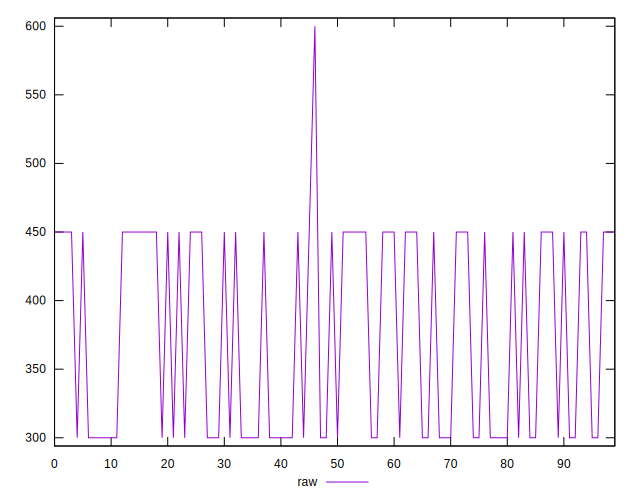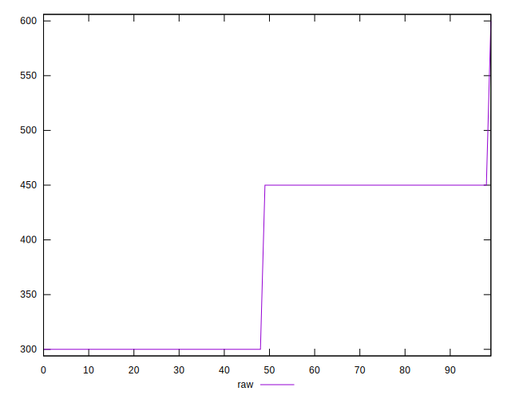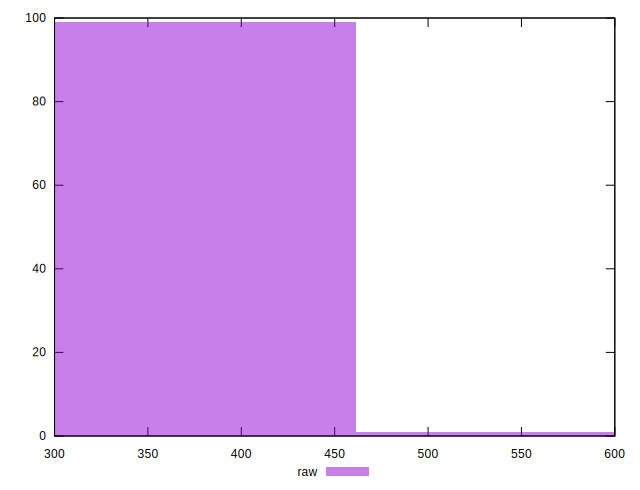
## Score


```yaml
p90min: 0.67
p90max: 0.75
p90range: 0.07999999999999996
p90mean: 0.7091489361702134
median: 0.67
p90stdev: 0.039990945104581205
mad: 0.03999999999999998
stdevBySn: 0.07155599999999997
lfitCenter: 0.7081471997992589
lfitStdev: 0.0505742363814548
mfitCenter: 0.7081471997992589
mfitStdev: 0.0633854055045943
mfitConfidence: 0.00633854055045943
p90skewness: 0.04256282653789481
p90eccentricity: 0.9999999999999978
p90discretization: 47
outlandishness: 0.9976071936716623

```

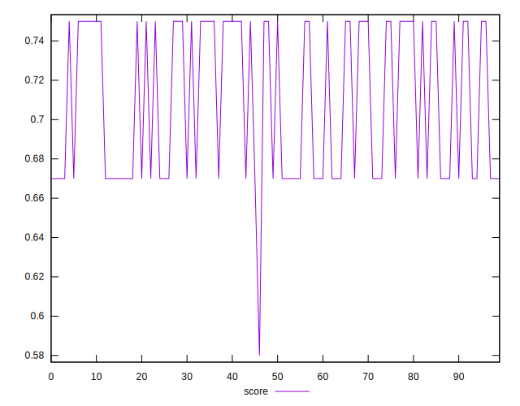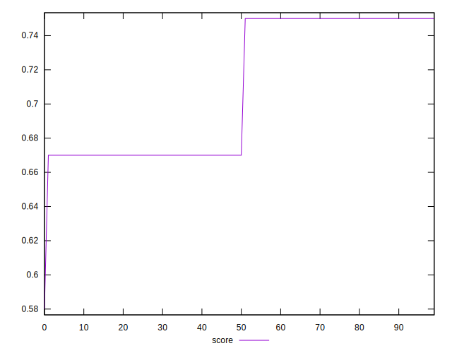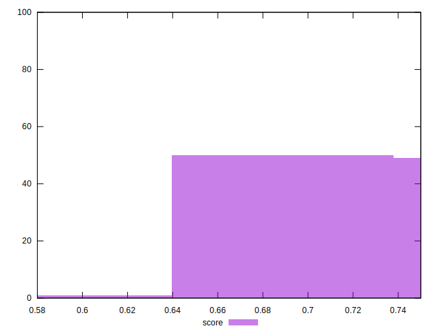
## Raw Estimate

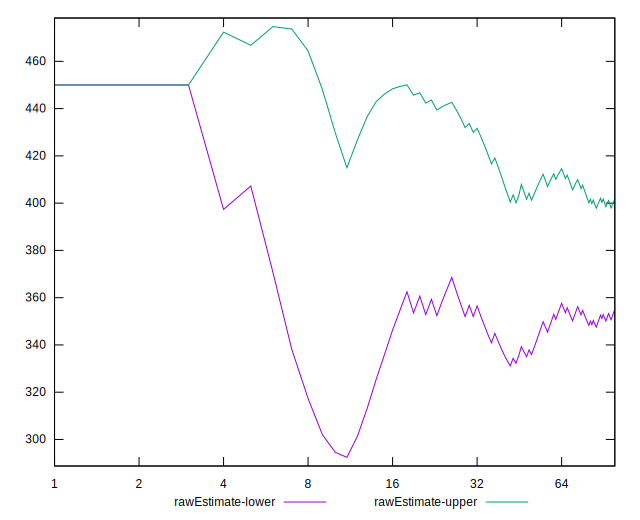
## Score Estimate

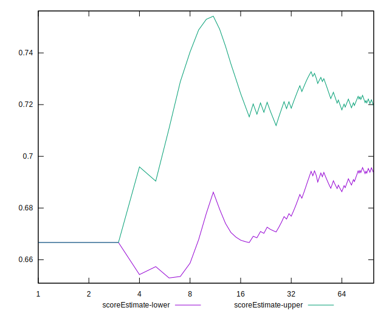
## P Score


```yaml
p90min: 0.6666666666666666
p90max: 0.75
p90range: 0.08333333333333337
p90mean: 0.7074468085106378
median: 0.6666666666666666
p90stdev: 0.041657234483938765
mad: 0.04166666666666663
stdevBySn: 0.07453749999999994
lfitCenter: 0.7064518081383168
lfitStdev: 0.05262291981979981
mfitCenter: 0.7064518081383168
mfitStdev: 0.0659530494233399
mfitConfidence: 0.00659530494233399
p90skewness: 0.04256282653794852
p90eccentricity: 1.0000000000000022
p90discretization: 47
outlandishness: 0.997795702288303

```

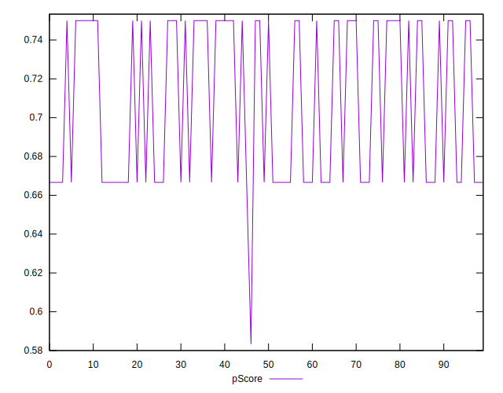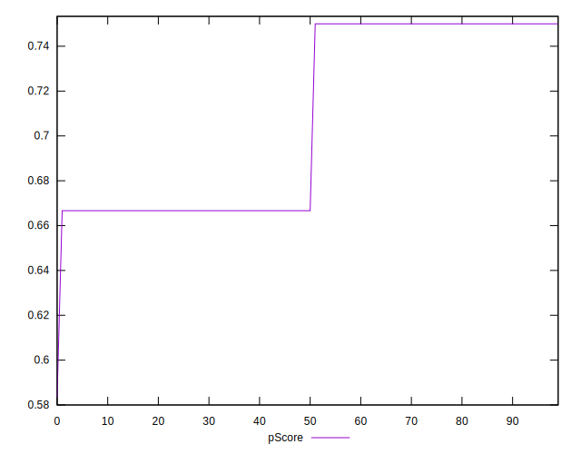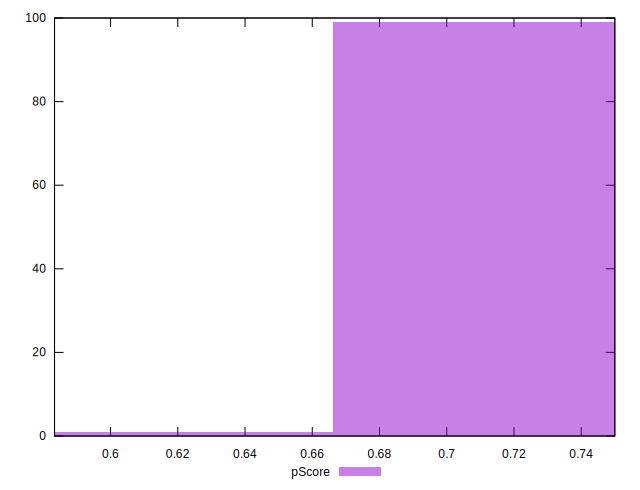
## Score Difference


```yaml
p90min: 0
p90max: 0
p90range: 0
p90mean: 0
median: 0
p90stdev: 0
mad: 0
stdevBySn: 0
lfitCenter: 0
lfitStdev: 0
mfitCenter: 0
mfitStdev: 0
mfitConfidence: 0
p90skewness: .nan
p90eccentricity: .nan
p90discretization: 94
outlandishness: .nan

```


## P Score Difference


```yaml
p90min: -0.0033333333333334103
p90max: 0
p90range: 0.0033333333333334103
p90mean: -0.0016666666666667052
median: -0.0016666666666667052
p90stdev: 0.0016666666666667043
mad: 0.0016666666666667052
stdevBySn: 0.002981500000000069
lfitCenter: -0.0016511546621582095
lfitStdev: 0.002108298312195941
mfitCenter: -0.0016511546621582095
mfitStdev: 0.002642360083012436
mfitConfidence: 0.00026423600830124364
p90skewness: 0
p90eccentricity: 1.0000000000000002
p90discretization: 47
outlandishness: 0.9604000000000001

```

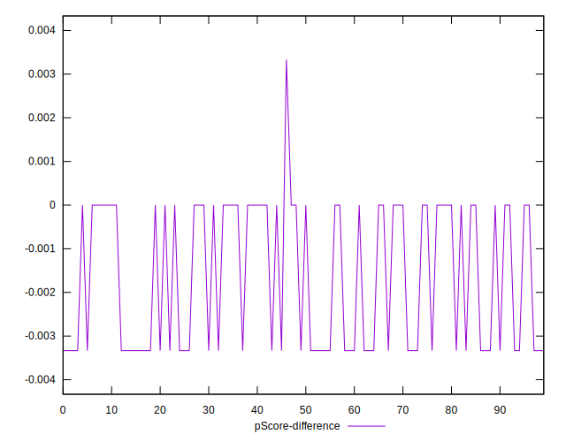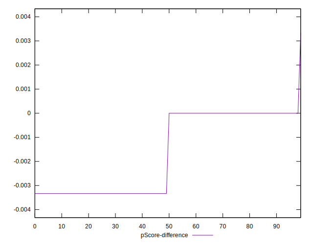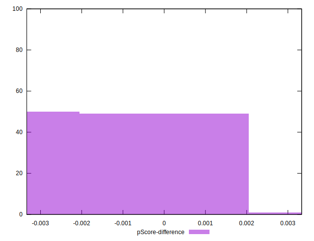