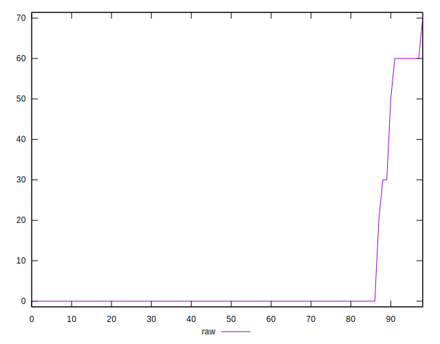

# //unused-css-rules/samples/card

[→ Parent](../..)


## Raw


```yaml
p90min: 0
p90max: 60
p90range: 60
p90mean: 4.623655913978495
median: 0
p90stdev: 14.923398657628477
mad: 0
stdevBySn: 0
lfitCenter: 3.315880715892388
lfitStdev: 7.764868905943379
mfitCenter: 3.315880715892388
mfitStdev: 9.73181998401295
mfitConfidence: 0.9780847095228314
p90skewness: 3.13989958079842
p90eccentricity: 1.0000000000000016
p90discretization: 18.6
outlandishness: 1.8346024778986083

```


## Score


```yaml
p90min: 0.95
p90max: 1
p90range: 0.050000000000000044
p90mean: 0.996236559139785
median: 1
p90stdev: 0.012261836808729849
mad: 0
stdevBySn: 0
lfitCenter: 0.9972784232717481
lfitStdev: 0.006373174526772488
mfitCenter: 0.9972784232717481
mfitStdev: 0.007987589742020434
mfitConfidence: 0.000802782974350711
p90skewness: -3.2088494290437097
p90eccentricity: 1.0000000000000013
p90discretization: 23.25
outlandishness: 0.9972153054128488

```


## Raw Estimate


## Score Estimate


## P Score


```yaml
p90min: 0.95
p90max: 1
p90range: 0.050000000000000044
p90mean: 0.996146953405018
median: 1
p90stdev: 0.012436165548023756
mad: 0
stdevBySn: 0
lfitCenter: 0.9972367660700897
lfitStdev: 0.006470724088286119
mfitCenter: 0.9972367660700897
mfitStdev: 0.00810984998667742
mfitConfidence: 0.0008150705912690223
p90skewness: -3.1398995807984096
p90eccentricity: 1.0000000000000016
p90discretization: 18.6
outlandishness: 0.9972596968852679

```


## Score Difference


```yaml
p90min: 0
p90max: 1.1102230246251565e-16
p90range: 1.1102230246251565e-16
p90mean: 5.9689409926083686e-18
median: 0
p90stdev: 2.5041112509012772e-17
mad: 0
stdevBySn: 0
lfitCenter: 4.5961331251298485e-18
lfitStdev: 1.1043855987317055e-17
mfitCenter: 4.5961331251298485e-18
mfitStdev: 1.3841420853308723e-17
mfitConfidence: 1.3911151374492699e-18
p90skewness: 3.9568697453691897
p90eccentricity: 0.9999999999999977
p90discretization: 46.5
outlandishness: 2.259100091827365

```


## P Score Difference


```yaml
p90min: 0
p90max: 0
p90range: 0
p90mean: 0
median: 0
p90stdev: 0
mad: 0
stdevBySn: 0
lfitCenter: -0.000032185983329102874
lfitStdev: 0.00013894840468272574
mfitCenter: -0.000032185983329102874
mfitStdev: 0.00017414600012152852
mfitConfidence: 0.00001750233154982715
p90skewness: .nan
p90eccentricity: .nan
p90discretization: 93
outlandishness: .inf

```

