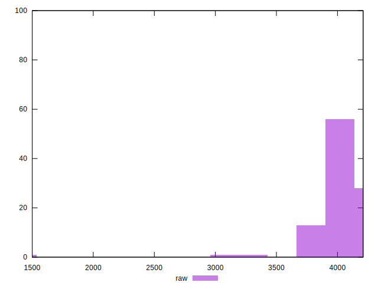
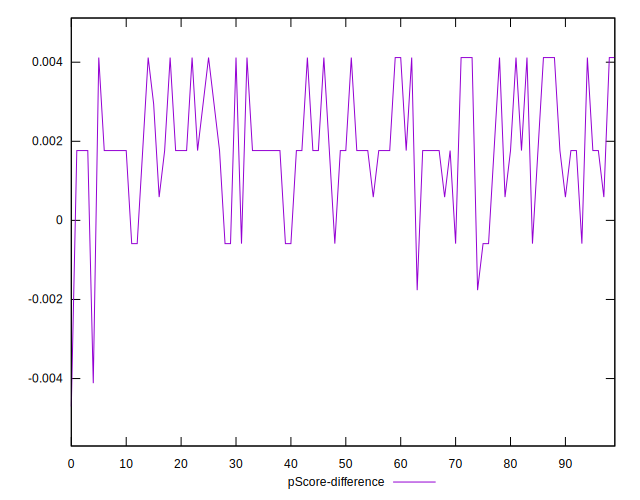

# //unused-javascript/samples/astro

[→ Parent](../..)


## Raw


```yaml
p90min: 3900
p90max: 4200
p90range: 300
p90mean: 4066.808510638298
median: 4050
p90stdev: 96.10735094826214
mad: 10
stdevBySn: 11.926000000000002
lfitCenter: 4046.2522902763594
lfitStdev: 83.46289276244464
mfitCenter: 4046.2522902763594
mfitStdev: 104.60522354567763
mfitConfidence: 10.460522354567763
p90skewness: -0.11037257832023782
p90eccentricity: 1.0000000000000027
p90discretization: 18.8
outlandishness: 0.9811517102593627

```


## Score


```yaml
p90min: 0.09
p90max: 0.13
p90range: 0.04000000000000001
p90mean: 0.1078723404255319
median: 0.11
p90stdev: 0.01287190081893972
mad: 0
stdevBySn: 0
lfitCenter: 0.11037271854785725
lfitStdev: 0.0105749964601416
mfitCenter: 0.11037271854785725
mfitStdev: 0.013253792578893368
mfitConfidence: 0.0013253792578893368
p90skewness: 0.10134474271940279
p90eccentricity: 1.0000000000000018
p90discretization: 31.333333333333332
outlandishness: 1.0876391757991672

```


## Raw Estimate


## Score Estimate


## P Score


```yaml
p90min: 0.09411764705882353
p90max: 0.12941176470588234
p90range: 0.03529411764705881
p90mean: 0.10978723404255303
median: 0.11176470588235293
p90stdev: 0.01130674717038378
mad: 0.0011764705882352788
stdevBySn: 0.0014030588235293938
lfitCenter: 0.11220561290866374
lfitStdev: 0.00981916385440539
mfitCenter: 0.11220561290866374
mfitStdev: 0.012306496887726955
mfitConfidence: 0.0012306496887726955
p90skewness: 0.11037257832029326
p90eccentricity: 1.0000000000000002
p90discretization: 18.8
outlandishness: 1.0842336121554528

```


## Score Difference


```yaml
p90min: 0
p90max: 0
p90range: 0
p90mean: 0
median: 0
p90stdev: 0
mad: 0
stdevBySn: 0
lfitCenter: 2.583267684513104e-19
lfitStdev: 6.445158398659724e-19
mfitCenter: 2.583267684513104e-19
mfitStdev: 8.077808146406197e-19
mfitConfidence: 8.077808146406197e-20
p90skewness: .nan
p90eccentricity: .nan
p90discretization: 94
outlandishness: .inf

```


## P Score Difference


```yaml
p90min: -0.001764705882352946
p90max: 0.0041176470588235314
p90range: 0.0058823529411764774
p90mean: 0.0019148936170212706
median: 0.0017647058823529321
p90stdev: 0.001517854111218583
mad: 0.0011764705882352788
stdevBySn: 0.0014030588235293938
lfitCenter: 0.0018499990254956153
lfitStdev: 0.0010188126143560834
mfitCenter: 0.0018499990254956153
mfitStdev: 0.0012768922541327072
mfitConfidence: 0.00012768922541327073
p90skewness: -0.08975770725670555
p90eccentricity: 0.9999999999999992
p90discretization: 13.428571428571429
outlandishness: 0.9010104190695882

```

