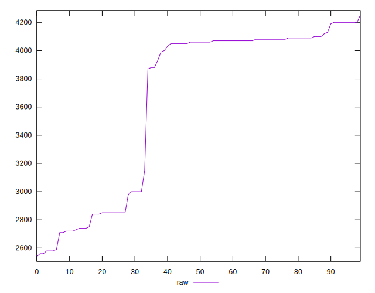

# //unused-javascript/samples/music

[→ Parent](../..)


## Raw


```yaml
p90min: 2580
p90max: 4200
p90range: 1620
p90mean: 3656.7021276595747
median: 4060
p90stdev: 602.6720435884948
mad: 65
stdevBySn: 107.334
lfitCenter: 3741.615896260078
lfitStdev: 597.9701407643571
mfitCenter: 3741.615896260078
mfitStdev: 749.4444318666312
mfitConfidence: 74.94444318666312
p90skewness: -0.7516472306364016
p90eccentricity: 0.9999999999999999
p90discretization: 3.357142857142857
outlandishness: 0.991103574519268

```


## Score


```yaml
p90min: 0.09
p90max: 0.28
p90range: 0.19000000000000003
p90mean: 0.15808510638297865
median: 0.11
p90stdev: 0.0705491619104386
mad: 0.009999999999999995
stdevBySn: 0.011925999999999996
lfitCenter: 0.14814852547271043
lfitStdev: 0.07028178860844186
mfitCenter: 0.14814852547271043
mfitStdev: 0.0880851593474147
mfitConfidence: 0.008808515934741471
p90skewness: 0.7402213795532436
p90eccentricity: 1.0000000000000002
p90discretization: 8.545454545454545
outlandishness: 1.0243728364692257

```


## Raw Estimate


## Score Estimate


## P Score


```yaml
p90min: 0.09411764705882353
p90max: 0.28470588235294114
p90range: 0.19058823529411761
p90mean: 0.15803504380475591
median: 0.11058823529411765
p90stdev: 0.07090259336335235
mad: 0.0076470588235294235
stdevBySn: 0.012627529411764692
lfitCenter: 0.14804518867528488
lfitStdev: 0.07034942832521845
mfitCenter: 0.14804518867528488
mfitStdev: 0.08816993316078012
mfitConfidence: 0.008816993316078011
p90skewness: 0.7516472306364034
p90eccentricity: 1
p90discretization: 3.357142857142857
outlandishness: 1.024419078577899

```


## Score Difference


```yaml
p90min: 0
p90max: 0
p90range: 0
p90mean: 0
median: 0
p90stdev: 0
mad: 0
stdevBySn: 0
lfitCenter: 0
lfitStdev: 0
mfitCenter: 0
mfitStdev: 0
mfitConfidence: 0
p90skewness: .nan
p90eccentricity: .nan
p90discretization: 94
outlandishness: .nan

```


## P Score Difference


```yaml
p90min: -0.004705882352941171
p90max: 0.004705882352941115
p90range: 0.009411764705882286
p90mean: -0.00005006257822278963
median: -0.000588235294117681
p90stdev: 0.002701988239001482
mad: 0.0023529411764705577
stdevBySn: 0.0028061176470588534
lfitCenter: -0.00013857649301499803
lfitStdev: 0.0024184202904969344
mfitCenter: -0.00013857649301499803
mfitStdev: 0.0030310403431004283
mfitConfidence: 0.0003031040343100428
p90skewness: 0.17392022060108092
p90eccentricity: 0.9999999999999999
p90discretization: 3.76
outlandishness: 0.8836000000000523

```

