# //uses-http2/samples/agenda

[→ Parent](../..)


## Raw


```yaml
p90min: 1210
p90max: 1280
p90range: 70
p90mean: 1252.659574468085
median: 1250
p90stdev: 14.230289235775084
mad: 10
stdevBySn: 11.926000000000002
lfitCenter: 1251.857219790145
lfitStdev: 13.267183350273235
mfitCenter: 1251.857219790145
mfitStdev: 16.627948471986016
mfitConfidence: 1.6627948471986016
p90skewness: -0.7185754793664664
p90eccentricity: 1.0000000000000016
p90discretization: 11.75
outlandishness: 0.9948025247603465

```

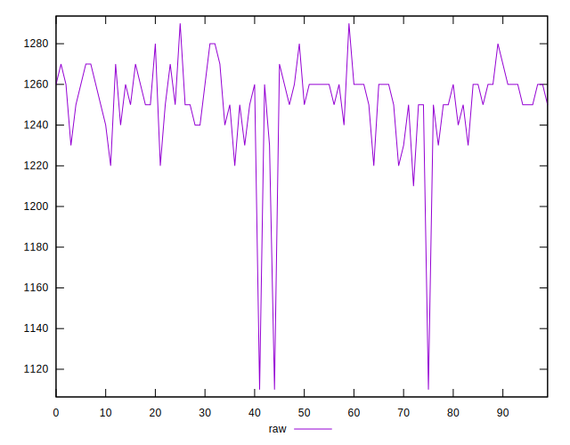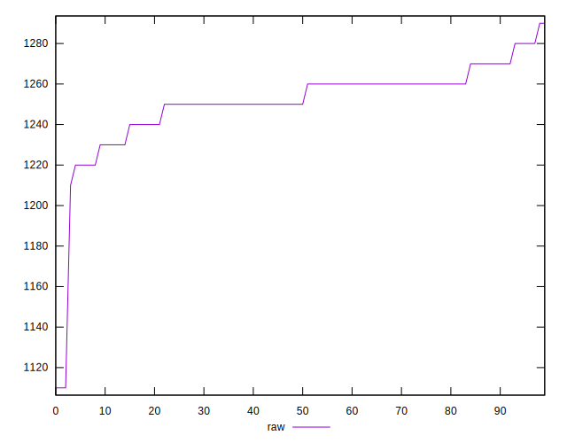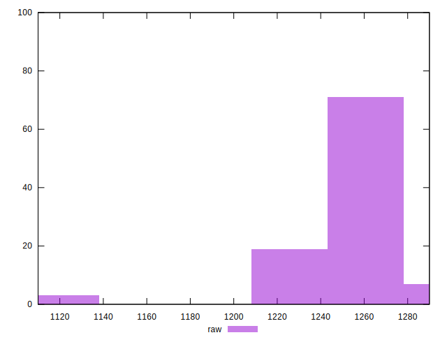
## Score


```yaml
p90min: 0.44
p90max: 0.45
p90range: 0.010000000000000009
p90mean: 0.4401063829787233
median: 0.44
p90stdev: 0.0010259202937226556
mad: 0
stdevBySn: 0
lfitCenter: 0.44033711439803114
lfitStdev: 0.000828648413403573
mfitCenter: 0.44033711439803114
mfitStdev: 0.001038556772427797
mfitConfidence: 0.0001038556772427797
p90skewness: 9.539955591520258
p90eccentricity: 1.0000000000000002
p90discretization: 47
outlandishness: 1.0026994262323956

```

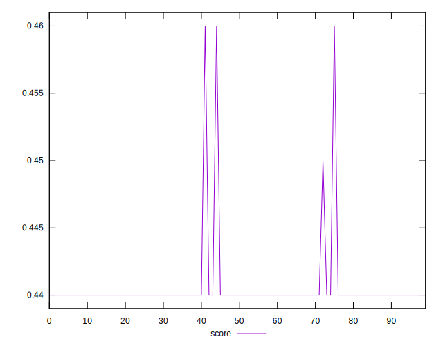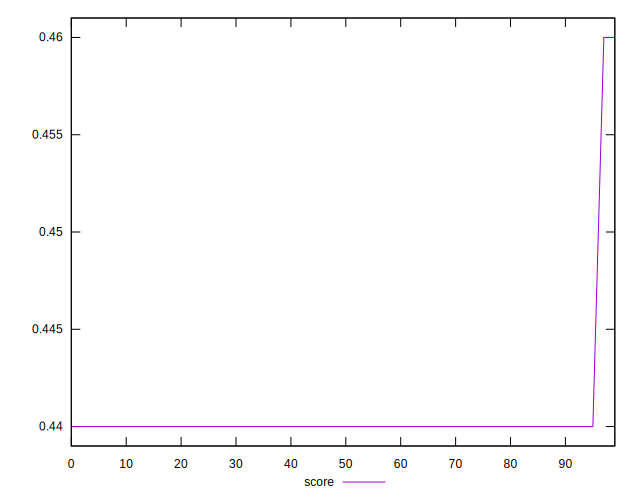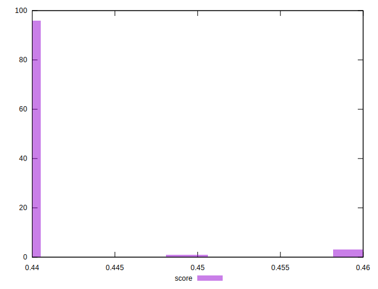
## Raw Estimate

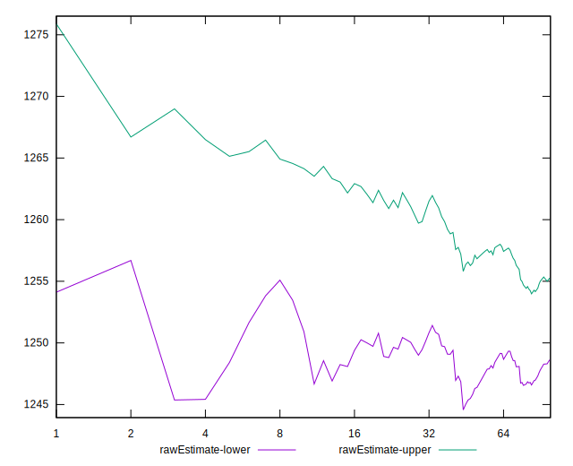
## Score Estimate

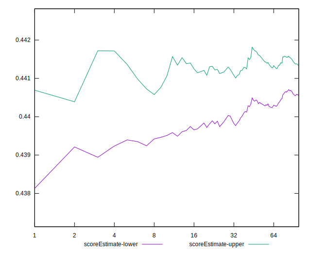
## P Score


```yaml
p90min: 0.4376470588235294
p90max: 0.44588235294117645
p90range: 0.008235294117647063
p90mean: 0.44086357947434274
median: 0.4411764705882353
p90stdev: 0.001674151674797069
mad: 0.0011764705882352788
stdevBySn: 0.0014030588235293938
lfitCenter: 0.44095797414233584
lfitStdev: 0.0015608451000321414
mfitCenter: 0.44095797414233584
mfitStdev: 0.00195622923199835
mfitConfidence: 0.000195622923199835
p90skewness: 0.7185754793668071
p90eccentricity: 0.9999999999999991
p90discretization: 11.75
outlandishness: 1.0017404301433193

```

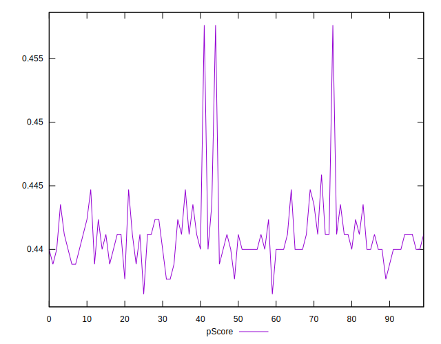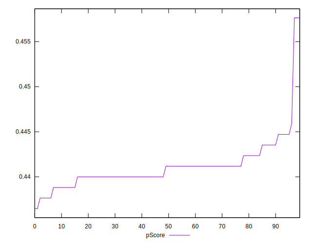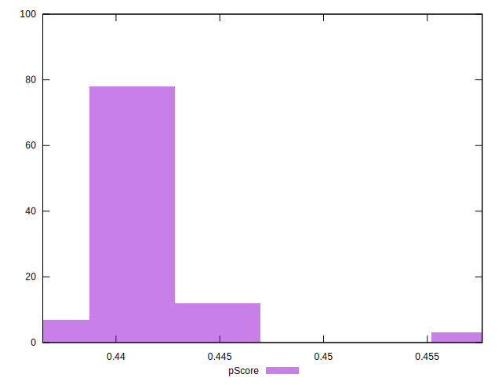
## Score Difference


```yaml
p90min: 0
p90max: 0
p90range: 0
p90mean: 0
median: 0
p90stdev: 0
mad: 0
stdevBySn: 0
lfitCenter: 0
lfitStdev: 0
mfitCenter: 0
mfitStdev: 0
mfitConfidence: 0
p90skewness: .nan
p90eccentricity: .nan
p90discretization: 94
outlandishness: .nan

```


## P Score Difference


```yaml
p90min: -0.002352941176470613
p90max: 0.004705882352941171
p90range: 0.007058823529411784
p90mean: 0.0005506883604505602
median: 0
p90stdev: 0.0015511322538002213
mad: 0.0011764705882352788
stdevBySn: 0.0014030588235293938
lfitCenter: 0.0005173901607262963
lfitStdev: 0.0012993932803868236
mfitCenter: 0.0005173901607262963
mfitStdev: 0.0016285479698802839
mfitConfidence: 0.0001628547969880284
p90skewness: 0.2919488129821763
p90eccentricity: 0.9999999999999988
p90discretization: 13.428571428571429
outlandishness: 0.9868616219008249

```

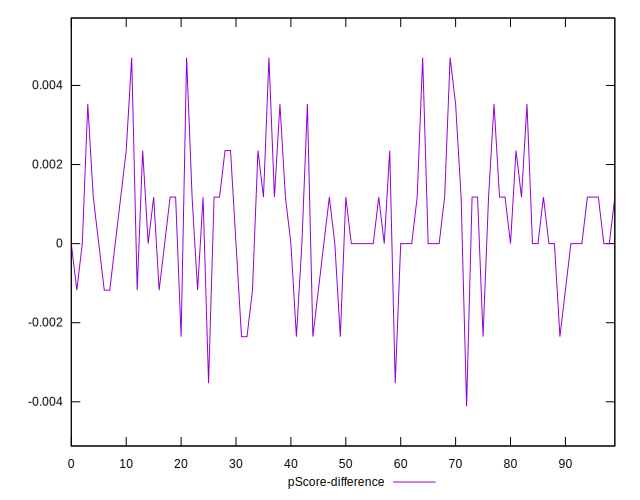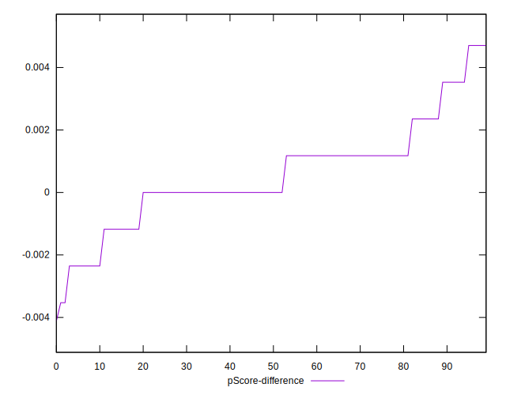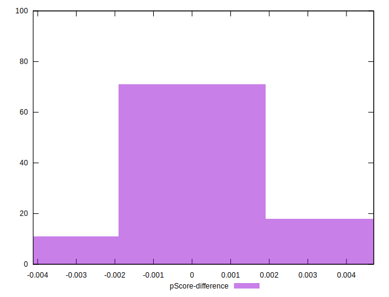