# //uses-http2/samples/astro

[→ Parent](../..)


## Raw


```yaml
p90min: 0
p90max: 120
p90range: 120
p90mean: 11.914893617021276
median: 0
p90stdev: 28.779299436444106
mad: 0
stdevBySn: 0
lfitCenter: 11.895414358361275
lfitStdev: 26.637154393562785
mfitCenter: 11.895414358361275
mfitStdev: 33.38472221290105
mfitConfidence: 3.3384722212901052
p90skewness: 2.266373823259722
p90eccentricity: 1.0000000000000004
p90discretization: 9.4
outlandishness: 3.5029132971938783

```

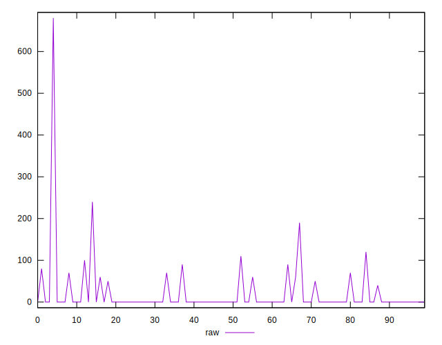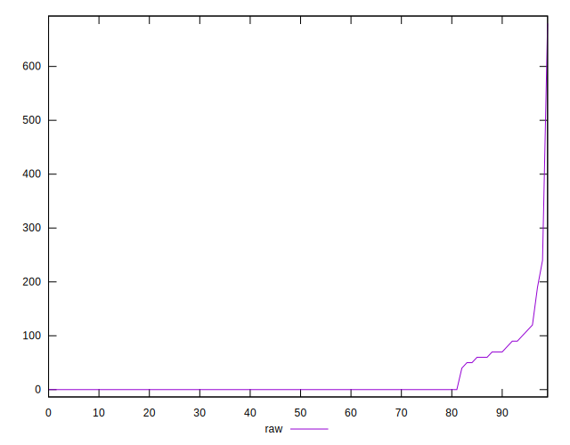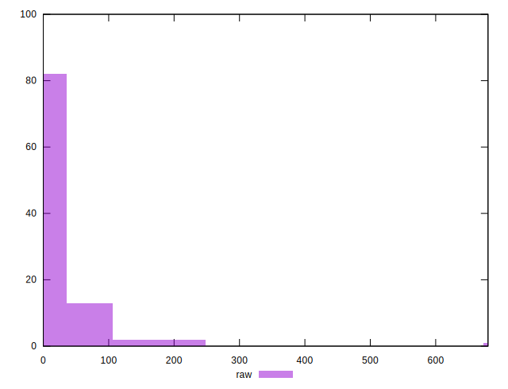
## Score


```yaml
p90min: 0.9
p90max: 1
p90range: 0.09999999999999998
p90mean: 0.9902127659574468
median: 1
p90stdev: 0.02365436954840392
mad: 0
stdevBySn: 0
lfitCenter: 0.9906559298670261
lfitStdev: 0.020923982242060726
mfitCenter: 0.9906559298670261
mfitStdev: 0.026224322779301215
mfitConfidence: 0.0026224322779301217
p90skewness: -2.2631052551138664
p90eccentricity: 0.9999999999999972
p90discretization: 10.444444444444445
outlandishness: 0.9846830848751665

```

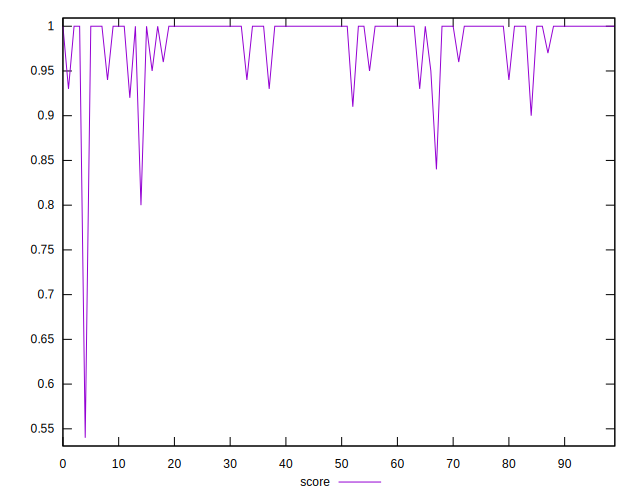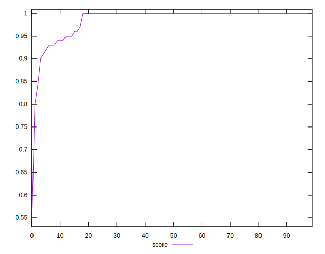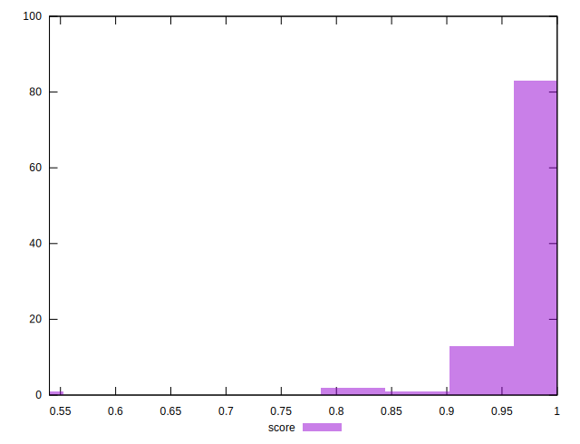
## Raw Estimate

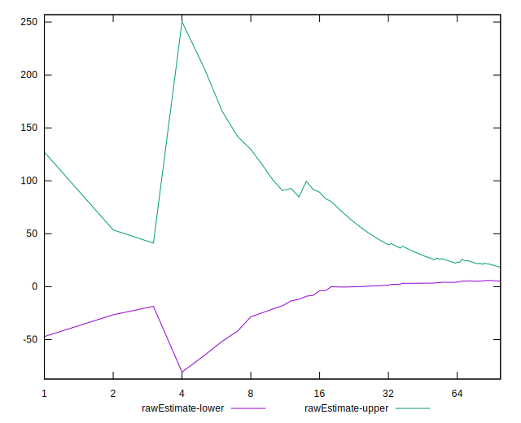
## Score Estimate

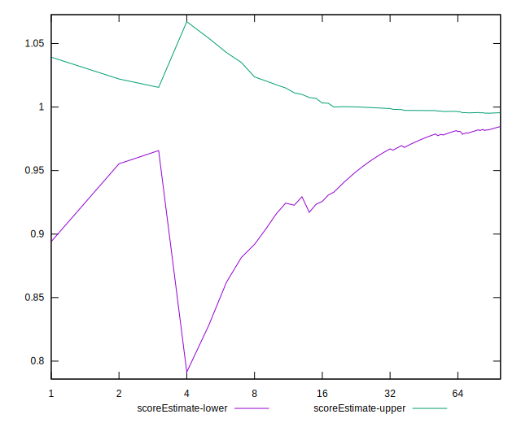
## P Score


```yaml
p90min: 0.9
p90max: 1
p90range: 0.09999999999999998
p90mean: 0.9900709219858156
median: 1
p90stdev: 0.023982749530370082
mad: 0
stdevBySn: 0
lfitCenter: 0.990578368177468
lfitStdev: 0.021097664523109808
mfitCenter: 0.990578368177468
mfitStdev: 0.02644200123776027
mfitConfidence: 0.002644200123776027
p90skewness: -2.2663738232597224
p90eccentricity: 1.0000000000000002
p90discretization: 9.4
outlandishness: 0.9847090951808833

```

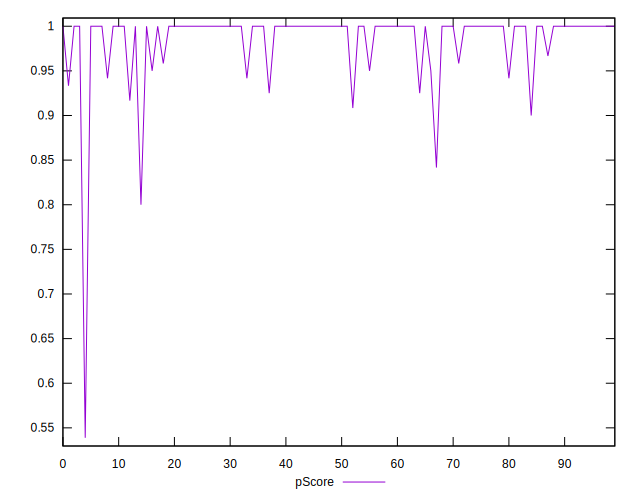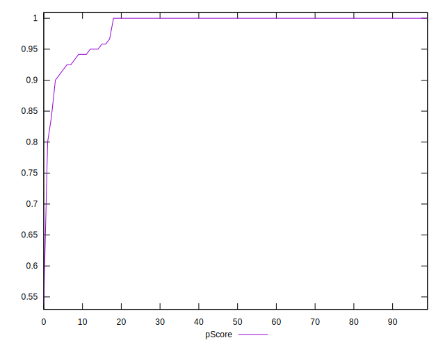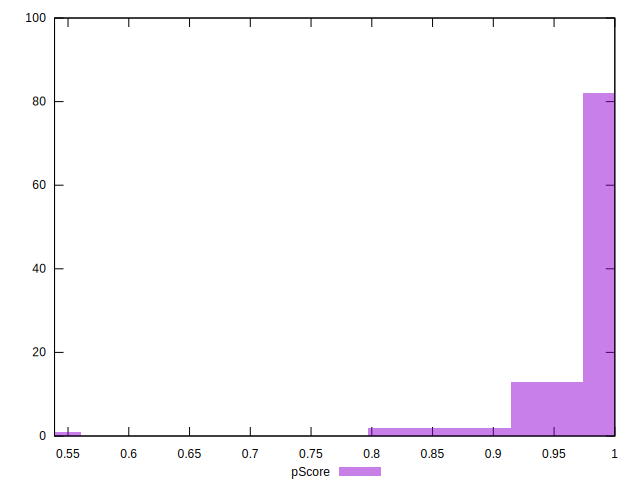
## Score Difference


```yaml
p90min: 0
p90max: 1.1102230246251565e-16
p90range: 1.1102230246251565e-16
p90mean: 3.543264972207946e-18
median: 0
p90stdev: 1.9514781802162963e-17
mad: 0
stdevBySn: 0
lfitCenter: 3.3158666172059827e-18
lfitStdev: 8.063403855810743e-18
mfitCenter: 3.3158666172059827e-18
mfitStdev: 1.0105978057540984e-17
mfitConfidence: 1.0105978057540984e-18
p90skewness: 5.326002287485495
p90eccentricity: 1.0000000000000044
p90discretization: 47
outlandishness: 3.5344000000000007

```

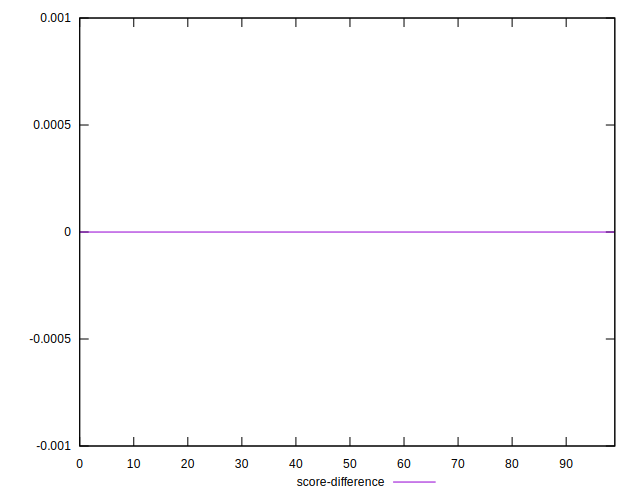
## P Score Difference


```yaml
p90min: -0.0033333333333332993
p90max: 0.0016666666666667052
p90range: 0.0050000000000000044
p90mean: -0.00006501182033096762
median: 0
p90stdev: 0.0005242753199443268
mad: 0
stdevBySn: 0
lfitCenter: -0.00006445955091356755
lfitStdev: 0.00027696410500319753
mfitCenter: -0.00006445955091356755
mfitStdev: 0.0003471230286787321
mfitConfidence: 0.00003471230286787321
p90skewness: -2.8033242639183378
p90eccentricity: 0.9999999999999996
p90discretization: 15.666666666666666
outlandishness: 3.863011570248062

```

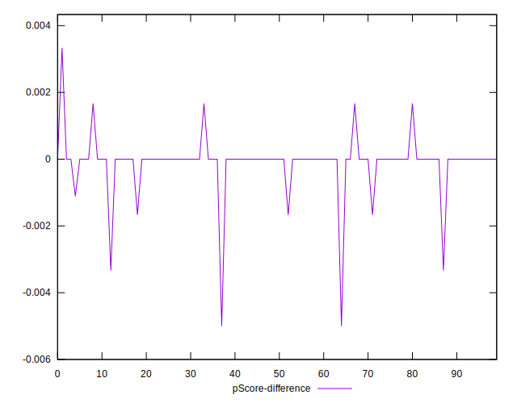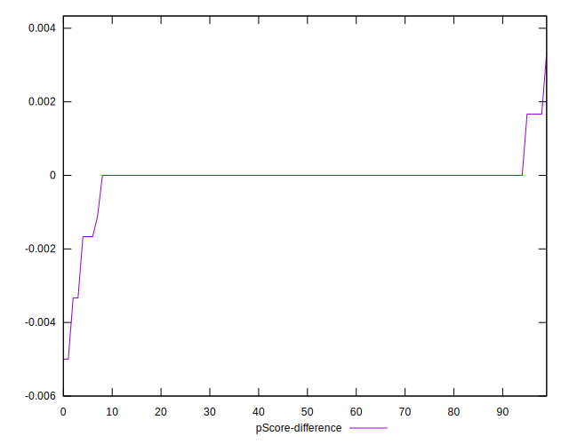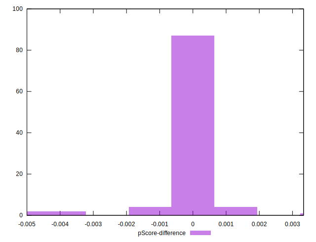