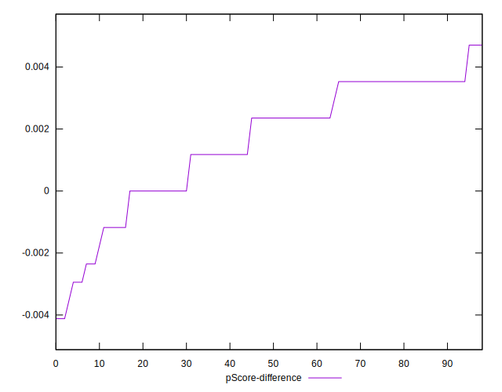

# //uses-http2/samples/card

[→ Parent](../..)


## Raw


```yaml
p90min: 1220
p90max: 1430
p90range: 210
p90mean: 1367.741935483871
median: 1400
p90stdev: 66.33458742411098
mad: 20
stdevBySn: 23.852000000000004
lfitCenter: 1375.0992647013918
lfitStdev: 57.6524482957947
mfitCenter: 1375.0992647013918
mfitStdev: 72.25662857267811
mfitConfidence: 7.262064411868077
p90skewness: -1.102775634363221
p90eccentricity: 0.9999999999999997
p90discretization: 5.8125
outlandishness: 0.9920921203852808

```


## Score


```yaml
p90min: 0.42
p90max: 0.44
p90range: 0.020000000000000018
p90mean: 0.4256989247311834
median: 0.42
p90stdev: 0.008600806346589787
mad: 0
stdevBySn: 0
lfitCenter: 0.42453662987619567
lfitStdev: 0.008500319925654923
mfitCenter: 0.42453662987619567
mfitStdev: 0.010653571145248033
mfitConfidence: 0.0010707241868528664
p90skewness: 0.9492730619823488
p90eccentricity: 0.9999999999999987
p90discretization: 31
outlandishness: 1.003600715699001

```


## Raw Estimate


## Score Estimate


## P Score


```yaml
p90min: 0.42
p90max: 0.4447058823529412
p90range: 0.02470588235294119
p90mean: 0.427324478178368
median: 0.4235294117647059
p90stdev: 0.007804069108718943
mad: 0.002352941176470613
stdevBySn: 0.0028061176470588534
lfitCenter: 0.4264589100351304
lfitStdev: 0.0067826409759758855
mfitCenter: 0.4264589100351304
mfitStdev: 0.008500779832079825
mfitConfidence: 0.000854360519043308
p90skewness: 1.1027756343632649
p90eccentricity: 0.9999999999999989
p90discretization: 5.8125
outlandishness: 1.0029858809313834

```


## Score Difference


```yaml
p90min: 0
p90max: 0
p90range: 0
p90mean: 0
median: 0
p90stdev: 0
mad: 0
stdevBySn: 0
lfitCenter: 0
lfitStdev: 0
mfitCenter: 0
mfitStdev: 0
mfitConfidence: 0
p90skewness: .nan
p90eccentricity: .nan
p90discretization: 93
outlandishness: .nan

```


## P Score Difference


```yaml
p90min: -0.003529411764705892
p90max: 0.004705882352941171
p90range: 0.008235294117647063
p90mean: 0.0015749525616698347
median: 0.002352941176470613
p90stdev: 0.0019805981011320837
mad: 0.0011764705882352788
stdevBySn: 0.0014030588235293938
lfitCenter: 0.001702979065052256
lfitStdev: 0.001798332594325507
mfitCenter: 0.001702979065052256
mfitStdev: 0.0022538756663313636
mfitConfidence: 0.00022652302755555746
p90skewness: -0.7511619179754475
p90eccentricity: 1.0000000000000002
p90discretization: 7.75
outlandishness: 0.9038531903177788

```

