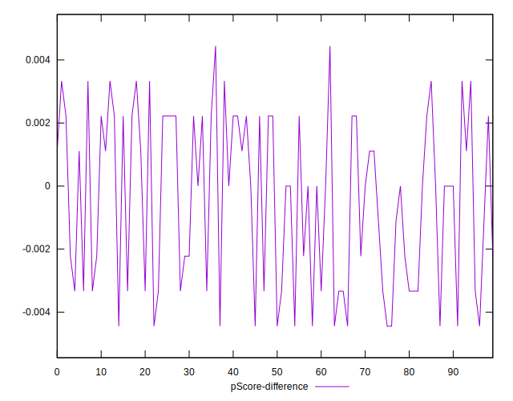

# //uses-http2/samples/music

[→ Parent](../..)


## Raw


```yaml
p90min: 550
p90max: 730
p90range: 180
p90mean: 662.5531914893617
median: 700
p90stdev: 68.49345628338652
mad: 20
stdevBySn: 35.778000000000006
lfitCenter: 669.9258837428611
lfitStdev: 70.4492505583055
mfitCenter: 669.9258837428611
mfitStdev: 88.2950417768524
mfitConfidence: 8.82950417768524
p90skewness: -0.6339183575539599
p90eccentricity: 1.0000000000000007
p90discretization: 9.4
outlandishness: 0.9920070443362048

```


## Score


```yaml
p90min: 0.51
p90max: 0.61
p90range: 0.09999999999999998
p90mean: 0.5489361702127665
median: 0.53
p90stdev: 0.0387701378038914
mad: 0.010000000000000009
stdevBySn: 0.011926000000000011
lfitCenter: 0.5444335343767454
lfitStdev: 0.039719485196382576
mfitCenter: 0.5444335343767454
mfitStdev: 0.04978099237361176
mfitConfidence: 0.0049780992373611764
p90skewness: 0.6588295063129632
p90eccentricity: 1
p90discretization: 15.666666666666666
outlandishness: 1.0057057902920497

```


## Raw Estimate


## Score Estimate


## P Score


```yaml
p90min: 0.5111111111111111
p90max: 0.6111111111111112
p90range: 0.10000000000000009
p90mean: 0.5485815602836881
median: 0.5277777777777778
p90stdev: 0.038051920157436976
mad: 0.011111111111111183
stdevBySn: 0.01987666666666673
lfitCenter: 0.5444856201428554
lfitStdev: 0.0391384725323922
mfitCenter: 0.5444856201428554
mfitStdev: 0.049052800987140543
mfitConfidence: 0.004905280098714054
p90skewness: 0.6339183575539398
p90eccentricity: 1.0000000000000004
p90discretization: 9.4
outlandishness: 1.005381061388472

```


## Score Difference


```yaml
p90min: 0
p90max: 0
p90range: 0
p90mean: 0
median: 0
p90stdev: 0
mad: 0
stdevBySn: 0
lfitCenter: 0
lfitStdev: 0
mfitCenter: 0
mfitStdev: 0
mfitConfidence: 0
p90skewness: .nan
p90eccentricity: .nan
p90discretization: 94
outlandishness: .nan

```


## P Score Difference


```yaml
p90min: -0.004444444444444362
p90max: 0.0033333333333332993
p90range: 0.007777777777777661
p90mean: -0.0004609929078014244
median: 0
p90stdev: 0.0026354036931563038
mad: 0.0022222222222222365
stdevBySn: 0.0026502222222222396
lfitCenter: -0.00037837681301447045
lfitStdev: 0.0025251321815140493
mfitCenter: -0.00037837681301447045
mfitStdev: 0.003164783864866428
mfitConfidence: 0.0003164783864866428
p90skewness: -0.14675719141137142
p90eccentricity: 0.9999999999999991
p90discretization: 9.4
outlandishness: 0.9294937541091407

```

