# //uses-long-cache-ttl/samples/astro

[→ Parent](../..)


## Raw


```yaml
p90min: 947591.2135222222
p90max: 985154.1130944444
p90range: 37562.899572222144
p90mean: 972794.0633418583
median: 976637.5237173612
p90stdev: 11880.47610268899
mad: 5676.061569444428
stdevBySn: 8110.275398510302
lfitCenter: 971973.8095665632
lfitStdev: 12827.79015353732
mfitCenter: 971973.8095665632
mfitStdev: 16077.250766122508
mfitConfidence: 1607.7250766122509
p90skewness: -1.1358737415688387
p90eccentricity: 0.9999999999999996
p90discretization: 1
outlandishness: 0.990173348119845

```

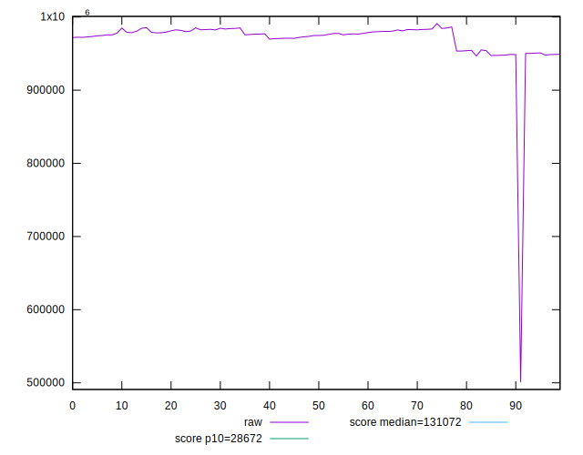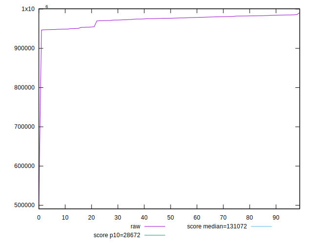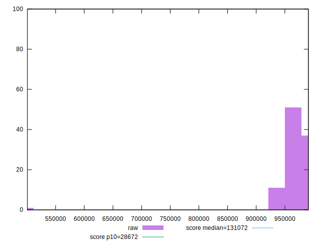
## Score


```yaml
p90min: 0.04
p90max: 0.05
p90range: 0.010000000000000002
p90mean: 0.0461702127659574
median: 0.05
p90stdev: 0.004861131769700367
mad: 0
stdevBySn: 0
lfitCenter: 0.0471238271671196
lfitStdev: 0.005800707386397636
mfitCenter: 0.0471238271671196
mfitStdev: 0.0072701085811180954
mfitConfidence: 0.0007270108581118095
p90skewness: -0.48145692048562994
p90eccentricity: 1.0000000000000007
p90discretization: 47
outlandishness: 1.0318627471383977

```

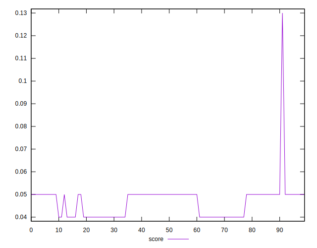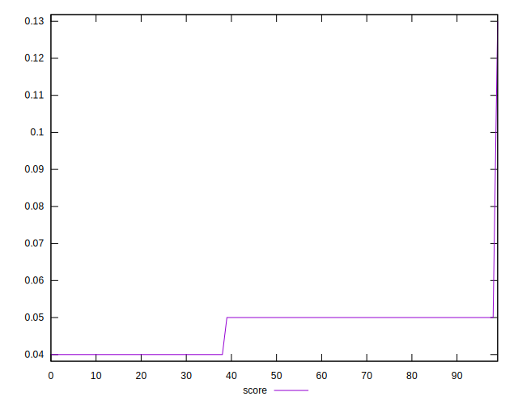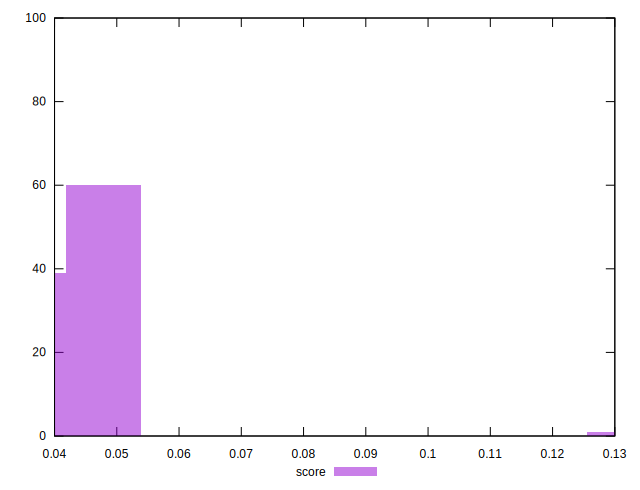
## Raw Estimate

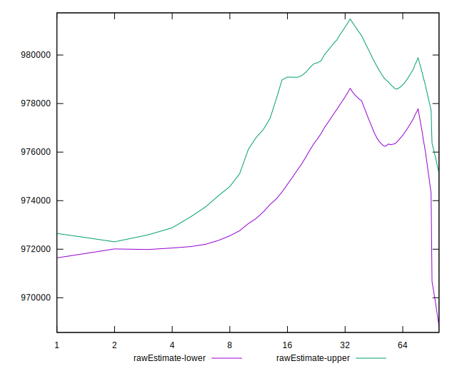
## Score Estimate

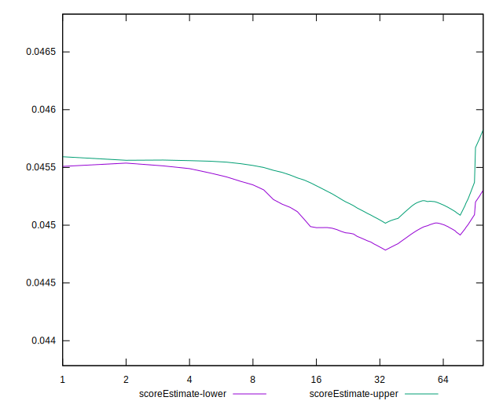
## P Score


```yaml
p90min: 0.04448804460757816
p90max: 0.04765355110996533
p90range: 0.003165506502387172
p90mean: 0.04551180716278339
median: 0.04517993677017554
p90stdev: 0.0010019508896019175
mad: 0.00046603377256720924
stdevBySn: 0.0006621773684913963
lfitCenter: 0.04578308148265347
lfitStdev: 0.0015095011096764575
mfitCenter: 0.04578308148265347
mfitStdev: 0.0018918790829546288
mfitConfidence: 0.00018918790829546288
p90skewness: 1.1599138457877356
p90eccentricity: 0.9999999999999997
p90discretization: 1
outlandishness: 1.0374368064436679

```

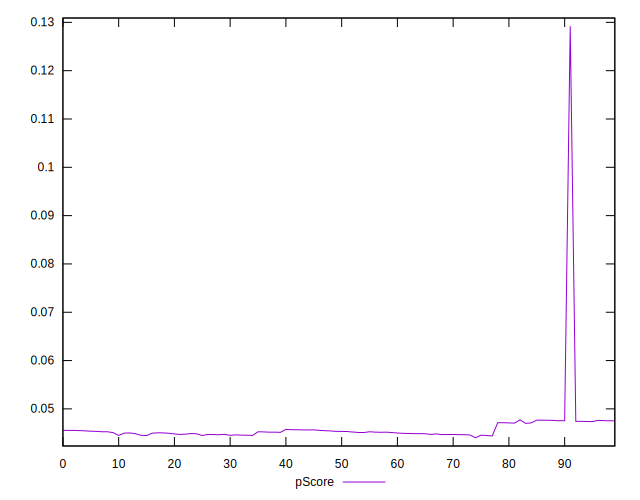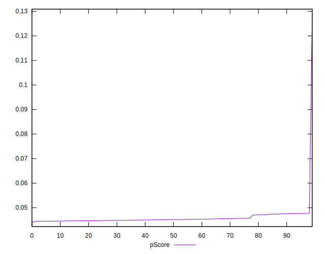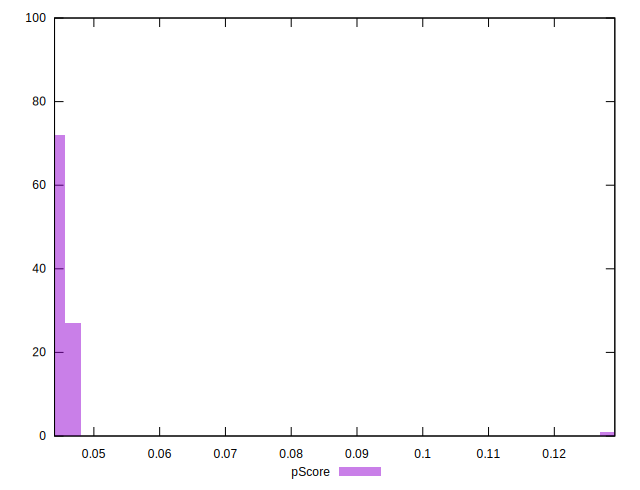
## Score Difference


```yaml
p90min: 0
p90max: 0
p90range: 0
p90mean: 0
median: 0
p90stdev: 0
mad: 0
stdevBySn: 0
lfitCenter: 0
lfitStdev: 0
mfitCenter: 0
mfitStdev: 0
mfitConfidence: 0
p90skewness: .nan
p90eccentricity: .nan
p90discretization: 94
outlandishness: .nan

```


## P Score Difference


```yaml
p90min: -0.004955708417053187
p90max: 0.004934057781613856
p90range: 0.009889766198667042
p90mean: -0.0005785238194960772
median: -0.002470128285907938
p90stdev: 0.004217432387595381
mad: 0.0023499349439165262
stdevBySn: 0.002908858024297884
lfitCenter: -0.000869211335867738
lfitStdev: 0.00447848184324496
mfitCenter: -0.000869211335867738
mfitStdev: 0.005612944613497672
mfitConfidence: 0.0005612944613497671
p90skewness: 0.36683854868212534
p90eccentricity: 0.9999999999999991
p90discretization: 1
outlandishness: 0.8845733071285582

```

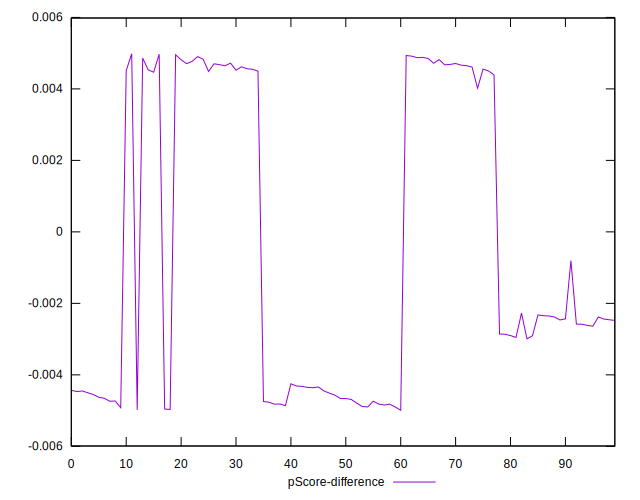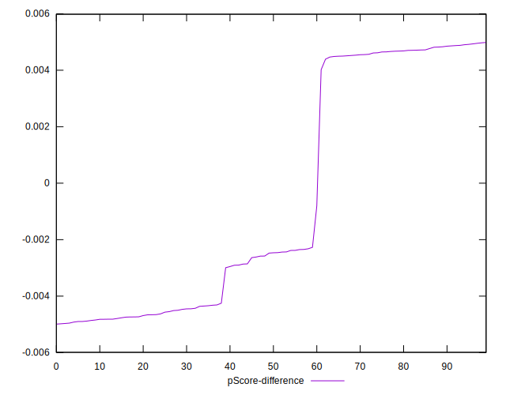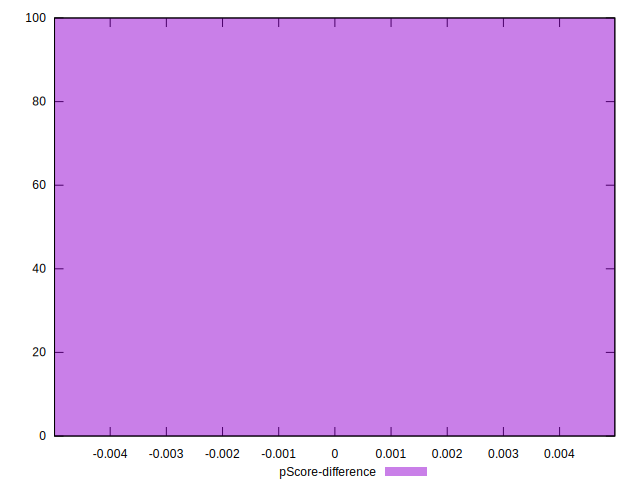