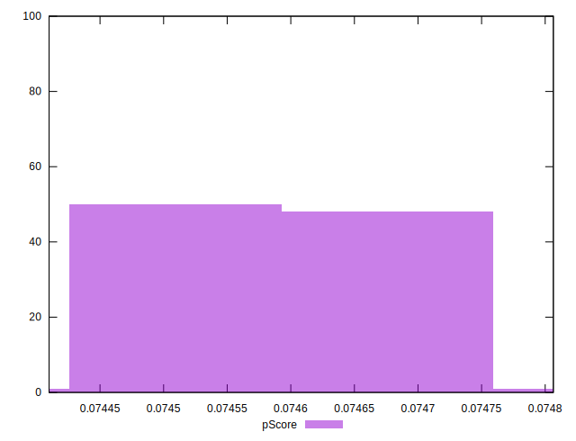

# //uses-long-cache-ttl/samples/music

[→ Parent](../..)


## Raw


```yaml
p90min: 724309.3782777777
p90max: 726091.8375666665
p90range: 1782.4592888888437
p90mean: 725242.4309700358
median: 725146.4592194443
p90stdev: 413.48072675407525
mad: 321.2307833333034
stdevBySn: 434.38366293611216
lfitCenter: 725218.0024151609
lfitStdev: 348.32136281495394
mfitCenter: 725218.0024151609
mfitStdev: 436.55608878426466
mfitConfidence: 43.65560887842646
p90skewness: 0.34771379082036086
p90eccentricity: 1.0000000000000007
p90discretization: 1
outlandishness: 0.9999834938874763

```


## Score


```yaml
p90min: 0.07
p90max: 0.07
p90range: 0
p90mean: 0.07000000000000008
median: 0.07
p90stdev: 6.938893903907228e-17
mad: 0
stdevBySn: 0
lfitCenter: 0.07000000000000009
lfitStdev: 0
mfitCenter: 0.07000000000000009
mfitStdev: 0
mfitConfidence: 0
p90skewness: -1
p90eccentricity: 1
p90discretization: 94
outlandishness: 1.0000000000000004

```


## Raw Estimate


## Score Estimate


## P Score


```yaml
p90min: 0.0744345349528086
p90max: 0.07472666246465509
p90range: 0.000292127511846485
p90mean: 0.07457358865259965
median: 0.07458927496008794
p90stdev: 0.00006774183465117952
mad: 0.000052654191877221646
stdevBySn: 0.00007123733940244305
lfitCenter: 0.07457758387208883
lfitStdev: 0.000057061746381482425
mfitCenter: 0.07457758387208883
mfitStdev: 0.00007151629351178624
mfitConfidence: 0.0000071516293511786245
p90skewness: -0.34527411030306876
p90eccentricity: 1.0000000000000007
p90discretization: 1
outlandishness: 1.0000266721310715

```


## Score Difference


```yaml
p90min: 0
p90max: 0
p90range: 0
p90mean: 0
median: 0
p90stdev: 0
mad: 0
stdevBySn: 0
lfitCenter: 0
lfitStdev: 0
mfitCenter: 0
mfitStdev: 0
mfitConfidence: 0
p90skewness: .nan
p90eccentricity: .nan
p90discretization: 94
outlandishness: .nan

```


## P Score Difference


```yaml
p90min: 0.0044345349528086
p90max: 0.004726662464655085
p90range: 0.000292127511846485
p90mean: 0.004573588652599631
median: 0.00458927496008793
p90stdev: 0.00006774183465117952
mad: 0.000052654191877221646
stdevBySn: 0.00007123733940244305
lfitCenter: 0.004577583872088801
lfitStdev: 0.00005706174638149422
mfitCenter: 0.004577583872088801
mfitStdev: 0.00007151629351180103
mfitConfidence: 0.000007151629351180103
p90skewness: -0.34527411030372196
p90eccentricity: 1
p90discretization: 1
outlandishness: 1.0004349406281527

```

