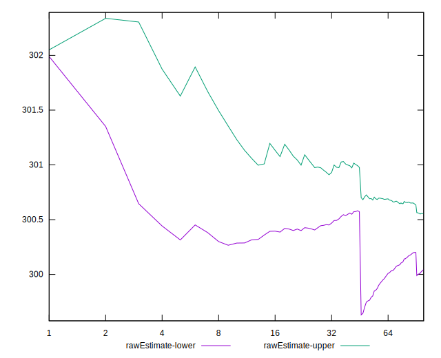

# //uses-rel-preconnect/samples/astro

[→ Parent](../..)


## Raw


```yaml
p90min: 300
p90max: 302.398
p90range: 2.3980000000000246
p90mean: 300.7471489361703
median: 300.59299999999996
p90stdev: 0.5831529480305636
mad: 0.24799999999996203
stdevBySn: 0.406676599999959
lfitCenter: 300.3001117349358
lfitStdev: 1.0384270393539838
mfitCenter: 300.3001117349358
mfitStdev: 1.301475290302627
mfitConfidence: 0.1301475290302627
p90skewness: 1.6498099055397994
p90eccentricity: 0.9999999999999997
p90discretization: 1.1058823529411765
outlandishness: 0.9945664254814844

```


## Score


```yaml
p90min: 0.75
p90max: 0.75
p90range: 0
p90mean: 0.75
median: 0.75
p90stdev: 0
mad: 0
stdevBySn: 0
lfitCenter: 0.7503282297538745
lfitStdev: 0.0008149905568989787
mfitCenter: 0.7503282297538745
mfitStdev: 0.0010214391877679382
mfitConfidence: 0.00010214391877679382
p90skewness: .nan
p90eccentricity: .nan
p90discretization: 94
outlandishness: 1.0018675377777775

```


## Raw Estimate


## Score Estimate


## P Score


```yaml
p90min: 0.7486677777777777
p90max: 0.75
p90range: 0.0013322222222222901
p90mean: 0.7495849172576833
median: 0.7496705555555556
p90stdev: 0.00032397386001698094
mad: 0.0001377777777776812
stdevBySn: 0.00022593144444440192
lfitCenter: 0.7499447010444876
lfitStdev: 0.0008411979770473879
mfitCenter: 0.7499447010444876
mfitStdev: 0.0010542853179755576
mfitConfidence: 0.00010542853179755576
p90skewness: -1.6498099055394915
p90eccentricity: 1.0000000000000004
p90discretization: 1.1058823529411765
outlandishness: 1.0018473765080291

```


## Score Difference


```yaml
p90min: 0
p90max: 0
p90range: 0
p90mean: 0
median: 0
p90stdev: 0
mad: 0
stdevBySn: 0
lfitCenter: 0
lfitStdev: 0
mfitCenter: 0
mfitStdev: 0
mfitConfidence: 0
p90skewness: .nan
p90eccentricity: .nan
p90discretization: 94
outlandishness: .nan

```


## P Score Difference


```yaml
p90min: -0.0013322222222222901
p90max: -0.00001111111111107288
p90range: 0.0013211111111112173
p90mean: -0.00042022458561205746
median: -0.00032999999999994145
p90stdev: 0.0003211685951695369
mad: 0.00013833333333324038
stdevBySn: 0.0002242750555555353
lfitCenter: -0.00038650614049912064
lfitStdev: 0.00022994885716453778
mfitCenter: -0.00038650614049912064
mfitStdev: 0.0002881981538338551
mfitConfidence: 0.00002881981538338551
p90skewness: -1.6684538364121975
p90eccentricity: 0.9999999999999999
p90discretization: 1.1058823529411765
outlandishness: 1.0133459359818096

```

