# //uses-rel-preload/samples/agenda

[→ Parent](../..)


## Raw


```yaml
p90min: 1130
p90max: 1145
p90range: 15
p90mean: 1138.468085106383
median: 1139
p90stdev: 3.1646388240009182
mad: 2
stdevBySn: 2.9815000000000005
lfitCenter: 1138.5911373831962
lfitStdev: 2.338333803969517
mfitCenter: 1138.5911373831962
mfitStdev: 2.930666817226689
mfitConfidence: 0.2930666817226689
p90skewness: -0.611442591998336
p90eccentricity: 1.0000000000000016
p90discretization: 5.875
outlandishness: 0.9999506621918848

```

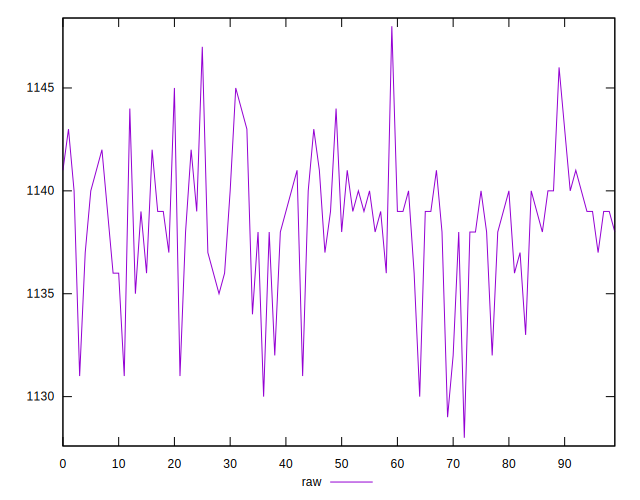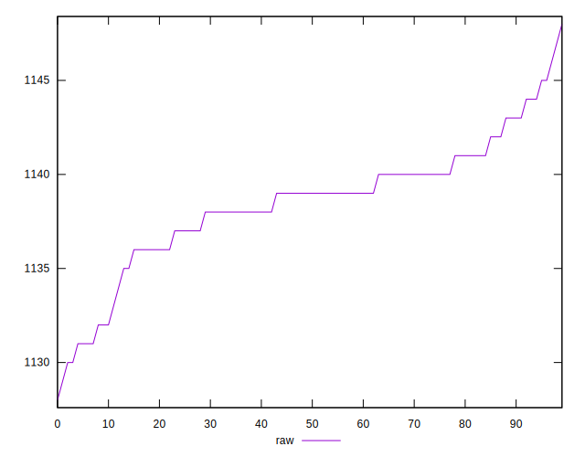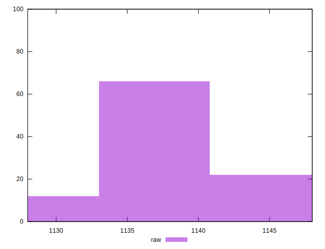
## Score


```yaml
p90min: 0.45
p90max: 0.46
p90range: 0.010000000000000009
p90mean: 0.4508510638297876
median: 0.45
p90stdev: 0.0027903993720434076
mad: 0
stdevBySn: 0
lfitCenter: 0.4505875202992917
lfitStdev: 0.0013861711751478733
mfitCenter: 0.4505875202992917
mfitStdev: 0.0017373079323002231
mfitConfidence: 0.0001737307932300223
p90skewness: 2.9737221214852676
p90eccentricity: 0.9999999999999991
p90discretization: 47
outlandishness: 1.0011045993451018

```

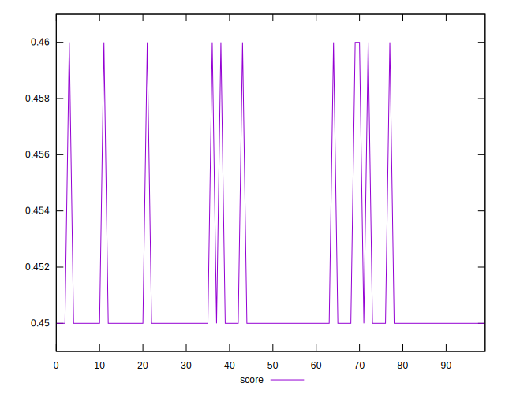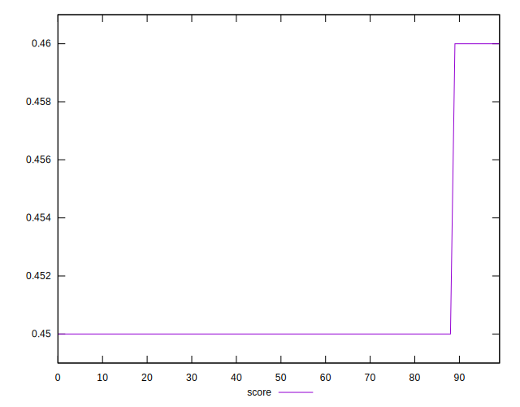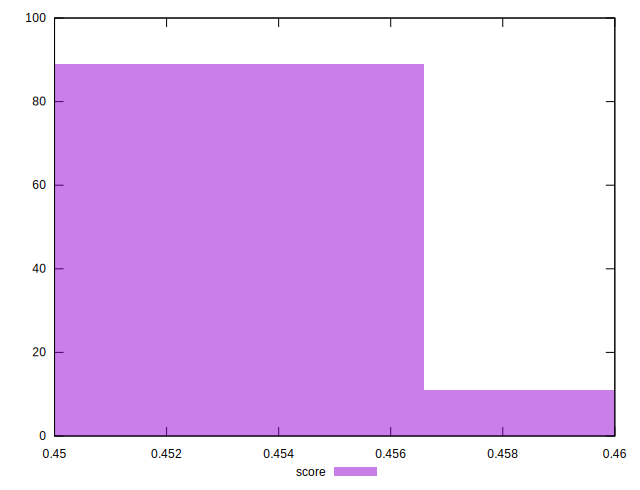
## Raw Estimate

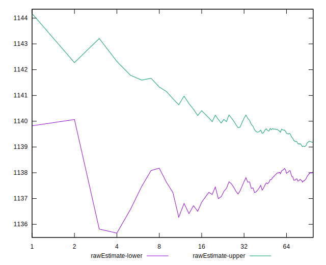
## Score Estimate

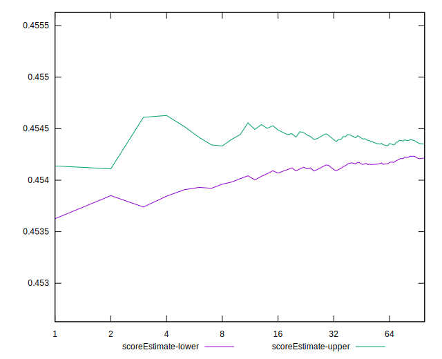
## P Score


```yaml
p90min: 0.4535294117647059
p90max: 0.45529411764705885
p90range: 0.001764705882352946
p90mean: 0.4542978723404256
median: 0.45423529411764707
p90stdev: 0.0003723104498824572
mad: 0.00023529411764705577
stdevBySn: 0.00035076470588233185
lfitCenter: 0.454283395601977
lfitStdev: 0.00027509809458466404
mfitCenter: 0.454283395601977
mfitStdev: 0.00034478433143845274
mfitConfidence: 0.00003447843314384527
p90skewness: 0.6114425919990385
p90eccentricity: 1.0000000000000004
p90discretization: 5.875
outlandishness: 1.0000145461485932

```

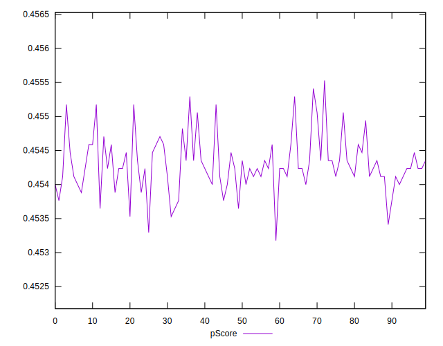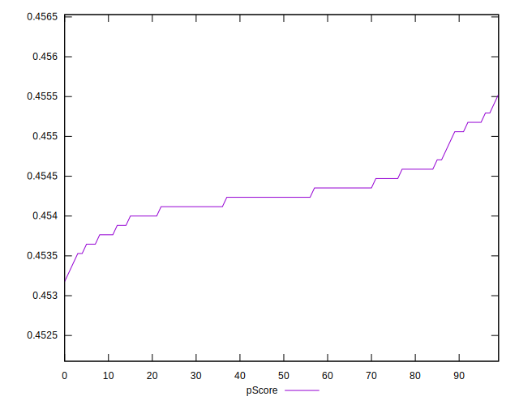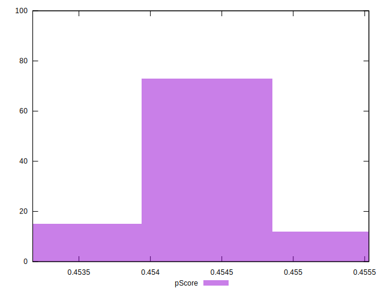
## Score Difference


```yaml
p90min: 0
p90max: 0
p90range: 0
p90mean: 0
median: 0
p90stdev: 0
mad: 0
stdevBySn: 0
lfitCenter: 0
lfitStdev: 0
mfitCenter: 0
mfitStdev: 0
mfitConfidence: 0
p90skewness: .nan
p90eccentricity: .nan
p90discretization: 94
outlandishness: .nan

```


## P Score Difference


```yaml
p90min: -0.0048235294117647265
p90max: 0.004705882352941171
p90range: 0.009529411764705897
p90mean: 0.003409261576971201
median: 0.004235294117647059
p90stdev: 0.0024967314994496946
mad: 0.00023529411764705577
stdevBySn: 0.00035076470588233185
lfitCenter: 0.003649210119989011
lfitStdev: 0.0012611625044754034
mfitCenter: 0.003649210119989011
mfitStdev: 0.0015806327979017458
mfitConfidence: 0.00015806327979017457
p90skewness: -2.904233087941425
p90eccentricity: 1.000000000000001
p90discretization: 5.222222222222222
outlandishness: 0.8816548162199914

```

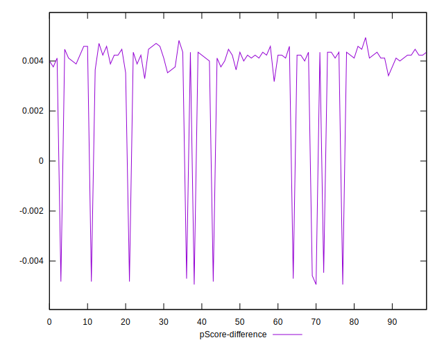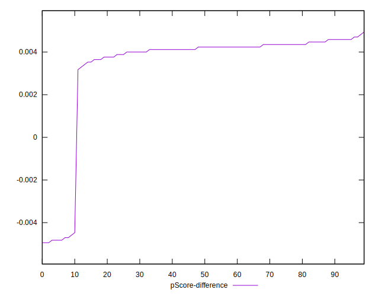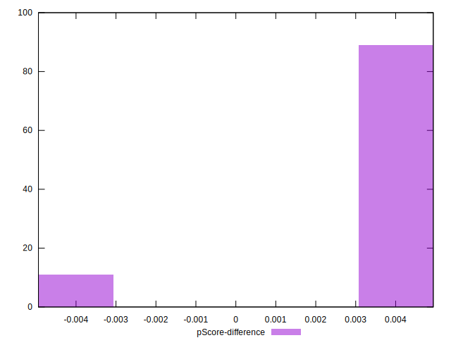