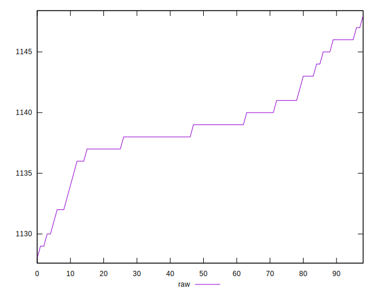
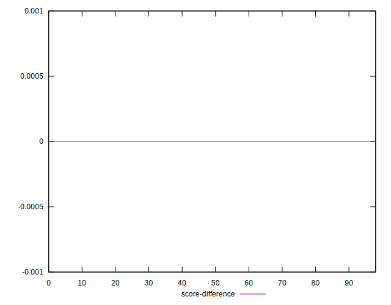

# //uses-rel-preload/samples/card

[→ Parent](../..)


## Raw


```yaml
p90min: 1130
p90max: 1146
p90range: 16
p90mean: 1139.0537634408602
median: 1139
p90stdev: 3.5206475192487643
mad: 2
stdevBySn: 2.3852
lfitCenter: 1138.9285982078386
lfitStdev: 2.471491252108594
mfitCenter: 1138.9285982078386
mfitStdev: 3.0975549296361793
mfitConfidence: 0.3113159839126948
p90skewness: -0.0327567862372517
p90eccentricity: 0.9999999999999988
p90discretization: 5.470588235294118
outlandishness: 0.9998878671707425

```


## Score


```yaml
p90min: 0.45
p90max: 0.46
p90range: 0.010000000000000009
p90mean: 0.45064516129032284
median: 0.45
p90stdev: 0.0024567010018915862
mad: 0
stdevBySn: 0
lfitCenter: 0.4504724118573126
lfitStdev: 0.00112821975404483
mfitCenter: 0.4504724118573126
mfitStdev: 0.0014140137691658428
mfitConfidence: 0.00014211373093088824
p90skewness: 3.545273687212075
p90eccentricity: 0.9999999999999989
p90discretization: 46.5
outlandishness: 1.001171684195702

```


## Raw Estimate


## Score Estimate


## P Score


```yaml
p90min: 0.45341176470588235
p90max: 0.45529411764705885
p90range: 0.0018823529411765016
p90mean: 0.45422896900695786
median: 0.45423529411764707
p90stdev: 0.00041419382579396927
mad: 0.00023529411764705577
stdevBySn: 0.00028061176470587875
lfitCenter: 0.45424369432848966
lfitStdev: 0.00029076367671865717
mfitCenter: 0.45424369432848966
mfitStdev: 0.0003644182270160199
mfitConfidence: 0.000036625409872081624
p90skewness: 0.03275678623475825
p90eccentricity: 0.9999999999999999
p90discretization: 5.470588235294118
outlandishness: 1.000033082552951

```


## Score Difference


```yaml
p90min: 0
p90max: 0
p90range: 0
p90mean: 0
median: 0
p90stdev: 0
mad: 0
stdevBySn: 0
lfitCenter: 0
lfitStdev: 0
mfitCenter: 0
mfitStdev: 0
mfitConfidence: 0
p90skewness: .nan
p90eccentricity: .nan
p90discretization: 93
outlandishness: .nan

```


## P Score Difference


```yaml
p90min: -0.0048235294117647265
p90max: 0.004588235294117615
p90range: 0.009411764705882342
p90mean: 0.003545857052498407
median: 0.004235294117647059
p90stdev: 0.0021797480424462835
mad: 0.00023529411764705577
stdevBySn: 0.00028061176470587875
lfitCenter: 0.0037234729315125574
lfitStdev: 0.001077715314689229
mfitCenter: 0.0037234729315125574
mfitStdev: 0.0013507158412605815
mfitConfidence: 0.00013575204981365437
p90skewness: -3.395890709381755
p90eccentricity: 1.0000000000000009
p90discretization: 5.470588235294118
outlandishness: 0.8805730203217739

```

