# //uses-rel-preload/samples/music

[→ Parent](../..)


## Raw


```yaml
p90min: 1200
p90max: 1243
p90range: 43
p90mean: 1225.1808510638298
median: 1226
p90stdev: 8.446279258836014
mad: 4
stdevBySn: 7.155600000000001
lfitCenter: 1226.6466671153644
lfitStdev: 9.751016128041648
mfitCenter: 1226.6466671153644
mfitStdev: 12.221086378763424
mfitConfidence: 1.2221086378763424
p90skewness: -0.5795163830099155
p90eccentricity: 1.000000000000001
p90discretization: 2.9375
outlandishness: 1.0039529466491852

```

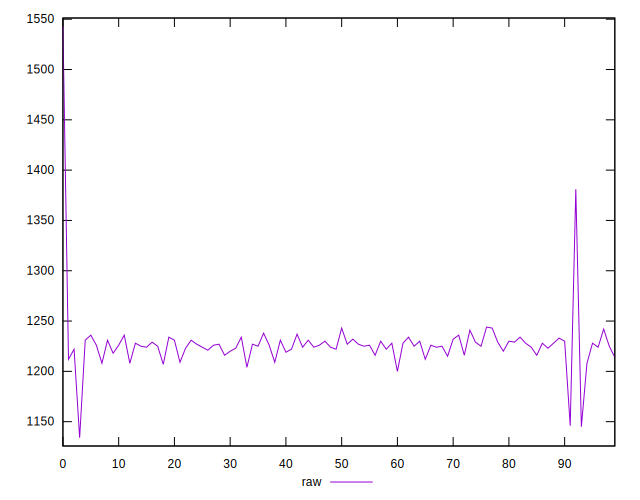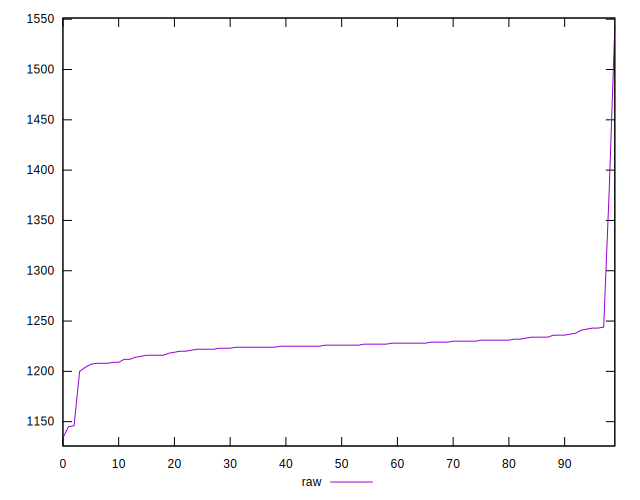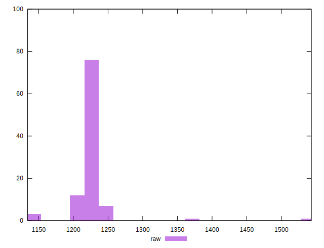
## Score


```yaml
p90min: 0.44
p90max: 0.45
p90range: 0.010000000000000009
p90mean: 0.4417021276595745
median: 0.44
p90stdev: 0.0037581961133309996
mad: 0
stdevBySn: 0
lfitCenter: 0.4409558075934742
lfitStdev: 0.002591661789487427
mfitCenter: 0.4409558075934742
mfitStdev: 0.0032481663631734234
mfitConfidence: 0.00032481663631734237
p90skewness: 1.755029402924143
p90eccentricity: 1.0000000000000022
p90discretization: 47
outlandishness: 0.9990849878276734

```

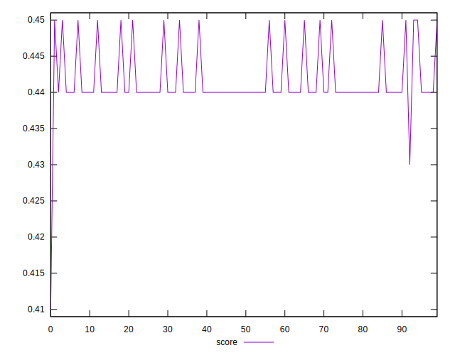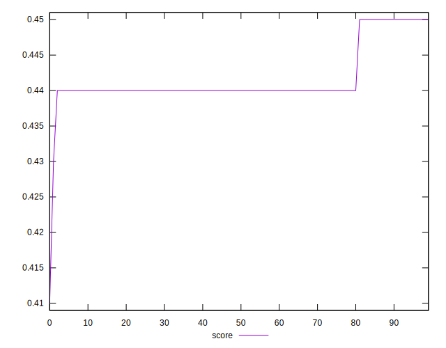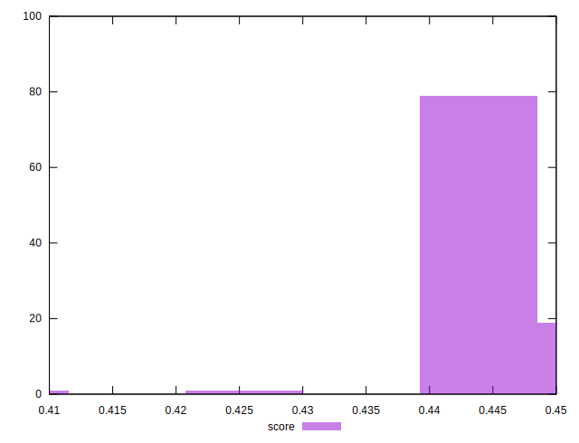
## Raw Estimate

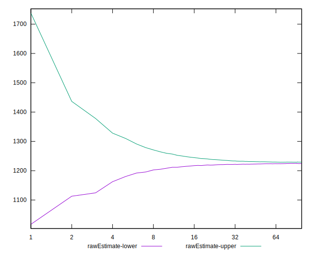
## Score Estimate

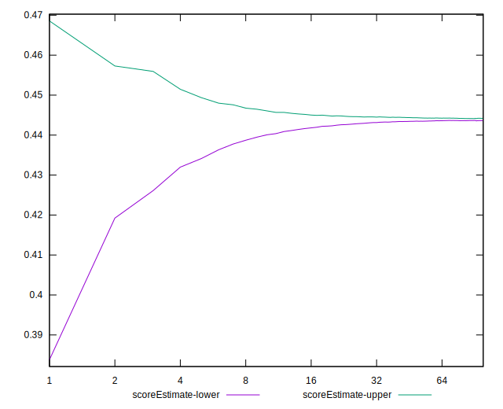
## P Score


```yaml
p90min: 0.442
p90max: 0.4470588235294118
p90range: 0.005058823529411782
p90mean: 0.4440963704630789
median: 0.444
p90stdev: 0.0009936799128042355
mad: 0.00047058823529411153
stdevBySn: 0.0008418352941176361
lfitCenter: 0.4439239215158399
lfitStdev: 0.0011471783680048228
mfitCenter: 0.4439239215158399
mfitStdev: 0.0014377748680897181
mfitConfidence: 0.0001437774868089718
p90skewness: 0.5795163830091743
p90eccentricity: 0.9999999999999994
p90discretization: 2.9375
outlandishness: 0.9987186809926597

```

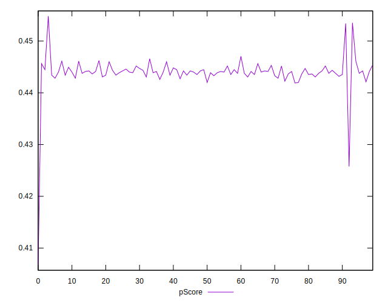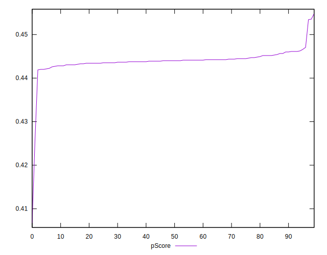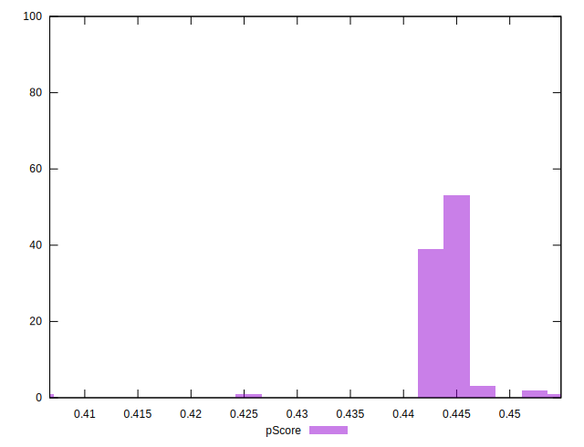
## Score Difference


```yaml
p90min: 0
p90max: 0
p90range: 0
p90mean: 0
median: 0
p90stdev: 0
mad: 0
stdevBySn: 0
lfitCenter: 2.583267684513104e-19
lfitStdev: 6.445158398659724e-19
mfitCenter: 2.583267684513104e-19
mfitStdev: 8.077808146406197e-19
mfitConfidence: 8.077808146406197e-20
p90skewness: .nan
p90eccentricity: .nan
p90discretization: 94
outlandishness: .inf

```


## P Score Difference


```yaml
p90min: -0.0048235294117647265
p90max: 0.004705882352941171
p90range: 0.009529411764705897
p90mean: 0.002458072590738417
median: 0.003647058823529392
p90stdev: 0.0028848916349320953
mad: 0.0005882352941176117
stdevBySn: 0.0008418352941176361
lfitCenter: 0.002837284467041073
lfitStdev: 0.00193501465398187
mfitCenter: 0.002837284467041073
mfitStdev: 0.0024251812241884592
mfitConfidence: 0.00024251812241884592
p90skewness: -1.721281524260472
p90eccentricity: 1.0000000000000004
p90discretization: 2.8484848484848486
outlandishness: 0.8845000254063982

```

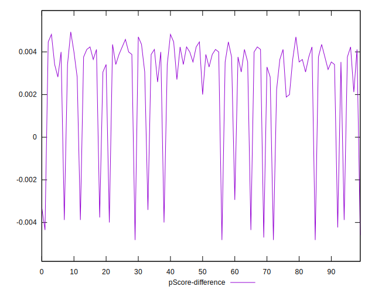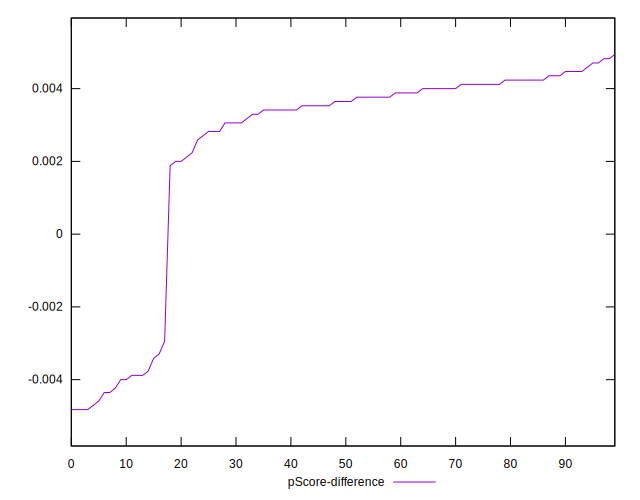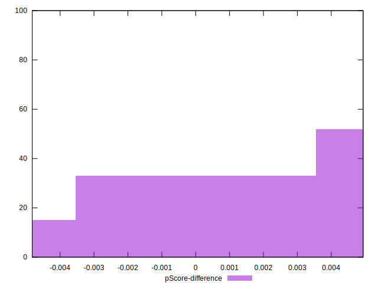