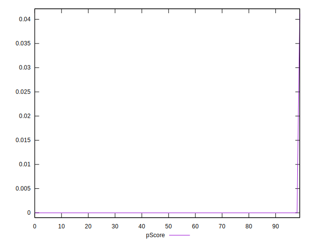
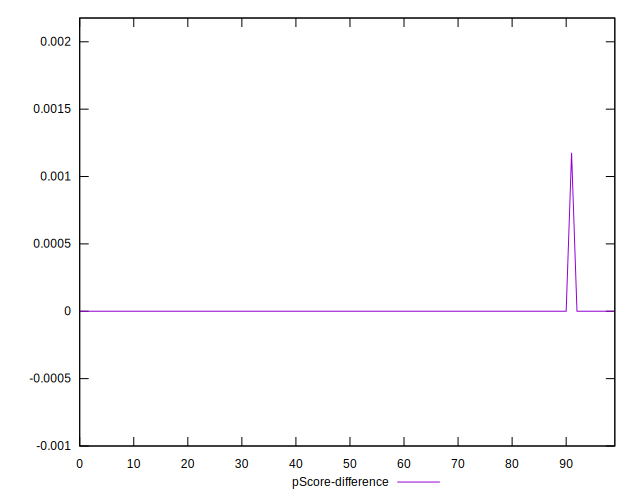

# //uses-text-compression/samples/astro

[→ Parent](../..)


## Raw


```yaml
p90min: 7950
p90max: 8400
p90range: 450
p90mean: 8195.212765957447
median: 8250
p90stdev: 95.502352910797
mad: 10
stdevBySn: 11.926000000000002
lfitCenter: 8183.891748256592
lfitStdev: 128.72500192549265
mfitCenter: 8183.891748256592
mfitStdev: 161.3328649015249
mfitConfidence: 16.133286490152493
p90skewness: -0.4989310377069275
p90eccentricity: 1.0000000000000002
p90discretization: 15.666666666666666
outlandishness: 0.9891906597294484

```


## Score


```yaml
p90min: 0
p90max: 0
p90range: 0
p90mean: 0
median: 0
p90stdev: 0
mad: 0
stdevBySn: 0
lfitCenter: 0.00018614405410194332
lfitStdev: 0.00046442260740076405
mfitCenter: 0.00018614405410194332
mfitStdev: 0.0005820674201300048
mfitConfidence: 0.00005820674201300048
p90skewness: .nan
p90eccentricity: .nan
p90discretization: 94
outlandishness: .inf

```


## Raw Estimate


## Score Estimate


## P Score


```yaml
p90min: 0
p90max: 0
p90range: 0
p90mean: 0
median: 0
p90stdev: 0
mad: 0
stdevBySn: 0
lfitCenter: 0.00019161887922258857
lfitStdev: 0.00047808209585372725
mfitCenter: 0.00019161887922258857
mfitStdev: 0.0005991870501338279
mfitConfidence: 0.00005991870501338279
p90skewness: .nan
p90eccentricity: .nan
p90discretization: 94
outlandishness: .inf

```


## Score Difference


```yaml
p90min: 0
p90max: 0
p90range: 0
p90mean: 0
median: 0
p90stdev: 0
mad: 0
stdevBySn: 0
lfitCenter: 0
lfitStdev: 0
mfitCenter: 0
mfitStdev: 0
mfitConfidence: 0
p90skewness: .nan
p90eccentricity: .nan
p90discretization: 94
outlandishness: .nan

```


## P Score Difference


```yaml
p90min: 0
p90max: 0
p90range: 0
p90mean: 0
median: 0
p90stdev: 0
mad: 0
stdevBySn: 0
lfitCenter: 0.000005474825120645223
lfitStdev: 0.000013659488452963226
mfitCenter: 0.000005474825120645223
mfitStdev: 0.00001711963000382314
mfitConfidence: 0.0000017119630003823142
p90skewness: .nan
p90eccentricity: .nan
p90discretization: 94
outlandishness: .inf

```

