# //uses-text-compression/samples/card

[→ Parent](../..)


## Raw


```yaml
p90min: 150
p90max: 450
p90range: 300
p90mean: 229.3548387096774
median: 150
p90stdev: 109.96388900538685
mad: 0
stdevBySn: 0
lfitCenter: 213.12296507295147
lfitStdev: 110.30217417885112
mfitCenter: 213.12296507295147
mfitStdev: 138.2432744140971
mfitConfidence: 13.893971849142389
p90skewness: 0.8584960586737115
p90eccentricity: 1.0000000000000009
p90discretization: 13.285714285714286
outlandishness: 1.0448743737087183

```

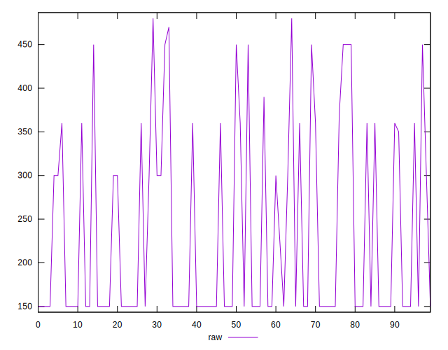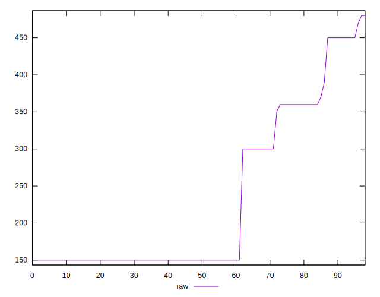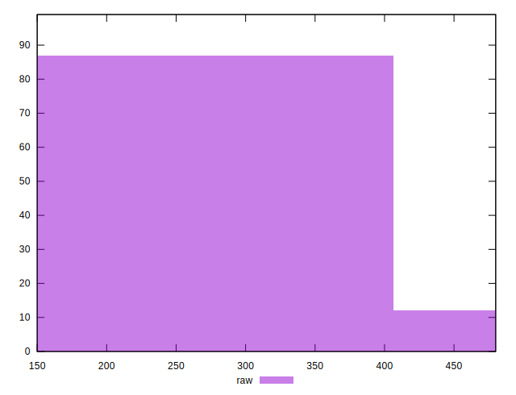
## Score


```yaml
p90min: 0.67
p90max: 0.88
p90range: 0.20999999999999996
p90mean: 0.8195698924731184
median: 0.88
p90stdev: 0.08167485995978693
mad: 0
stdevBySn: 0
lfitCenter: 0.8312878899639957
lfitStdev: 0.08512039381548434
mfitCenter: 0.8312878899639957
mfitStdev: 0.10668259305015795
mfitConfidence: 0.010722004024531835
p90skewness: -0.7167896093382767
p90eccentricity: 1.0000000000000009
p90discretization: 15.5
outlandishness: 0.992191063852207

```

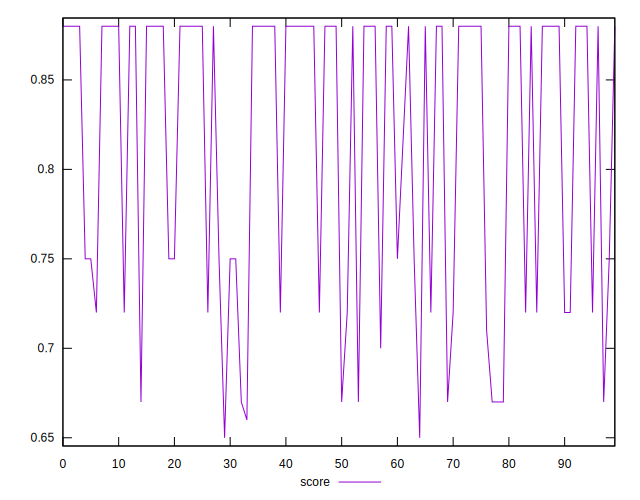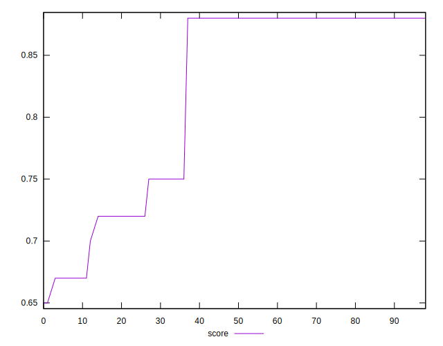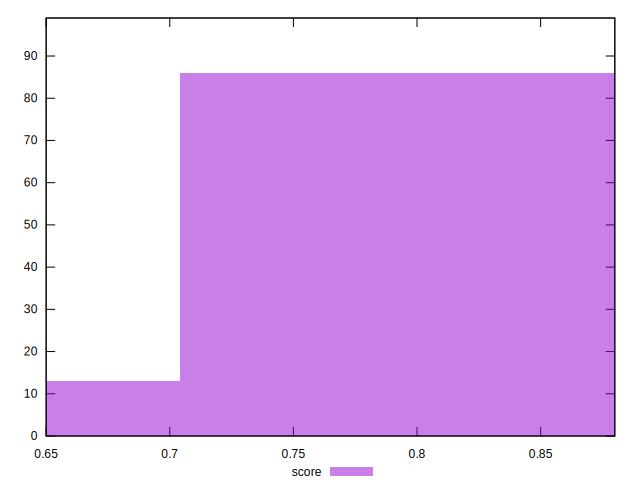
## Raw Estimate

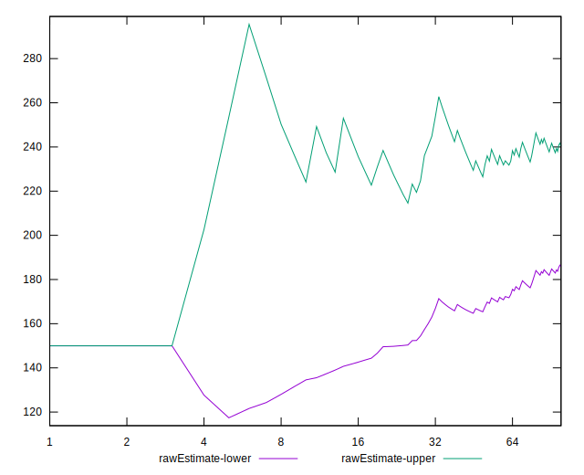
## Score Estimate

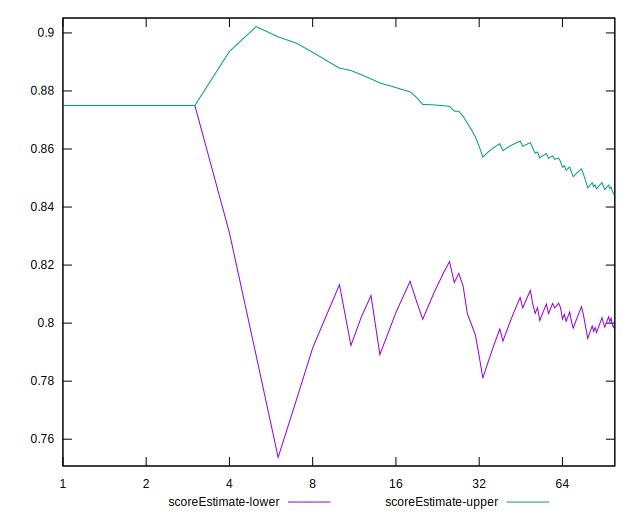
## P Score


```yaml
p90min: 0.6666666666666666
p90max: 0.875
p90range: 0.20833333333333337
p90mean: 0.8156810035842296
median: 0.875
p90stdev: 0.0804082874607377
mad: 0
stdevBySn: 0
lfitCenter: 0.827311632896731
lfitStdev: 0.08333148749350741
mfitCenter: 0.827311632896731
mfitStdev: 0.10444053146423514
mfitConfidence: 0.010496668356732589
p90skewness: -0.7333200330403539
p90eccentricity: 1.0000000000000009
p90discretization: 13.285714285714286
outlandishness: 0.9922498468881281

```

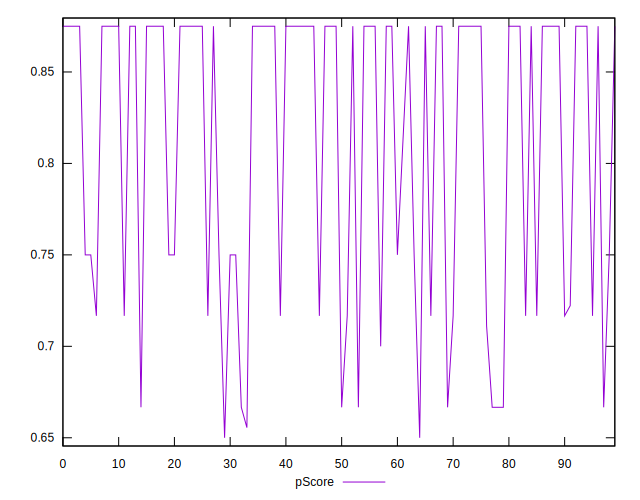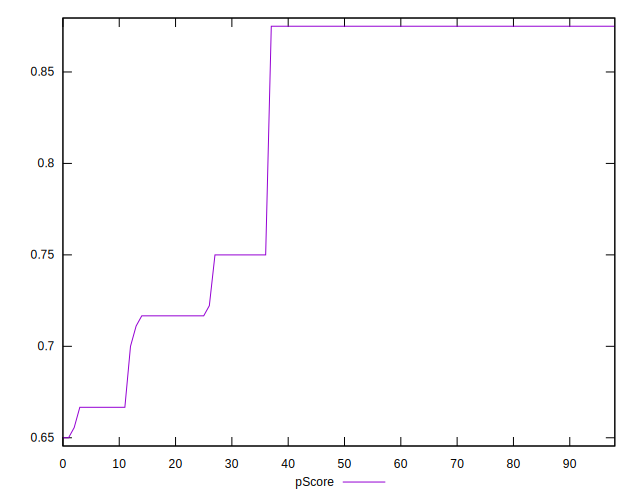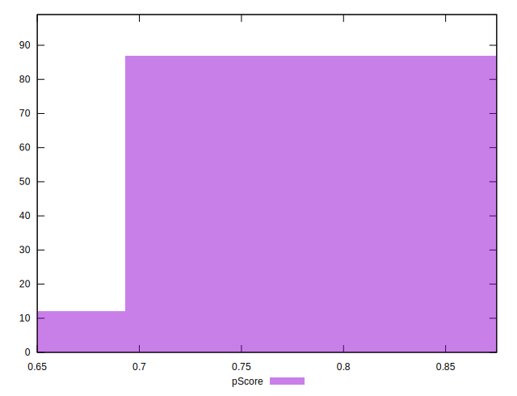
## Score Difference


```yaml
p90min: 0
p90max: 0
p90range: 0
p90mean: 0
median: 0
p90stdev: 0
mad: 0
stdevBySn: 0
lfitCenter: 5.21847134031707e-19
lfitStdev: 1.3019283231074932e-18
mfitCenter: 5.21847134031707e-19
mfitStdev: 1.631725174763995e-18
mfitConfidence: 1.6399455047482617e-19
p90skewness: .nan
p90eccentricity: .nan
p90discretization: 93
outlandishness: .inf

```

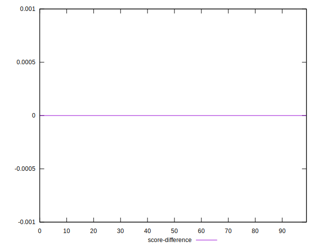
## P Score Difference


```yaml
p90min: -0.0050000000000000044
p90max: 0
p90range: 0.0050000000000000044
p90mean: -0.003972520908004785
median: -0.0050000000000000044
p90stdev: 0.0016735148763641322
mad: 0
stdevBySn: 0
lfitCenter: -0.004207352630378545
lfitStdev: 0.001392890860455591
mfitCenter: -0.004207352630378545
mfitStdev: 0.0017457298089031716
mfitConfidence: 0.00017545244731729254
p90skewness: 1.5913858574420998
p90eccentricity: 0.9999999999999984
p90discretization: 18.6
outlandishness: 0.9390753671186807

```

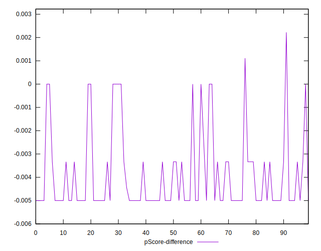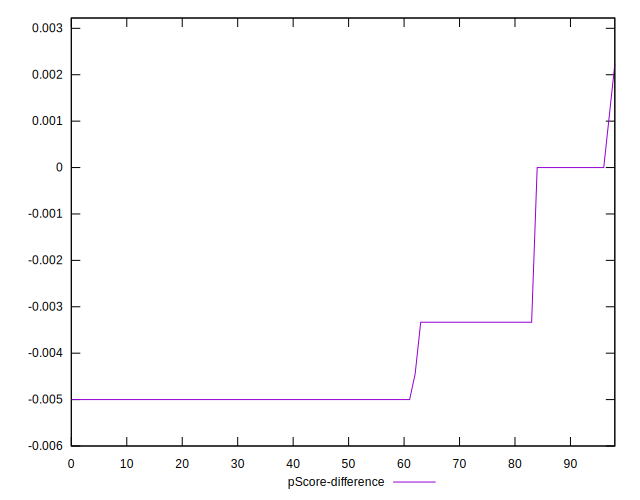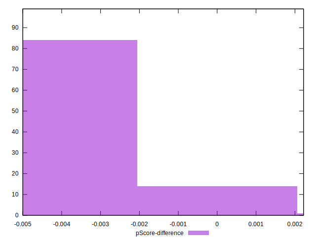