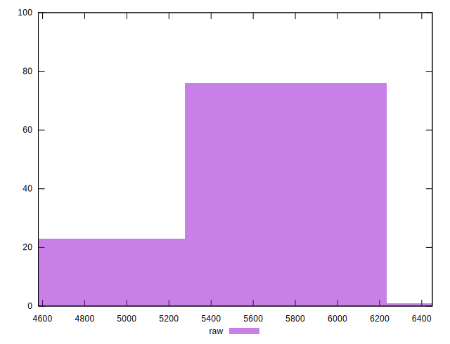
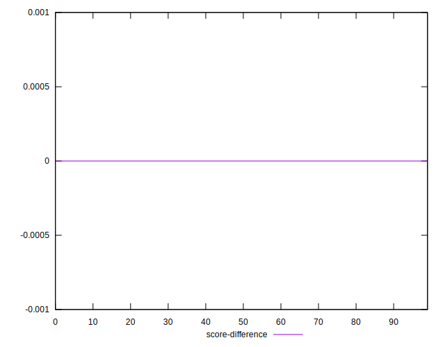

# //uses-text-compression/samples/music

[→ Parent](../..)


## Raw


```yaml
p90min: 4930
p90max: 6160
p90range: 1230
p90mean: 5759.36170212766
median: 6000
p90stdev: 389.7566303139671
mad: 10
stdevBySn: 11.926000000000002
lfitCenter: 5811.501640304518
lfitStdev: 380.16735128885705
mfitCenter: 5811.501640304518
mfitStdev: 476.46911639555606
mfitConfidence: 47.646911639555604
p90skewness: -0.8594095505535138
p90eccentricity: 1.0000000000000002
p90discretization: 2.9375
outlandishness: 0.9934261853848932

```


## Score


```yaml
p90min: 0
p90max: 0.01
p90range: 0.01
p90mean: 0.00010638297872340425
median: 0
p90stdev: 0.0010259202937226554
mad: 0
stdevBySn: 0
lfitCenter: 0.0006691029059426981
lfitStdev: 0.0016446970661923492
mfitCenter: 0.0006691029059426981
mfitStdev: 0.0020613220867343883
mfitConfidence: 0.00020613220867343884
p90skewness: 9.539955591519895
p90eccentricity: 0.9999999999999991
p90discretization: 47
outlandishness: 173.18560000000005

```


## Raw Estimate


## Score Estimate


## P Score


```yaml
p90min: 0
p90max: 0.008235294117647063
p90range: 0.008235294117647063
p90mean: 0.00010012515644555682
median: 0
p90stdev: 0.0008521674358222389
mad: 0
stdevBySn: 0
lfitCenter: 0.0006697111952125973
lfitStdev: 0.0016375047504452011
mfitCenter: 0.0006697111952125973
mfitStdev: 0.00205230785571938
mfitConfidence: 0.000205230785571938
p90skewness: 9.275289040956078
p90eccentricity: 0.9999999999999982
p90discretization: 31.333333333333332
outlandishness: 195.51030625000035

```


## Score Difference


```yaml
p90min: 0
p90max: 0
p90range: 0
p90mean: 0
median: 0
p90stdev: 0
mad: 0
stdevBySn: 0
lfitCenter: 0
lfitStdev: 0
mfitCenter: 0
mfitStdev: 0
mfitConfidence: 0
p90skewness: .nan
p90eccentricity: .nan
p90discretization: 94
outlandishness: .nan

```


## P Score Difference


```yaml
p90min: 0
p90max: 0
p90range: 0
p90mean: 0
median: 0
p90stdev: 0
mad: 0
stdevBySn: 0
lfitCenter: -2.2110317866385892e-7
lfitStdev: 0.00006266668700730302
mfitCenter: -2.2110317866385892e-7
mfitStdev: 0.00007854104484400978
mfitConfidence: 0.000007854104484400977
p90skewness: .nan
p90eccentricity: .nan
p90discretization: 94
outlandishness: .inf

```

