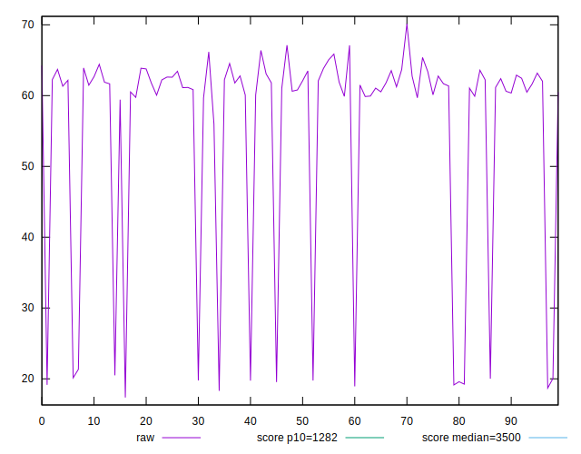
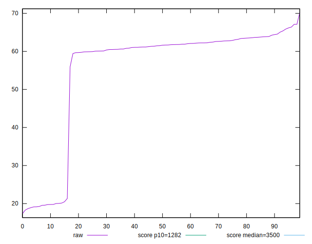
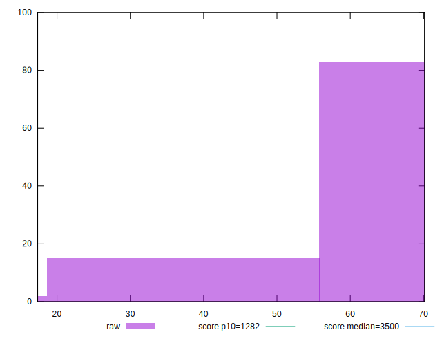
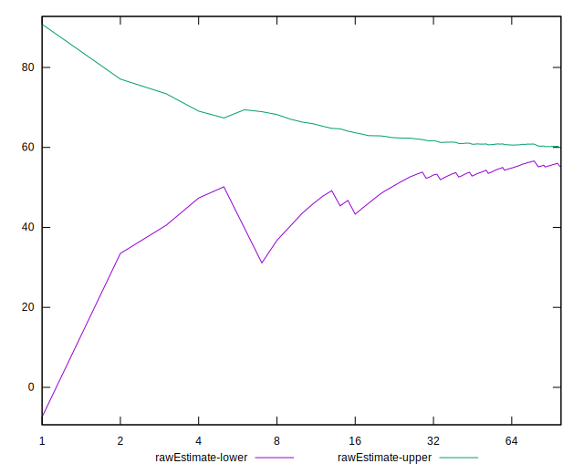
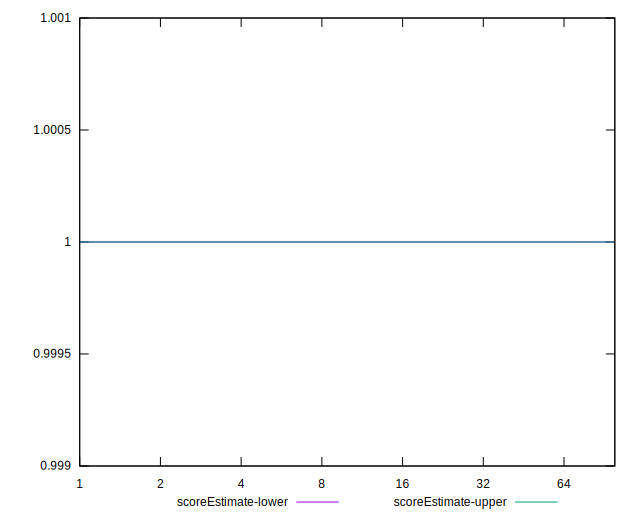
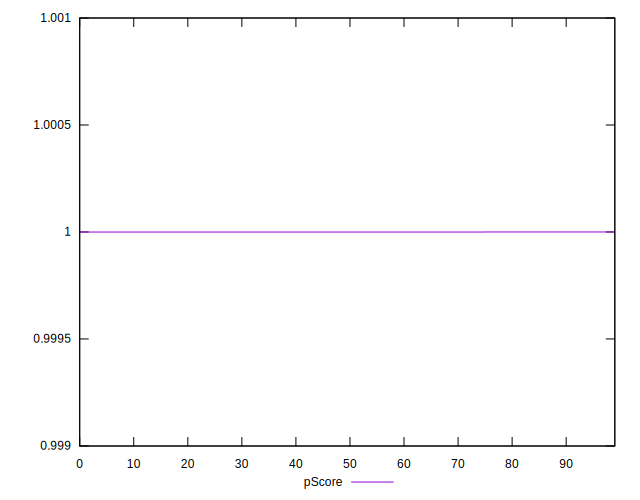
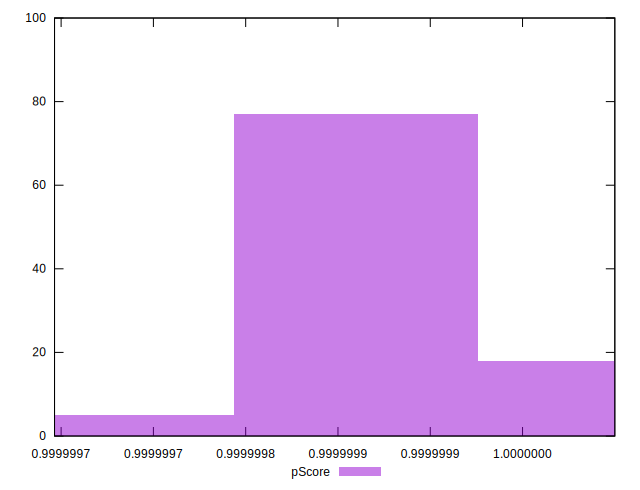
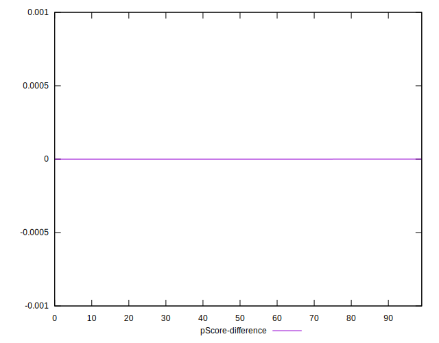
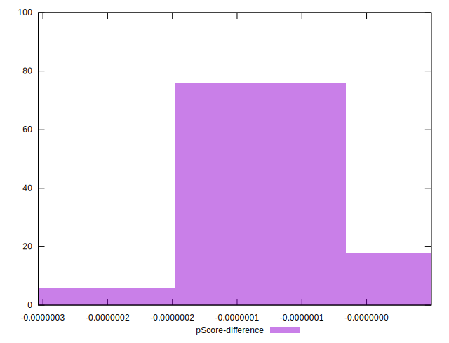

# //bootup-time/samples/agenda

[→ Parent](../..)


## Raw


```yaml
p90min: 18.927999999999997
p90max: 66.38399999999999
p90range: 47.45599999999999
p90mean: 55.699999999999974
median: 61.56399999999999
p90stdev: 15.115634988527038
mad: 1.504000000000012
stdevBySn: 2.739402200000001
lfitCenter: 57.65449907750029
lfitStdev: 9.497089572622233
mfitCenter: 57.65449907750029
mfitStdev: 11.902836636696208
mfitConfidence: 1.1902836636696208
p90skewness: -1.9253772105337832
p90eccentricity: 1.0000000000000002
p90discretization: 1
outlandishness: 0.9730784665911577

```


## Score


```yaml
p90min: 1
p90max: 1
p90range: 0
p90mean: 1
median: 1
p90stdev: 0
mad: 0
stdevBySn: 0
lfitCenter: 1
lfitStdev: 0
mfitCenter: 1
mfitStdev: 0
mfitConfidence: 0
p90skewness: .nan
p90eccentricity: .nan
p90discretization: 94
outlandishness: 1

```


## Raw Estimate


## Score Estimate


## P Score


```yaml
p90min: 0.999999789431114
p90max: 0.9999999999862927
p90range: 2.105551787368043e-7
p90mean: 0.9999998854095875
median: 0.9999998733888953
p90stdev: 5.3603071301439484e-8
mad: 2.0437151415642063e-8
stdevBySn: 3.80073659470348e-8
lfitCenter: 0.9999998807218782
lfitStdev: 3.610484112429125e-8
mfitCenter: 0.9999998807218782
mfitStdev: 4.525070785213747e-8
mfitConfidence: 4.5250707852137464e-9
p90skewness: 1.120094900704443
p90eccentricity: 1
p90discretization: 1.0217391304347827
outlandishness: 0.9999999986195596

```


## Score Difference


```yaml
p90min: 0
p90max: 0
p90range: 0
p90mean: 0
median: 0
p90stdev: 0
mad: 0
stdevBySn: 0
lfitCenter: 0
lfitStdev: 0
mfitCenter: 0
mfitStdev: 0
mfitConfidence: 0
p90skewness: .nan
p90eccentricity: .nan
p90discretization: 94
outlandishness: .nan

```


## P Score Difference


```yaml
p90min: -2.1056888599435553e-7
p90max: -1.3707257551232033e-11
p90range: 2.105551787368043e-7
p90mean: -1.145904128417792e-7
median: -1.2661110471157144e-7
p90stdev: 5.36030713014395e-8
mad: 2.0437151415642063e-8
stdevBySn: 3.80073659470348e-8
lfitCenter: -1.1927812205632492e-7
lfitStdev: 3.610484103042343e-8
mfitCenter: -1.1927812205632492e-7
mfitStdev: 4.52507077344916e-8
mfitConfidence: 4.52507077344916e-9
p90skewness: 1.1200949264841842
p90eccentricity: 0.9999999999999996
p90discretization: 1.0217391304347827
outlandishness: 1.012083014539879

```

