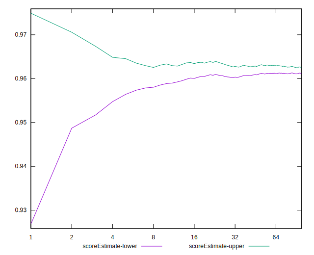

# //bootup-time/samples/astro

[→ Parent](../..)


## Raw


```yaml
p90min: 827.0639999999999
p90max: 906.096
p90range: 79.03200000000015
p90mean: 870.3706808510638
median: 876.9660000000002
p90stdev: 22.92989818862476
mad: 19.677999999999884
stdevBySn: 27.80069859999984
lfitCenter: 871.8574132564295
lfitStdev: 22.692931789226297
mfitCenter: 871.8574132564295
mfitStdev: 28.441372257192565
mfitConfidence: 2.8441372257192565
p90skewness: -0.2790914058042254
p90eccentricity: 0.9999999999999999
p90discretization: 1
outlandishness: 1.0018374841058

```


## Score


```yaml
p90min: 0.96
p90max: 0.97
p90range: 0.010000000000000009
p90mean: 0.9624468085106369
median: 0.96
p90stdev: 0.004298978159824848
mad: 0
stdevBySn: 0
lfitCenter: 0.961653593028437
lfitStdev: 0.003654257301609835
mfitCenter: 0.961653593028437
mfitStdev: 0.004579932342104521
mfitConfidence: 0.0004579932342104521
p90skewness: 1.1878131939464982
p90eccentricity: 0.9999999999999979
p90discretization: 47
outlandishness: 0.9999027325521559

```


## Raw Estimate


## Score Estimate


## P Score


```yaml
p90min: 0.9576792875113946
p90max: 0.9671761262979928
p90range: 0.009496838786598127
p90mean: 0.9620622472587582
median: 0.9613074787690044
p90stdev: 0.0027585399690694796
mad: 0.002419971970057888
stdevBySn: 0.0033555972736038398
lfitCenter: 0.9618790557937816
lfitStdev: 0.0027361342142314476
mfitCenter: 0.9618790557937816
mfitStdev: 0.0034292356957395537
mfitConfidence: 0.00034292356957395535
p90skewness: 0.24921966920811867
p90eccentricity: 1.0000000000000002
p90discretization: 1.010752688172043
outlandishness: 0.9997290655817538

```


## Score Difference


```yaml
p90min: 0
p90max: 0
p90range: 0
p90mean: 0
median: 0
p90stdev: 0
mad: 0
stdevBySn: 0
lfitCenter: 5.166535369026208e-19
lfitStdev: 1.2890316797319448e-18
mfitCenter: 5.166535369026208e-19
mfitStdev: 1.6155616292812394e-18
mfitConfidence: 1.6155616292812395e-19
p90skewness: .nan
p90eccentricity: .nan
p90discretization: 94
outlandishness: .inf

```


## P Score Difference


```yaml
p90min: -0.004683595049051914
p90max: 0.004531519917001958
p90range: 0.009215114966053872
p90mean: -0.0005004776542601511
median: -0.0003014853292970243
p90stdev: 0.0025291329596938824
mad: 0.0018673221652784067
stdevBySn: 0.0028508270579452283
lfitCenter: -0.0004629010281387291
lfitStdev: 0.0020735992587416555
mfitCenter: -0.0004629010281387291
mfitStdev: 0.0025988712687229536
mfitConfidence: 0.00025988712687229537
p90skewness: 0.019249359681860787
p90eccentricity: 0.9999999999999996
p90discretization: 1.010752688172043
outlandishness: 0.8747588340163162

```

