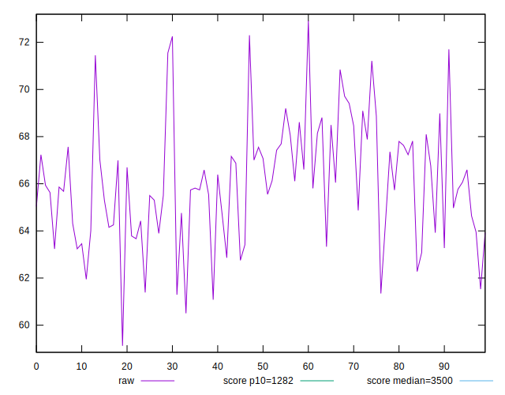
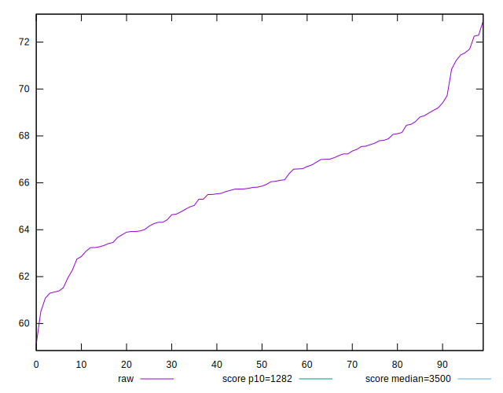
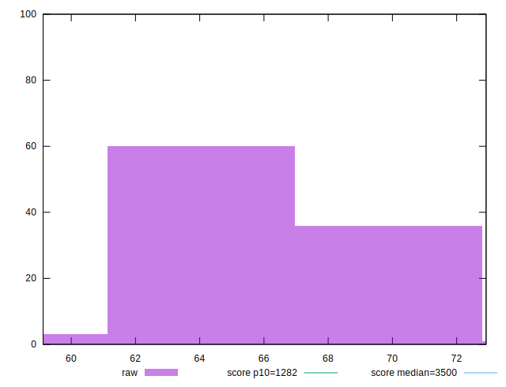
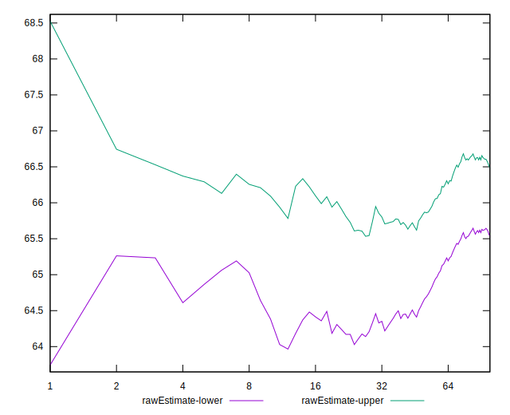
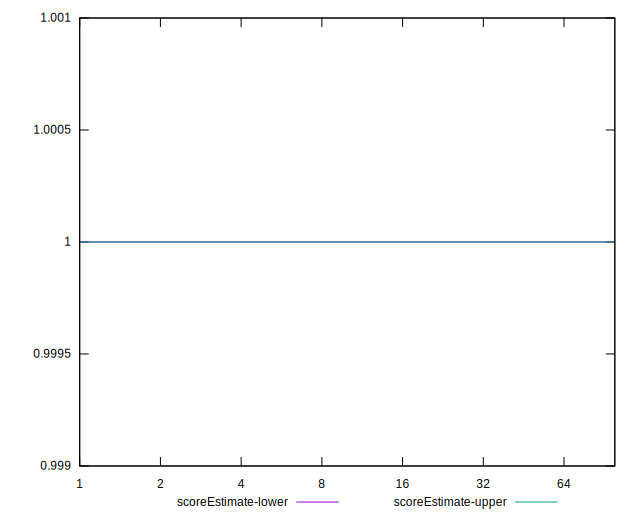
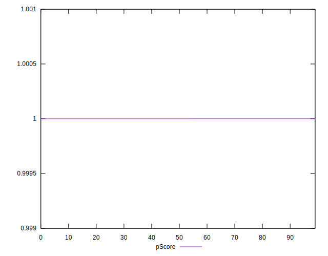
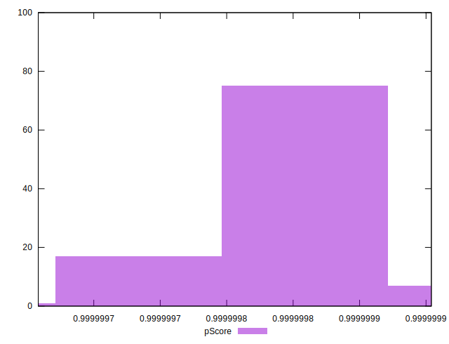
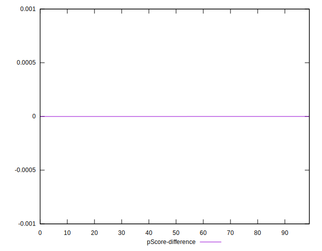
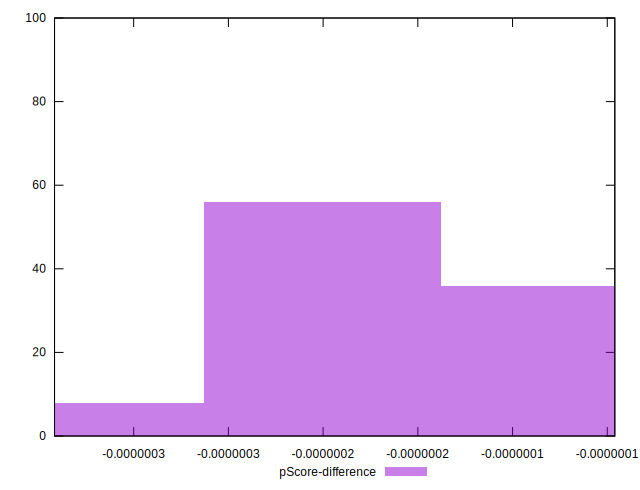

# //bootup-time/samples/card

[→ Parent](../..)


## Raw


```yaml
p90min: 61.29199999999997
p90max: 71.70400000000001
p90range: 10.412000000000035
p90mean: 66.0243404255319
median: 65.838
p90stdev: 2.3664711611280804
mad: 1.8099999999999952
stdevBySn: 2.70958719999999
lfitCenter: 66.00976297667434
lfitStdev: 1.9315851875309564
mfitCenter: 66.00976297667434
mfitStdev: 2.420883025397755
mfitConfidence: 0.24208830253977548
p90skewness: 0.21520545074956782
p90eccentricity: 1.0000000000000007
p90discretization: 1
outlandishness: 1.0006150063733896

```


## Score


```yaml
p90min: 1
p90max: 1
p90range: 0
p90mean: 1
median: 1
p90stdev: 0
mad: 0
stdevBySn: 0
lfitCenter: 1
lfitStdev: 0
mfitCenter: 1
mfitStdev: 0
mfitConfidence: 0
p90skewness: .nan
p90eccentricity: .nan
p90discretization: 94
outlandishness: 1

```


## Raw Estimate


## Score Estimate


## P Score


```yaml
p90min: 0.9999996489856509
p90max: 0.9999998771535372
p90range: 2.2816788636248475e-7
p90mean: 0.9999997921108926
median: 0.9999998007592346
p90stdev: 5.086337168756742e-8
mad: 3.58590468430009e-8
stdevBySn: 5.0383548148552616e-8
lfitCenter: 0.9999997933345028
lfitStdev: 4.11773174593953e-8
mfitCenter: 0.9999997933345028
mfitStdev: 5.160811416051878e-8
mfitConfidence: 5.160811416051878e-9
p90skewness: -0.7337870885185788
p90eccentricity: 1.0000000000000002
p90discretization: 1.032967032967033
outlandishness: 0.9999999957499734

```


## Score Difference


```yaml
p90min: 0
p90max: 0
p90range: 0
p90mean: 0
median: 0
p90stdev: 0
mad: 0
stdevBySn: 0
lfitCenter: 0
lfitStdev: 0
mfitCenter: 0
mfitStdev: 0
mfitConfidence: 0
p90skewness: .nan
p90eccentricity: .nan
p90discretization: 94
outlandishness: .nan

```


## P Score Difference


```yaml
p90min: -3.5101434914253105e-7
p90max: -1.228464627800463e-7
p90range: 2.2816788636248475e-7
p90mean: -2.078891076022582e-7
median: -1.9924076538613278e-7
p90stdev: 5.086337168756743e-8
mad: 3.5859046787489746e-8
stdevBySn: 5.0383548148552616e-8
lfitCenter: -2.0666549733915843e-7
lfitStdev: 4.117731750497336e-8
mfitCenter: -2.0666549733915843e-7
mfitStdev: 5.1608114217642414e-8
mfitConfidence: 5.160811421764241e-9
p90skewness: -0.7337870946488695
p90eccentricity: 0.9999999999999996
p90discretization: 1.032967032967033
outlandishness: 1.0205482027670318

```

