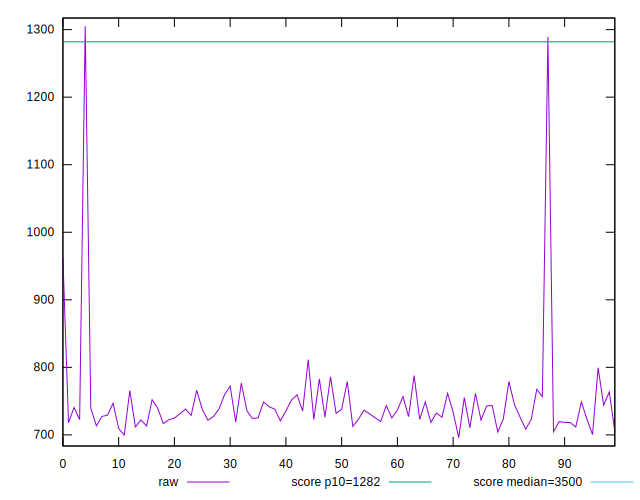

# //bootup-time/samples/music

[→ Parent](../..)


## Raw


```yaml
p90min: 704.34
p90max: 811.3840000000002
p90range: 107.04400000000021
p90mean: 737.4745957446814
median: 732.2200000000004
p90stdev: 22.11263626965417
mad: 12.581999999999823
stdevBySn: 20.949211600000037
lfitCenter: 741.505379074934
lfitStdev: 26.836918429594608
mfitCenter: 741.505379074934
mfitStdev: 33.63508930363887
mfitConfidence: 3.363508930363887
p90skewness: 1.0139249038936515
p90eccentricity: 1.0000000000000002
p90discretization: 1
outlandishness: 1.0335624781691728

```


## Score


```yaml
p90min: 0.97
p90max: 0.98
p90range: 0.010000000000000009
p90mean: 0.9778723404255317
median: 0.98
p90stdev: 0.00409263490673859
mad: 0
stdevBySn: 0
lfitCenter: 0.9777688040819207
lfitStdev: 0.004769013893871368
mfitCenter: 0.9777688040819207
mfitStdev: 0.005977072540257413
mfitConfidence: 0.0005977072540257414
p90skewness: -1.403663161257134
p90eccentricity: 0.9999999999999987
p90discretization: 47
outlandishness: 0.9963783937493239

```


## Raw Estimate


## Score Estimate


## P Score


```yaml
p90min: 0.9689264713045295
p90max: 0.9796107926099771
p90range: 0.010684321305447608
p90mean: 0.9764967772745667
median: 0.9770461656276956
p90stdev: 0.0021688312192291283
mad: 0.0011837003896608689
stdevBySn: 0.001960421791601703
lfitCenter: 0.9758626237850214
lfitStdev: 0.003097547136558777
mfitCenter: 0.9758626237850214
mfitStdev: 0.0038821996211566958
mfitConfidence: 0.00038821996211566955
p90skewness: -1.1288899918635669
p90eccentricity: 1.0000000000000002
p90discretization: 1
outlandishness: 0.9964471678336143

```


## Score Difference


```yaml
p90min: 0
p90max: 0
p90range: 0
p90mean: 0
median: 0
p90stdev: 0
mad: 0
stdevBySn: 0
lfitCenter: 5.166535369026208e-19
lfitStdev: 1.2890316797319448e-18
mfitCenter: 5.166535369026208e-19
mfitStdev: 1.6155616292812394e-18
mfitConfidence: 1.6155616292812395e-19
p90skewness: .nan
p90eccentricity: .nan
p90discretization: 94
outlandishness: .inf

```


## P Score Difference


```yaml
p90min: -0.004556920855539159
p90max: 0.004404077108494997
p90range: 0.008960997964034156
p90mean: -0.0014235339003207121
median: -0.002063426216265929
p90stdev: 0.0023325630394517853
mad: 0.001262623040067412
stdevBySn: 0.0018195162775413525
lfitCenter: -0.0016019972531326285
lfitStdev: 0.0017221693394722456
mfitCenter: -0.0016019972531326285
mfitStdev: 0.0021584191821837555
mfitConfidence: 0.00021584191821837556
p90skewness: 1.1183778827090618
p90eccentricity: 1.0000000000000007
p90discretization: 1
outlandishness: 0.8853294871974914

```

