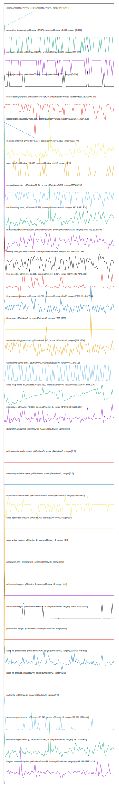

# //correlation/astro

[→ Parent](../..)

[0. score, p90stdev=0.045, score:p90stdev=0.045, range=[0.31:0.4]](../../meta/score/samples/astro)  
[1. unminified-javascript, p90stdev=67.871, score:p90stdev=0.054, range=[0:300]](../../unminified-javascript/samples/astro/)  
[2. unused-css-rules, p90stdev=59.021, score:p90stdev=0.031, range=[300:600]](../../unused-css-rules/samples/astro/)  
[3. legacy-javascript, p90stdev=33.662, score:p90stdev=0.027, range=[0:150]](../../legacy-javascript/samples/astro/)  
[4. first-meaningful-paint, p90stdev=193.514, score:p90stdev=0.026, range=[4116.095:5708.268]](../../first-meaningful-paint/samples/astro/)  
[5. speed-index, p90stdev=642.455, score:p90stdev=0.025, range=[9739.367:11024.276]](../../speed-index/samples/astro/)  
[6. max-potential-fid, p90stdev=6.377, score:p90stdev=0.012, range=[321:408]](../../max-potential-fid/samples/astro/)  
[7. uses-http2, p90stdev=15.657, score:p90stdev=0.012, range=[0:70]](../../uses-http2/samples/astro/)  
[8. unused-javascript, p90stdev=89.24, score:p90stdev=0.012, range=[3150:4210]](../../unused-javascript/samples/astro/)  
[9. total-blocking-time, p90stdev=7.774, score:p90stdev=0.011, range=[362.5:652.824]](../../total-blocking-time/samples/astro/)  
[10. mainthread-work-breakdown, p90stdev=26.184, score:p90stdev=0.005, range=[2030.732:2839.796]](../../mainthread-work-breakdown/samples/astro/)  
[11. bootup-time, p90stdev=22.93, score:p90stdev=0.004, range=[790.948:1035.296]](../../bootup-time/samples/astro/)  
[12. first-cpu-idle, p90stdev=37.591, score:p90stdev=0.004, range=[6900.136:7875.785]](../../first-cpu-idle/samples/astro/)  
[13. first-contentful-paint, p90stdev=11.238, score:p90stdev=0.002, range=[2536.114:2627.94]](../../first-contentful-paint/samples/astro/)  
[14. dom-size, p90stdev=0, score:p90stdev=0, range=[1287:1288]](../../dom-size/samples/astro/)  
[15. render-blocking-resources, p90stdev=9.143, score:p90stdev=0, range=[862:1780]](../../render-blocking-resources/samples/astro/)  
[16. cumulative-layout-shift, p90stdev=0, score:p90stdev=0, range=[0.113:0.113]](../../cumulative-layout-shift/samples/astro/)  
[17. uses-long-cache-ttl, p90stdev=3205.922, score:p90stdev=0, range=[956172.96:973775.074]](../../uses-long-cache-ttl/samples/astro/)  
[18. interactive, p90stdev=49.592, score:p90stdev=0, range=[14866.12:15180.987]](../../interactive/samples/astro/)  
[19. uses-passive-event-listeners, p90stdev=NaN, score:p90stdev=0, range=[NaN:NaN]](../../uses-passive-event-listeners/samples/astro/)  
[20. no-document-write, p90stdev=NaN, score:p90stdev=0, range=[NaN:NaN]](../../no-document-write/samples/astro/)  
[21. duplicated-javascript, p90stdev=0, score:p90stdev=0, range=[0:0]](../../duplicated-javascript/samples/astro/)  
[22. efficient-animated-content, p90stdev=0, score:p90stdev=0, range=[0:0]](../../efficient-animated-content/samples/astro/)  
[23. uses-responsive-images, p90stdev=0, score:p90stdev=0, range=[0:0]](../../uses-responsive-images/samples/astro/)  
[24. uses-text-compression, p90stdev=70.697, score:p90stdev=0, range=[7950:8400]](../../uses-text-compression/samples/astro/)  
[25. uses-optimized-images, p90stdev=0, score:p90stdev=0, range=[0:0]](../../uses-optimized-images/samples/astro/)  
[26. uses-webp-images, p90stdev=0, score:p90stdev=0, range=[0:0]](../../uses-webp-images/samples/astro/)  
[27. unminified-css, p90stdev=0, score:p90stdev=0, range=[0:0]](../../unminified-css/samples/astro/)  
[28. offscreen-images, p90stdev=0, score:p90stdev=0, range=[0:0]](../../offscreen-images/samples/astro/)  
[29. total-byte-weight, p90stdev=2604.674, score:p90stdev=0, range=[1696734:1755526]](../../total-byte-weight/samples/astro/)  
[30. preload-lcp-image, p90stdev=0, score:p90stdev=0, range=[0:0]](../../preload-lcp-image/samples/astro/)  
[31. unsized-images, p90stdev=NaN, score:p90stdev=0, range=[NaN:NaN]](../../unsized-images/samples/astro/)  
[32. third-party-summary, p90stdev=NaN, score:p90stdev=0, range=[NaN:NaN]](../../third-party-summary/samples/astro/)  
[33. font-display, p90stdev=NaN, score:p90stdev=0, range=[NaN:NaN]](../../font-display/samples/astro/)  
[34. uses-rel-preconnect, p90stdev=0.499, score:p90stdev=0, range=[299.382:303.852]](../../uses-rel-preconnect/samples/astro/)  
[35. uses-rel-preload, p90stdev=0, score:p90stdev=0, range=[0:0]](../../uses-rel-preload/samples/astro/)  
[36. redirects, p90stdev=0, score:p90stdev=0, range=[0:0]](../../redirects/samples/astro/)  
[37. server-response-time, p90stdev=82.649, score:p90stdev=0, range=[53.836:1078.403]](../../server-response-time/samples/astro/)  
[38. estimated-input-latency, p90stdev=1.395, score:p90stdev=0, range=[14.72:31.467]](../../estimated-input-latency/samples/astro/)  
[39. largest-contentful-paint, p90stdev=349.688, score:p90stdev=0, range=[8023.146:15852.823]](../../largest-contentful-paint/samples/astro/)  
[40. timing-budget, p90stdev=NaN, score:p90stdev=NaN, range=[NaN:NaN]](../../timing-budget/samples/astro/)  
[41. metrics, p90stdev=NaN, score:p90stdev=NaN, range=[NaN:NaN]](../../metrics/samples/astro/)  
[42. screenshot-thumbnails, p90stdev=NaN, score:p90stdev=NaN, range=[NaN:NaN]](../../screenshot-thumbnails/samples/astro/)  
