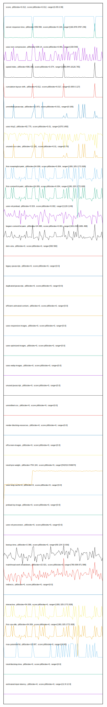

# //correlation/card

[→ Parent](../..)

[0. score, p90stdev=0.012, score:p90stdev=0.012, range=[0.85:0.99]](../../meta/score/samples/card)  
[1. server-response-time, p90stdev=259.558, score:p90stdev=0.103, range=[160.878:3787.246]](../../server-response-time/samples/card/)  
[2. uses-text-compression, p90stdev=109.14, score:p90stdev=0.081, range=[150:540]](../../uses-text-compression/samples/card/)  
[3. speed-index, p90stdev=596.303, score:p90stdev=0.074, range=[1586.844:10126.765]](../../speed-index/samples/card/)  
[4. cumulative-layout-shift, p90stdev=0.012, score:p90stdev=0.017, range=[0.005:0.127]](../../cumulative-layout-shift/samples/card/)  
[5. unminified-javascript, p90stdev=12.973, score:p90stdev=0.011, range=[0:100]](../../unminified-javascript/samples/card/)  
[6. uses-http2, p90stdev=82.775, score:p90stdev=0.01, range=[1070:1450]](../../uses-http2/samples/card/)  
[7. unused-css-rules, p90stdev=12.191, score:p90stdev=0.01, range=[0:70]](../../unused-css-rules/samples/card/)  
[8. first-meaningful-paint, p90stdev=54.009, score:p90stdev=0.004, range=[1381.325:1772.828]](../../first-meaningful-paint/samples/card/)  
[9. first-contentful-paint, p90stdev=54.009, score:p90stdev=0.004, range=[1381.325:1772.828]](../../first-contentful-paint/samples/card/)  
[10. uses-rel-preload, p90stdev=3.524, score:p90stdev=0.002, range=[1129:1149]](../../uses-rel-preload/samples/card/)  
[11. largest-contentful-paint, p90stdev=24.995, score:p90stdev=0.001, range=[1811.844:1981.468]](../../largest-contentful-paint/samples/card/)  
[12. dom-size, p90stdev=0, score:p90stdev=0, range=[582:582]](../../dom-size/samples/card/)  
[13. uses-passive-event-listeners, p90stdev=NaN, score:p90stdev=0, range=[NaN:NaN]](../../uses-passive-event-listeners/samples/card/)  
[14. no-document-write, p90stdev=NaN, score:p90stdev=0, range=[NaN:NaN]](../../no-document-write/samples/card/)  
[15. legacy-javascript, p90stdev=0, score:p90stdev=0, range=[0:0]](../../legacy-javascript/samples/card/)  
[16. duplicated-javascript, p90stdev=0, score:p90stdev=0, range=[0:0]](../../duplicated-javascript/samples/card/)  
[17. efficient-animated-content, p90stdev=0, score:p90stdev=0, range=[0:0]](../../efficient-animated-content/samples/card/)  
[18. uses-responsive-images, p90stdev=0, score:p90stdev=0, range=[0:0]](../../uses-responsive-images/samples/card/)  
[19. uses-optimized-images, p90stdev=0, score:p90stdev=0, range=[0:0]](../../uses-optimized-images/samples/card/)  
[20. uses-webp-images, p90stdev=0, score:p90stdev=0, range=[0:0]](../../uses-webp-images/samples/card/)  
[21. unused-javascript, p90stdev=0, score:p90stdev=0, range=[0:0]](../../unused-javascript/samples/card/)  
[22. unminified-css, p90stdev=0, score:p90stdev=0, range=[0:0]](../../unminified-css/samples/card/)  
[23. render-blocking-resources, p90stdev=0, score:p90stdev=0, range=[0:0]](../../render-blocking-resources/samples/card/)  
[24. offscreen-images, p90stdev=0, score:p90stdev=0, range=[0:0]](../../offscreen-images/samples/card/)  
[25. total-byte-weight, p90stdev=754.164, score:p90stdev=0, range=[542414:546674]](../../total-byte-weight/samples/card/)  
[26. uses-long-cache-ttl, p90stdev=0, score:p90stdev=0, range=[0:0]](../../uses-long-cache-ttl/samples/card/)  
[27. preload-lcp-image, p90stdev=0, score:p90stdev=0, range=[0:0]](../../preload-lcp-image/samples/card/)  
[28. unsized-images, p90stdev=NaN, score:p90stdev=0, range=[NaN:NaN]](../../unsized-images/samples/card/)  
[29. font-display, p90stdev=NaN, score:p90stdev=0, range=[NaN:NaN]](../../font-display/samples/card/)  
[30. uses-rel-preconnect, p90stdev=0, score:p90stdev=0, range=[0:0]](../../uses-rel-preconnect/samples/card/)  
[31. bootup-time, p90stdev=2.366, score:p90stdev=0, range=[59.124:72.916]](../../bootup-time/samples/card/)  
[32. mainthread-work-breakdown, p90stdev=22.021, score:p90stdev=0, range=[780.008:971.588]](../../mainthread-work-breakdown/samples/card/)  
[33. redirects, p90stdev=0, score:p90stdev=0, range=[0:0]](../../redirects/samples/card/)  
[34. interactive, p90stdev=54.009, score:p90stdev=0, range=[1381.325:1772.828]](../../interactive/samples/card/)  
[35. first-cpu-idle, p90stdev=54.009, score:p90stdev=0, range=[1381.325:1772.828]](../../first-cpu-idle/samples/card/)  
[36. max-potential-fid, p90stdev=10.097, score:p90stdev=0, range=[16:45]](../../max-potential-fid/samples/card/)  
[37. total-blocking-time, p90stdev=0, score:p90stdev=0, range=[0:0]](../../total-blocking-time/samples/card/)  
[38. estimated-input-latency, p90stdev=0, score:p90stdev=0, range=[12.8:12.8]](../../estimated-input-latency/samples/card/)  
