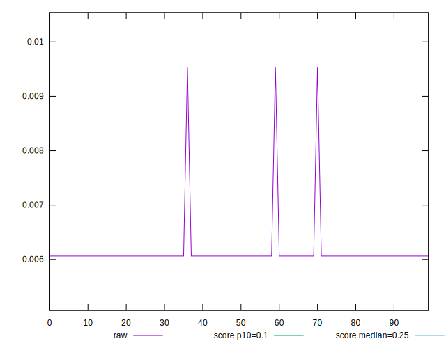
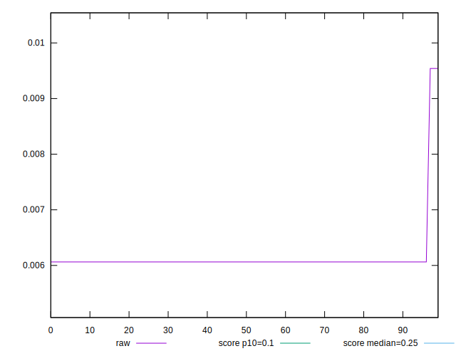
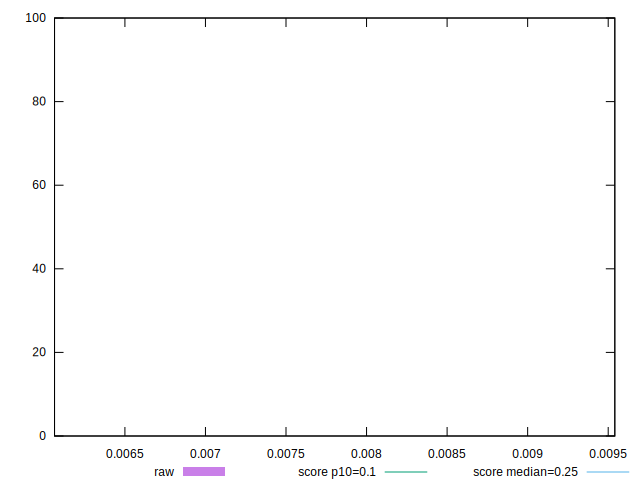
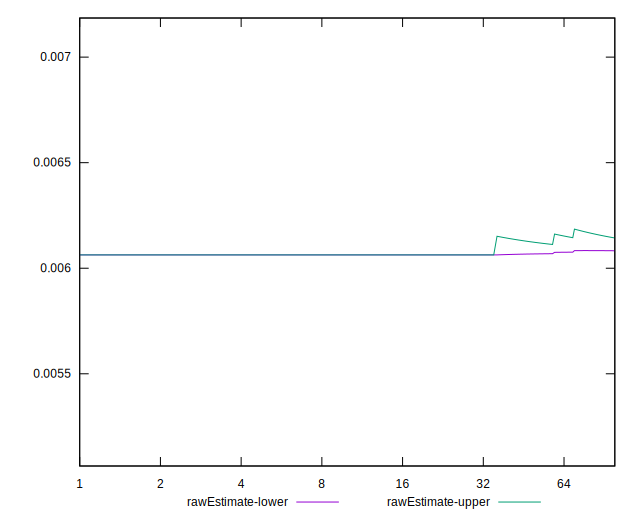
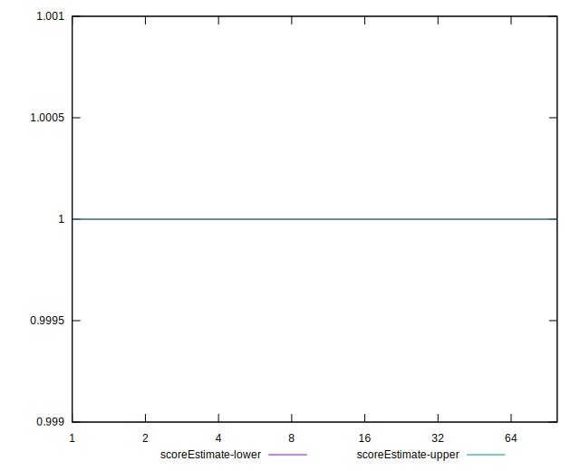
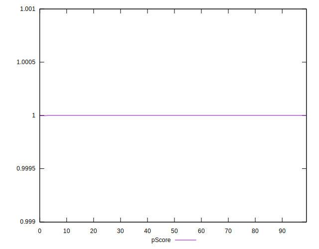
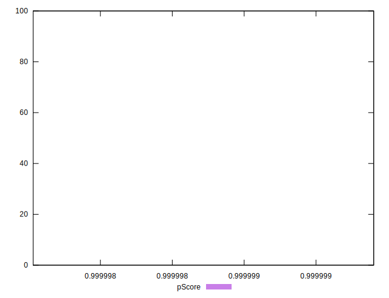
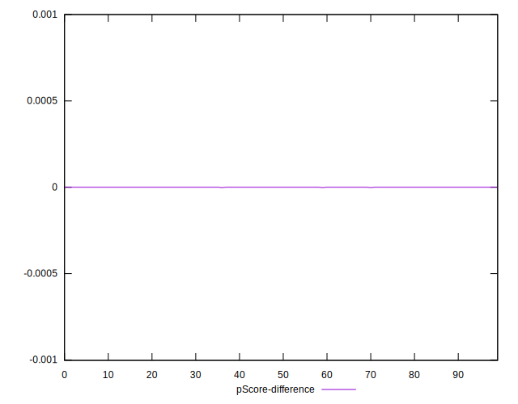
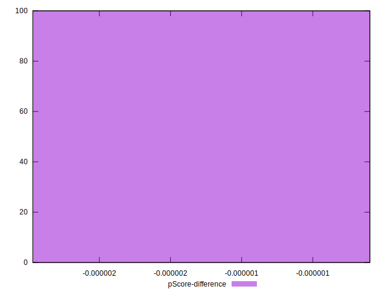

# //cumulative-layout-shift/samples/agenda

[→ Parent](../..)


## Raw


```yaml
p90min: 0.006063152419196235
p90max: 0.006063152419196235
p90range: 0
p90mean: 0.006063152419196233
median: 0.006063152419196235
p90stdev: 1.734723475976807e-18
mad: 0
stdevBySn: 0
lfitCenter: 0.006113014712886343
lfitStdev: 0.0001231943477343721
mfitCenter: 0.006113014712886343
mfitStdev: 0.0001544012178082154
mfitConfidence: 0.00001544012178082154
p90skewness: 1
p90eccentricity: 1
p90discretization: 94
outlandishness: 1.0347134089390082

```


## Score


```yaml
p90min: 1
p90max: 1
p90range: 0
p90mean: 1
median: 1
p90stdev: 0
mad: 0
stdevBySn: 0
lfitCenter: 1
lfitStdev: 0
mfitCenter: 1
mfitStdev: 0
mfitConfidence: 0
p90skewness: .nan
p90eccentricity: .nan
p90discretization: 94
outlandishness: 1

```


## Raw Estimate


## Score Estimate


## P Score


```yaml
p90min: 0.9999999011422622
p90max: 0.9999999011422622
p90range: 0
p90mean: 0.9999999011422611
median: 0.9999999011422622
p90stdev: 1.1102230246251565e-15
mad: 0
stdevBySn: 0
lfitCenter: 0.9999998671797795
lfitStdev: 8.391081917255784e-8
mfitCenter: 0.9999998671797795
mfitStdev: 1.0516661604851438e-7
mfitConfidence: 1.0516661604851438e-8
p90skewness: 1
p90eccentricity: 1
p90discretization: 94
outlandishness: 0.9999998578646402

```


## Score Difference


```yaml
p90min: 0
p90max: 0
p90range: 0
p90mean: 0
median: 0
p90stdev: 0
mad: 0
stdevBySn: 0
lfitCenter: 0
lfitStdev: 0
mfitCenter: 0
mfitStdev: 0
mfitConfidence: 0
p90skewness: .nan
p90eccentricity: .nan
p90discretization: 94
outlandishness: .nan

```


## P Score Difference


```yaml
p90min: -9.885773777362772e-8
p90max: -9.885773777362772e-8
p90range: 0
p90mean: -9.885773777362772e-8
median: -9.885773777362772e-8
p90stdev: 0
mad: 0
stdevBySn: 0
lfitCenter: -1.328202205501263e-7
lfitStdev: 8.39108192473845e-8
mfitCenter: -1.328202205501263e-7
mfitStdev: 1.051666161422957e-7
mfitConfidence: 1.051666161422957e-8
p90skewness: .nan
p90eccentricity: .nan
p90discretization: 94
outlandishness: 2.9545771416251174

```

