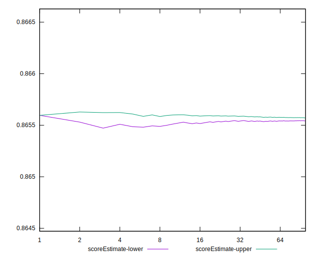

# //cumulative-layout-shift/samples/astro

[→ Parent](../..)


## Raw


```yaml
p90min: 0.113388671875
p90max: 0.11342529296875001
p90range: 0.00003662109375000833
p90mean: 0.11340503449135628
median: 0.113388671875
p90stdev: 0.000018206638722080558
mad: 0
stdevBySn: 0
lfitCenter: 0.11340384875948528
lfitStdev: 0.000022276722188102
mfitCenter: 0.11340384875948528
mfitStdev: 0.00002791973087949214
mfitConfidence: 0.000002791973087949214
p90skewness: 0.21398024625745135
p90eccentricity: 1.000000000000001
p90discretization: 47
outlandishness: 1.0000020612116896

```


## Score


```yaml
p90min: 0.87
p90max: 0.87
p90range: 0
p90mean: 0.8700000000000002
median: 0.87
p90stdev: 2.220446049250313e-16
mad: 0
stdevBySn: 0
lfitCenter: 0.8700000000000004
lfitStdev: 0
mfitCenter: 0.8700000000000004
mfitStdev: 0
mfitConfidence: 0
p90skewness: -1
p90eccentricity: 1
p90discretization: 94
outlandishness: 1.0000000000000004

```


## Raw Estimate


## Score Estimate


## P Score


```yaml
p90min: 0.8654981956894828
p90max: 0.8655959825000461
p90range: 0.00009778681056327176
p90mean: 0.8655522905208577
median: 0.8655959825000461
p90stdev: 0.0000486159464232172
mad: 0
stdevBySn: 0
lfitCenter: 0.8655554566998548
lfitStdev: 0.00005948401288744936
mfitCenter: 0.8655554566998548
mfitStdev: 0.00007455215437111524
mfitConfidence: 0.000007455215437111524
p90skewness: -0.21398024622061915
p90eccentricity: 1.000000000000001
p90discretization: 47
outlandishness: 0.9999992788754347

```


## Score Difference


```yaml
p90min: 0
p90max: 0
p90range: 0
p90mean: 0
median: 0
p90stdev: 0
mad: 0
stdevBySn: 0
lfitCenter: 0
lfitStdev: 0
mfitCenter: 0
mfitStdev: 0
mfitConfidence: 0
p90skewness: .nan
p90eccentricity: .nan
p90discretization: 94
outlandishness: .nan

```


## P Score Difference


```yaml
p90min: -0.004501804310517166
p90max: -0.004404017499953894
p90range: 0.00009778681056327176
p90mean: -0.004447709479141739
median: -0.004404017499953894
p90stdev: 0.0000486159464232172
mad: 0
stdevBySn: 0
lfitCenter: -0.004444543300145345
lfitStdev: 0.00005948401288747839
mfitCenter: -0.004444543300145345
mfitStdev: 0.00007455215437115163
mfitConfidence: 0.000007455215437115163
p90skewness: -0.2139802462554631
p90eccentricity: 1.000000000000001
p90discretization: 47
outlandishness: 1.0001403403330433

```

