# //cumulative-layout-shift/samples/card

[→ Parent](../..)


## Raw


```yaml
p90min: 0.011352840529547797
p90max: 0.12706176386939155
p90range: 0.11570892333984376
p90mean: 0.012583786522524839
median: 0.011352840529547797
p90stdev: 0.01187081326191445
mad: 0
stdevBySn: 0
lfitCenter: 0.013566457694361087
lfitStdev: 0.005511936105281485
mfitCenter: 0.013566457694361087
mfitStdev: 0.006908187451680335
mfitConfidence: 0.0006908187451680336
p90skewness: 9.539955591519957
p90eccentricity: 1.0000000000000029
p90discretization: 47
outlandishness: 1.6006424094975957

```

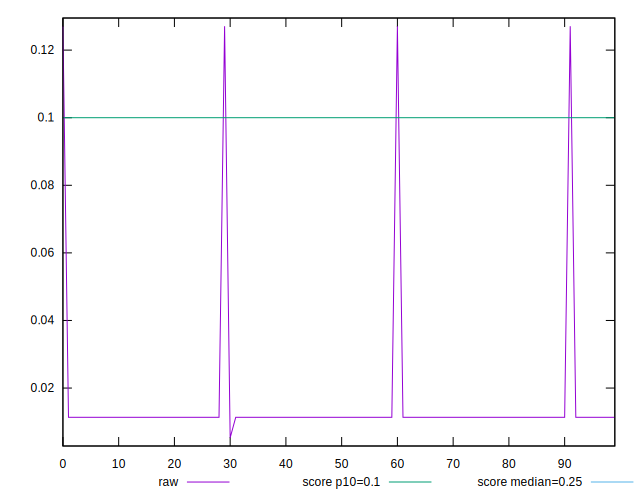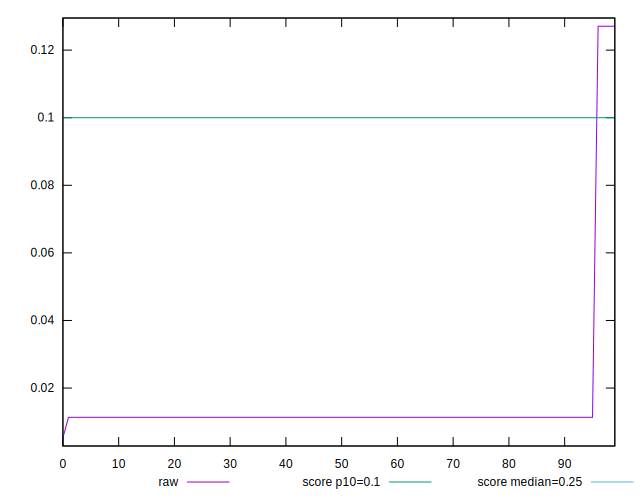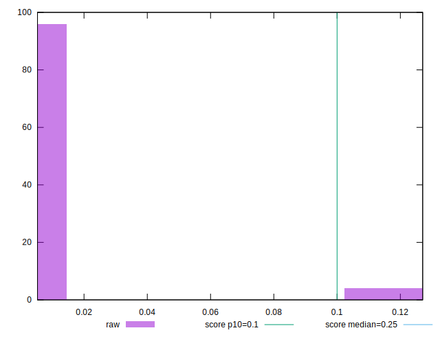
## Score


```yaml
p90min: 0.83
p90max: 1
p90range: 0.17000000000000004
p90mean: 0.9981914893617021
median: 1
p90stdev: 0.017440644993285133
mad: 0
stdevBySn: 0
lfitCenter: 0.9967062907419018
lfitStdev: 0.008096144711929806
mfitCenter: 0.9967062907419018
mfitStdev: 0.01014701263542411
mfitConfidence: 0.001014701263542411
p90skewness: -9.53995559151989
p90eccentricity: 1.0000000000000044
p90discretization: 47
outlandishness: 0.9900239395718495

```

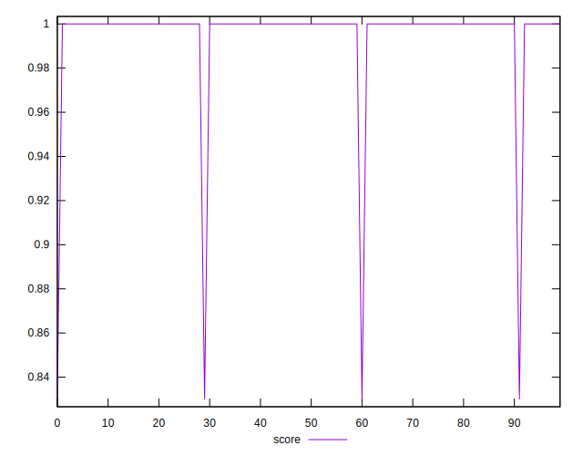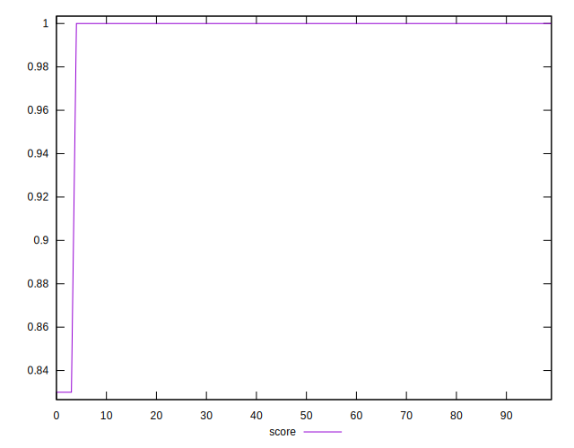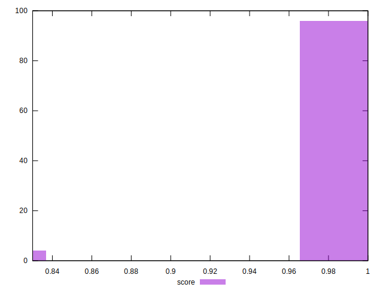
## Raw Estimate

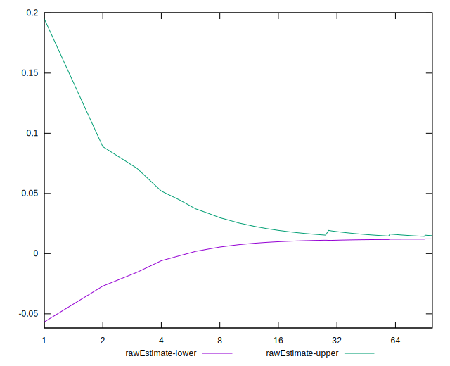
## Score Estimate

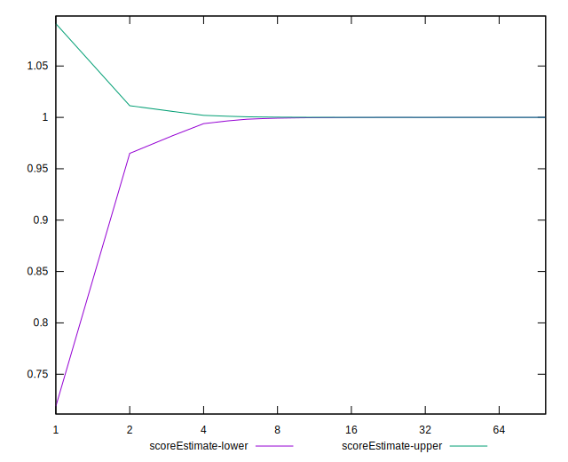
## P Score


```yaml
p90min: 0.8280724101476665
p90max: 0.9999923522960321
p90range: 0.1719199421483656
p90mean: 0.9981634167412631
median: 0.9999923522960321
p90stdev: 0.017637615754563303
mad: 0
stdevBySn: 0
lfitCenter: 0.9966614800464442
lfitStdev: 0.008187582488193615
mfitCenter: 0.9966614800464442
mfitStdev: 0.010261612893215548
mfitConfidence: 0.0010261612893215548
p90skewness: -9.539955591520027
p90eccentricity: 0.9999999999999999
p90discretization: 47
outlandishness: 0.9899114265169795

```

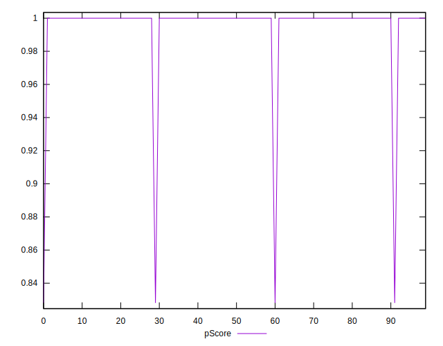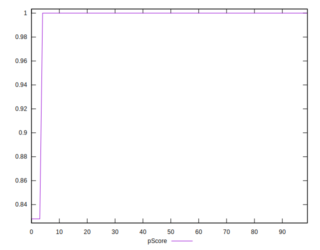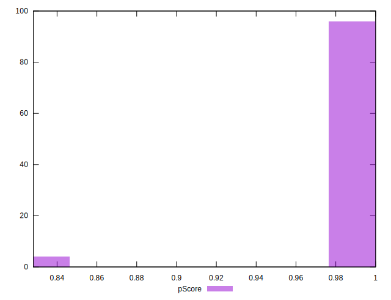
## Score Difference


```yaml
p90min: 0
p90max: 1.1102230246251565e-16
p90range: 1.1102230246251565e-16
p90mean: 1.1810883240693154e-18
median: 0
p90stdev: 1.139000331521095e-17
mad: 0
stdevBySn: 0
lfitCenter: 2.1510305028010703e-18
lfitStdev: 5.2873683940481196e-18
mfitCenter: 2.1510305028010703e-18
mfitStdev: 6.626733564123762e-18
mfitConfidence: 6.626733564123762e-19
p90skewness: 9.539955591519906
p90eccentricity: 0.9999999999999999
p90discretization: 47
outlandishness: 14.137600000000003

```

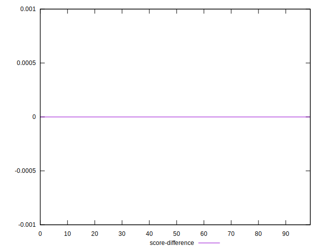
## P Score Difference


```yaml
p90min: -0.0019275898523334334
p90max: -0.000007647703967883501
p90range: 0.0019199421483655499
p90mean: -0.000028072620439857438
median: -0.000007647703967883501
p90stdev: 0.000196970761278169
mad: 0
stdevBySn: 0
lfitCenter: -0.000044810695457803765
lfitStdev: 0.00009143777626406695
mfitCenter: -0.000044810695457803765
mfitStdev: 0.00011460025779176245
mfitConfidence: 0.000011460025779176244
p90skewness: -9.539955591519885
p90eccentricity: 1.000000000000004
p90discretization: 47
outlandishness: 9.032387880884977

```

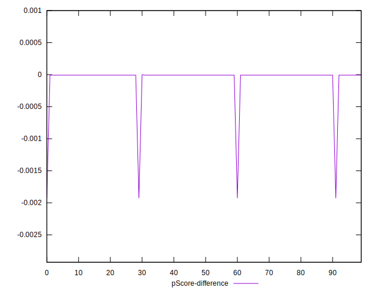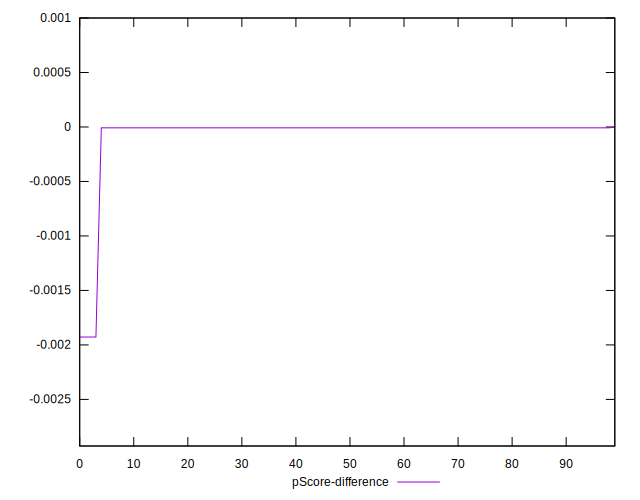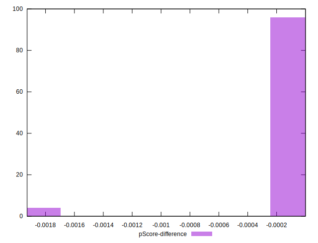