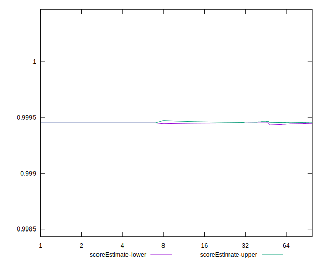

# //cumulative-layout-shift/samples/music

[→ Parent](../..)


## Raw


```yaml
p90min: 0.023033367262946237
p90max: 0.024251628981696235
p90range: 0.0012182617187499988
p90mean: 0.024118026920525996
median: 0.024215007887946234
p90stdev: 0.0003309848619117008
mad: 0
stdevBySn: 0
lfitCenter: 0.024205911940512945
lfitStdev: 0.00017268006787774908
mfitCenter: 0.024205911940512945
mfitStdev: 0.0002164223705215565
mfitConfidence: 0.00002164223705215565
p90skewness: -2.968223874029038
p90eccentricity: 1.0000000000000018
p90discretization: 23.5
outlandishness: 1.0079667622217743

```


## Score


```yaml
p90min: 1
p90max: 1
p90range: 0
p90mean: 1
median: 1
p90stdev: 0
mad: 0
stdevBySn: 0
lfitCenter: 1
lfitStdev: 0
mfitCenter: 1
mfitStdev: 0
mfitConfidence: 0
p90skewness: .nan
p90eccentricity: .nan
p90discretization: 94
outlandishness: 1

```


## Raw Estimate


## Score Estimate


## P Score


```yaml
p90min: 0.9994486861417509
p90max: 0.9995735337766942
p90range: 0.00012484763494335915
p90mean: 0.9994626590103523
median: 0.9994527833197606
p90stdev: 0.00003383690346107941
mad: 0
stdevBySn: 0
lfitCenter: 0.9994452341540819
lfitStdev: 0.00003598380377517979
mfitCenter: 0.9994452341540819
mfitStdev: 0.00004509901003120024
mfitConfidence: 0.000004509901003120024
p90skewness: 2.9671288986140265
p90eccentricity: 0.9999999999999983
p90discretization: 23.5
outlandishness: 0.9999440196422343

```


## Score Difference


```yaml
p90min: 0
p90max: 0
p90range: 0
p90mean: 0
median: 0
p90stdev: 0
mad: 0
stdevBySn: 0
lfitCenter: 0
lfitStdev: 0
mfitCenter: 0
mfitStdev: 0
mfitConfidence: 0
p90skewness: .nan
p90eccentricity: .nan
p90discretization: 94
outlandishness: .nan

```


## P Score Difference


```yaml
p90min: -0.0005513138582491361
p90max: -0.000426466223305777
p90range: 0.00012484763494335915
p90mean: -0.0005373409896463491
median: -0.0005472166802393819
p90stdev: 0.0000338369034610794
mad: 0
stdevBySn: 0
lfitCenter: -0.0005547658459185708
lfitStdev: 0.00003598380377580107
mfitCenter: -0.0005547658459185708
mfitStdev: 0.0000450990100319789
mfitConfidence: 0.00000450990100319789
p90skewness: 2.967128898450459
p90eccentricity: 0.9999999999999987
p90discretization: 23.5
outlandishness: 1.1068363452741894

```

