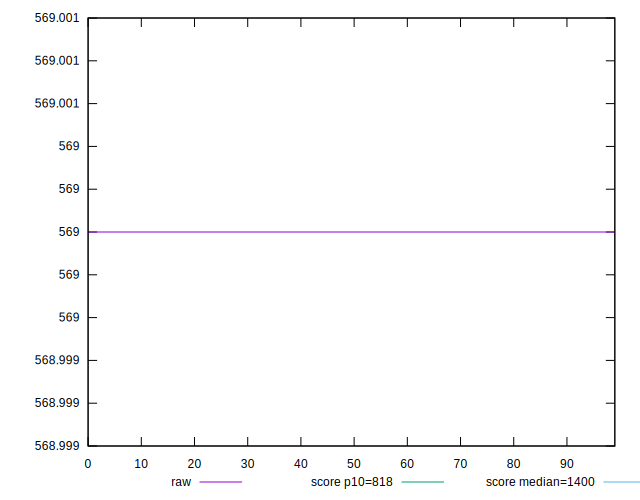
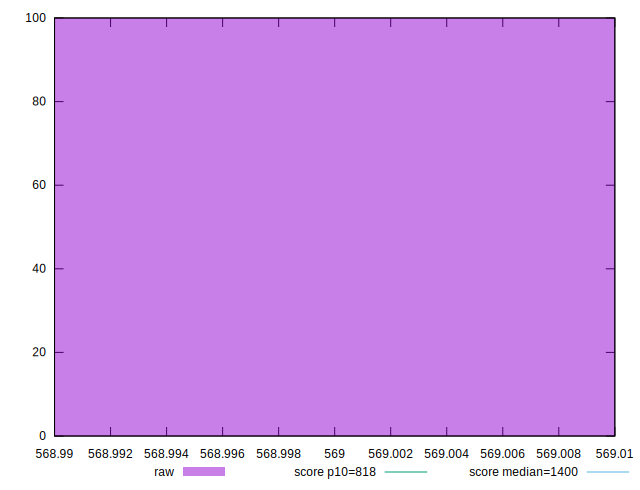
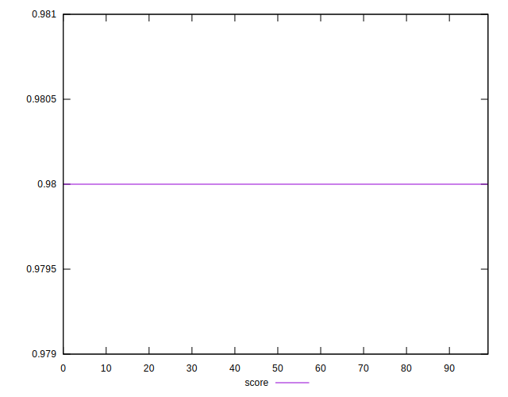
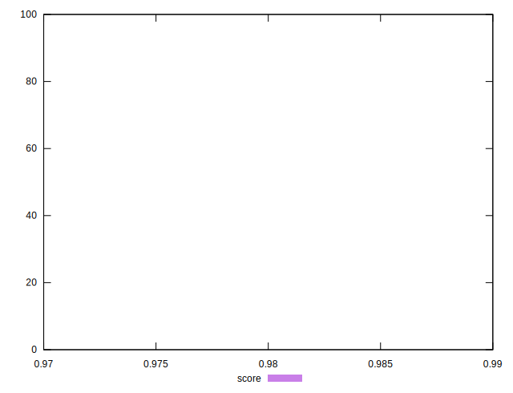
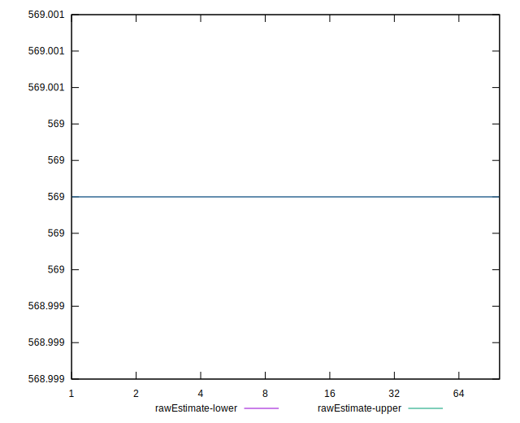
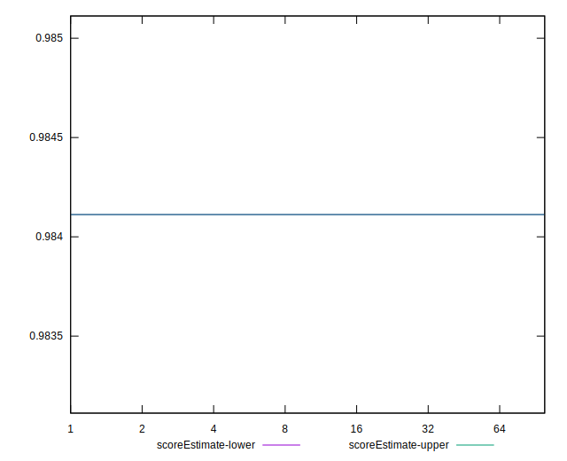
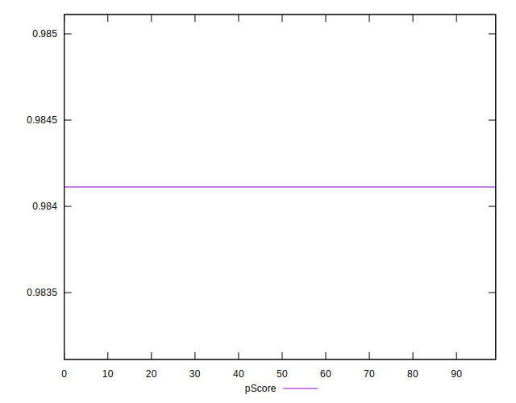
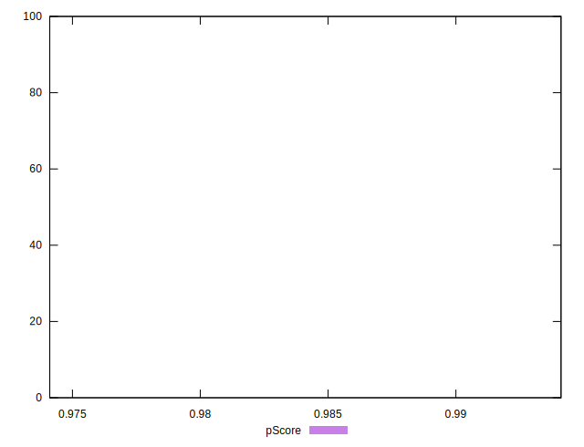
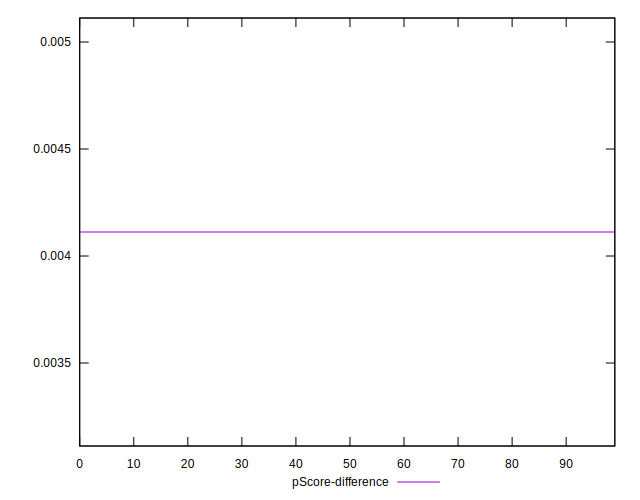
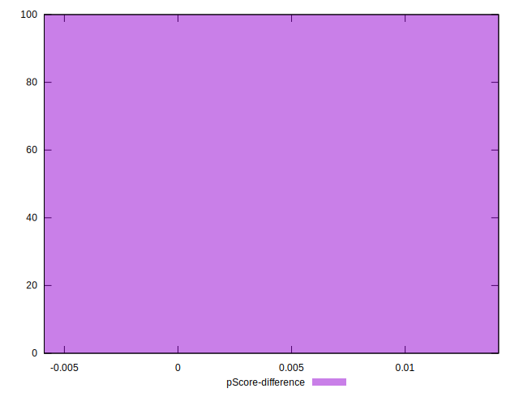

# //dom-size/samples/agenda

[→ Parent](../..)


## Raw


```yaml
p90min: 569
p90max: 569
p90range: 0
p90mean: 569
median: 569
p90stdev: 0
mad: 0
stdevBySn: 0
lfitCenter: 569
lfitStdev: 0
mfitCenter: 569
mfitStdev: 0
mfitConfidence: 0
p90skewness: .nan
p90eccentricity: .nan
p90discretization: 94
outlandishness: 1

```


## Score


```yaml
p90min: 0.98
p90max: 0.98
p90range: 0
p90mean: 0.9800000000000002
median: 0.98
p90stdev: 2.220446049250313e-16
mad: 0
stdevBySn: 0
lfitCenter: 0.9800000000000004
lfitStdev: 0
mfitCenter: 0.9800000000000004
mfitStdev: 0
mfitConfidence: 0
p90skewness: -1
p90eccentricity: 1
p90discretization: 94
outlandishness: 1.0000000000000004

```


## Raw Estimate


## Score Estimate


## P Score


```yaml
p90min: 0.9841121673367461
p90max: 0.9841121673367461
p90range: 0
p90mean: 0.9841121673367467
median: 0.9841121673367461
p90stdev: 5.551115123125783e-16
mad: 0
stdevBySn: 0
lfitCenter: 0.9841121673367467
lfitStdev: 0
mfitCenter: 0.9841121673367467
mfitStdev: 0
mfitConfidence: 0
p90skewness: -1
p90eccentricity: 1
p90discretization: 94
outlandishness: 1

```


## Score Difference


```yaml
p90min: 0
p90max: 0
p90range: 0
p90mean: 0
median: 0
p90stdev: 0
mad: 0
stdevBySn: 0
lfitCenter: 0
lfitStdev: 0
mfitCenter: 0
mfitStdev: 0
mfitConfidence: 0
p90skewness: .nan
p90eccentricity: .nan
p90discretization: 94
outlandishness: .nan

```


## P Score Difference


```yaml
p90min: 0.004112167336746131
p90max: 0.004112167336746131
p90range: 0
p90mean: 0.004112167336746131
median: 0.004112167336746131
p90stdev: 0
mad: 0
stdevBySn: 0
lfitCenter: 0.004112167336746131
lfitStdev: 0
mfitCenter: 0.004112167336746131
mfitStdev: 0
mfitConfidence: 0
p90skewness: .nan
p90eccentricity: .nan
p90discretization: 94
outlandishness: 1

```

