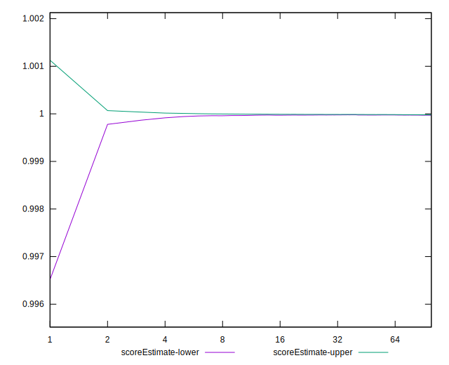

# //estimated-input-latency/samples/astro

[→ Parent](../..)


## Raw


```yaml
p90min: 15.066666666666666
p90max: 22.200000000000003
p90range: 7.133333333333336
p90mean: 17.80113475177306
median: 17.6
p90stdev: 1.3949719362346167
mad: 1
stdevBySn: 1.4311200000000035
lfitCenter: 17.842541185893975
lfitStdev: 1.2681780307115018
mfitCenter: 17.842541185893975
mfitStdev: 1.5894254561230032
mfitConfidence: 0.1589425456123003
p90skewness: 0.5494026501522378
p90eccentricity: 0.9999999999999984
p90discretization: 2.473684210526316
outlandishness: 1.0235738667444136

```


## Score


```yaml
p90min: 1
p90max: 1
p90range: 0
p90mean: 1
median: 1
p90stdev: 0
mad: 0
stdevBySn: 0
lfitCenter: 1
lfitStdev: 0
mfitCenter: 1
mfitStdev: 0
mfitConfidence: 0
p90skewness: .nan
p90eccentricity: .nan
p90discretization: 94
outlandishness: 1

```


## Raw Estimate


## Score Estimate


## P Score


```yaml
p90min: 0.9998005908619518
p90max: 0.9999957588911782
p90range: 0.0001951680292263669
p90mean: 0.999967982825012
median: 0.9999781567708548
p90stdev: 0.000030058699464658214
mad: 0.000011305257960558812
stdevBySn: 0.000017043734464788432
lfitCenter: 0.999946896574481
lfitStdev: 0.00006879064827380504
mfitCenter: 0.999946896574481
mfitStdev: 0.00008621629208341246
mfitConfidence: 0.000008621629208341247
p90skewness: -2.7608578427991874
p90eccentricity: 1
p90discretization: 3.1333333333333333
outlandishness: 0.9998951608792517

```


## Score Difference


```yaml
p90min: 0
p90max: 0
p90range: 0
p90mean: 0
median: 0
p90stdev: 0
mad: 0
stdevBySn: 0
lfitCenter: 0
lfitStdev: 0
mfitCenter: 0
mfitStdev: 0
mfitConfidence: 0
p90skewness: .nan
p90eccentricity: .nan
p90discretization: 94
outlandishness: .nan

```


## P Score Difference


```yaml
p90min: -0.00019940913804816773
p90max: -0.000004241108821800843
p90range: 0.0001951680292263669
p90mean: -0.00003201717498788945
median: -0.000021843229145224186
p90stdev: 0.000030058699464658214
mad: 0.000011305257960558812
stdevBySn: 0.000017043734464788432
lfitCenter: -0.00005310342551920868
lfitStdev: 0.00006879064827400319
mfitCenter: -0.00005310342551920868
mfitStdev: 0.00008621629208366081
mfitConfidence: 0.000008621629208366082
p90skewness: -2.760857842745671
p90eccentricity: 1.0000000000000007
p90discretization: 3.1333333333333333
outlandishness: 6.954945266353968

```

