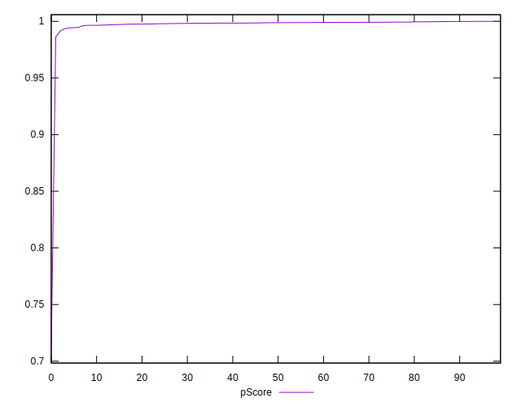

# //estimated-input-latency/samples/music

[→ Parent](../..)


## Raw


```yaml
p90min: 17.866666666666667
p90max: 34.800000000000004
p90range: 16.933333333333337
p90mean: 27.251773049645394
median: 27.6
p90stdev: 3.603060877048583
mad: 1.9000000000000004
stdevBySn: 3.1802666666666664
lfitCenter: 27.60231600943052
lfitStdev: 2.9351145902355773
mfitCenter: 27.60231600943052
mfitStdev: 3.678620614284825
mfitConfidence: 0.3678620614284825
p90skewness: -0.7025333425896864
p90eccentricity: 1.0000000000000007
p90discretization: 1.7735849056603774
outlandishness: 1.030978760462637

```


## Score


```yaml
p90min: 0.99
p90max: 1
p90range: 0.010000000000000009
p90mean: 0.9995744680851064
median: 1
p90stdev: 0.002018475102235138
mad: 0
stdevBySn: 0
lfitCenter: 0.9982971551618499
lfitStdev: 0.004117596295099523
mfitCenter: 0.9982971551618499
mfitStdev: 0.005160641653599016
mfitConfidence: 0.0005160641653599016
p90skewness: -4.532597979574556
p90eccentricity: 0.9999999999999991
p90discretization: 47
outlandishness: 0.9936584468341642

```


## Raw Estimate


## Score Estimate


## P Score


```yaml
p90min: 0.9934922349594801
p90max: 0.9999745756736776
p90range: 0.00648234071419751
p90mean: 0.9984566331111313
median: 0.9987718577003963
p90stdev: 0.001283921196394502
mad: 0.0006286381509719163
stdevBySn: 0.0009997682807669848
lfitCenter: 0.9971306983962176
lfitStdev: 0.0038290557900164707
mfitCenter: 0.9971306983962176
mfitStdev: 0.004799009759026382
mfitConfidence: 0.00047990097590263817
p90skewness: -1.6449943482291232
p90eccentricity: 0.9999999999999996
p90discretization: 1.8076923076923077
outlandishness: 0.993826121587432

```


## Score Difference


```yaml
p90min: 0
p90max: 0
p90range: 0
p90mean: 0
median: 0
p90stdev: 0
mad: 0
stdevBySn: 0
lfitCenter: 5.166535369026208e-19
lfitStdev: 1.2890316797319448e-18
mfitCenter: 5.166535369026208e-19
mfitStdev: 1.6155616292812394e-18
mfitConfidence: 1.6155616292812395e-19
p90skewness: .nan
p90eccentricity: .nan
p90discretization: 94
outlandishness: .inf

```


## P Score Difference


```yaml
p90min: -0.003514851032545563
p90max: 0.004202895498387704
p90range: 0.007717746530933267
p90mean: -0.001119652900883731
median: -0.0010955790980251567
p90stdev: 0.0011787643069197057
mad: 0.000658384949169033
stdevBySn: 0.0009997682807669848
lfitCenter: -0.001080312730664759
lfitStdev: 0.0008661538289002974
mfitCenter: -0.001080312730664759
mfitStdev: 0.001085562839943033
mfitConfidence: 0.0001085562839943033
p90skewness: 1.288507275407876
p90eccentricity: 1.0000000000000002
p90discretization: 1.8076923076923077
outlandishness: 0.8467831648624019

```

