# //first-contentful-paint/samples/astro

[→ Parent](../..)


## Raw


```yaml
p90min: 2537.37
p90max: 2585.532
p90range: 48.16200000000026
p90mean: 2553.853723404255
median: 2557.8495
p90stdev: 11.238468355933755
mad: 7.350999999999885
stdevBySn: 11.113839399999682
lfitCenter: 2554.7432649823327
lfitStdev: 10.895009496036279
mfitCenter: 2554.7432649823327
mfitStdev: 13.654869441309001
mfitConfidence: 1.3654869441309
p90skewness: 0.299776802055267
p90eccentricity: 1.0000000000000007
p90discretization: 1
outlandishness: 1.0008363124083361

```

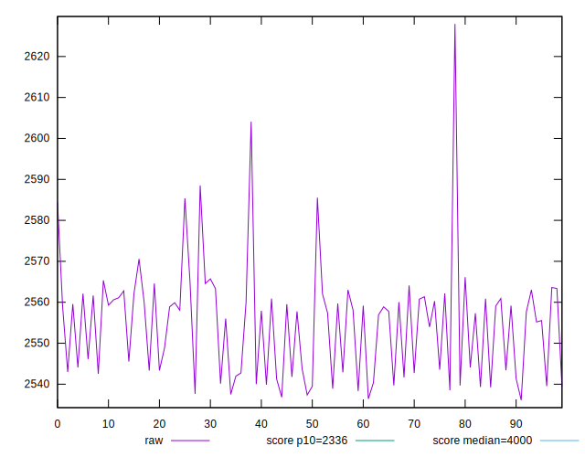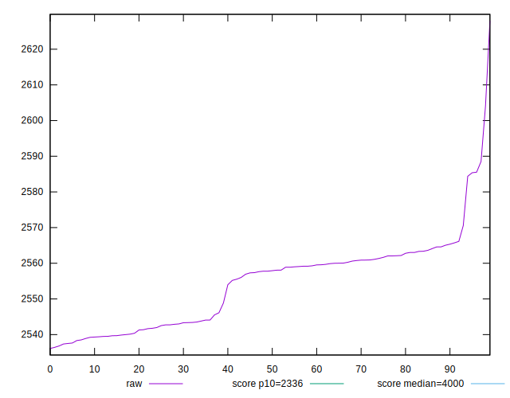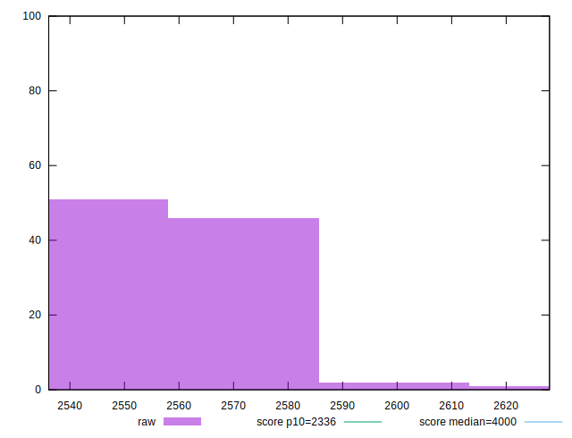
## Score


```yaml
p90min: 0.85
p90max: 0.86
p90range: 0.010000000000000009
p90mean: 0.8593617021276593
median: 0.86
p90stdev: 0.0024444947432076727
mad: 0
stdevBySn: 0
lfitCenter: 0.8594862968379354
lfitStdev: 0.0012275074928705743
mfitCenter: 0.8594862968379354
mfitStdev: 0.0015384524960234526
mfitConfidence: 0.00015384524960234525
p90skewness: -3.56859194709134
p90eccentricity: 1.0000000000000047
p90discretization: 47
outlandishness: 0.999158384630761

```

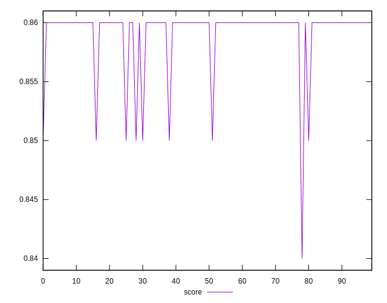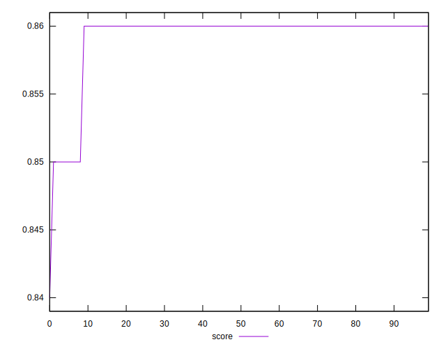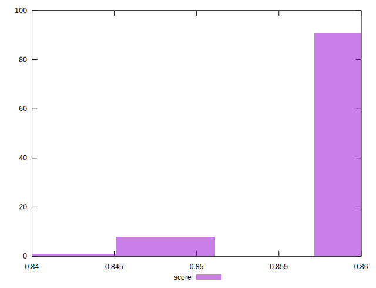
## Raw Estimate

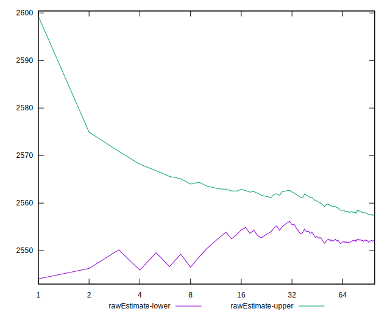
## Score Estimate

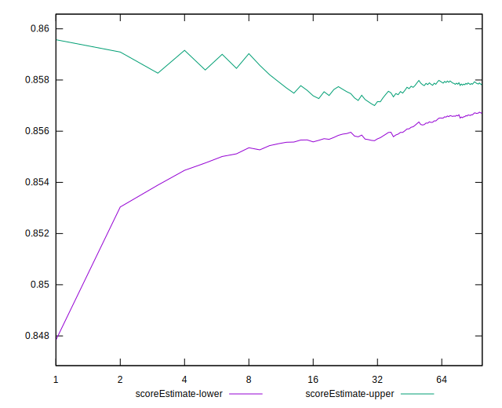
## P Score


```yaml
p90min: 0.8507666609708383
p90max: 0.8609349826500025
p90range: 0.01016832167916415
p90mean: 0.8574798254264147
median: 0.8566470101000029
p90stdev: 0.002364426669252507
mad: 0.0015521764393500725
stdevBySn: 0.0023452374818249506
lfitCenter: 0.8572923324642068
lfitStdev: 0.002289350049392384
mfitCenter: 0.8572923324642068
mfitStdev: 0.0028692747850546
mfitConfidence: 0.00028692747850546
p90skewness: -0.31750682622373927
p90eccentricity: 1.0000000000000002
p90discretization: 1
outlandishness: 0.9994630963306922

```

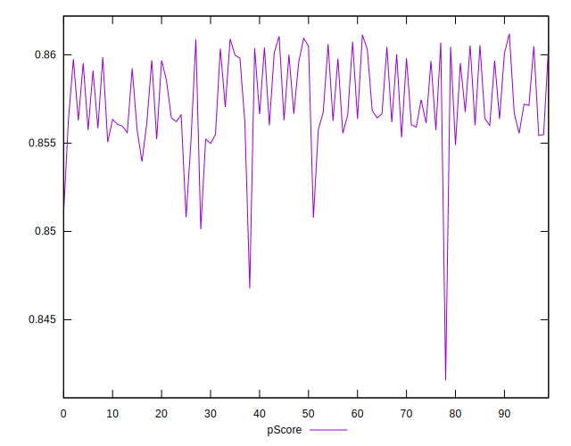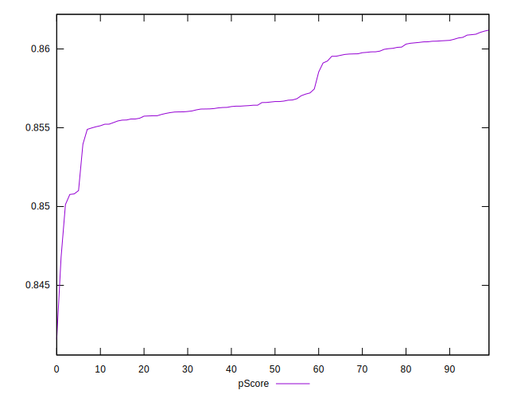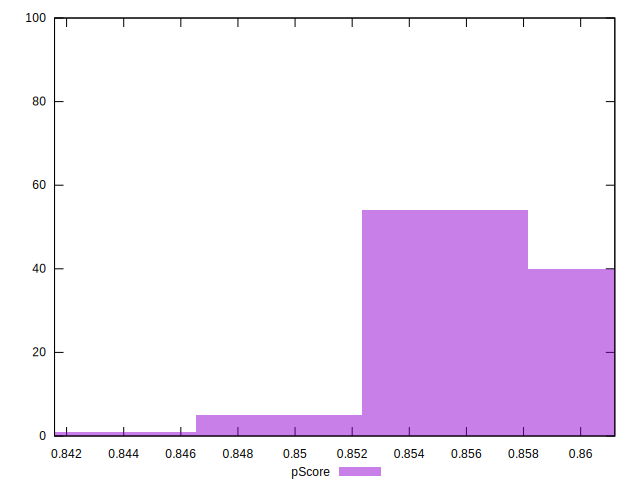
## Score Difference


```yaml
p90min: 0
p90max: 0
p90range: 0
p90mean: 0
median: 0
p90stdev: 0
mad: 0
stdevBySn: 0
lfitCenter: 0
lfitStdev: 0
mfitCenter: 0
mfitStdev: 0
mfitConfidence: 0
p90skewness: .nan
p90eccentricity: .nan
p90discretization: 94
outlandishness: .nan

```


## P Score Difference


```yaml
p90min: -0.004773247701611694
p90max: 0.0015776374464008258
p90range: 0.0063508851480125195
p90mean: -0.0018541622075194315
median: -0.0028295098776711103
p90stdev: 0.002086066054083632
mad: 0.0019410636133288528
stdevBySn: 0.0024428052921843706
lfitCenter: -0.0018622895976856382
lfitStdev: 0.0023663493292114647
mfitCenter: -0.0018622895976856382
mfitStdev: 0.0029657790711120724
mfitConfidence: 0.00029657790711120724
p90skewness: 0.1117421280521619
p90eccentricity: 1
p90discretization: 1
outlandishness: 0.8912056374530738

```

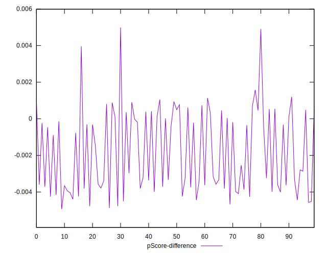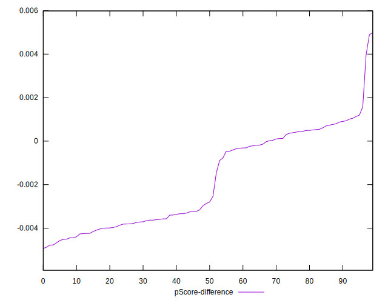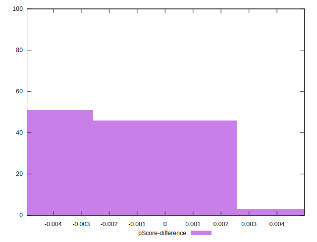