# //first-contentful-paint/samples/card

[→ Parent](../..)


## Raw


```yaml
p90min: 1589.0114999999998
p90max: 1760.65
p90range: 171.63850000000025
p90mean: 1650.3060414893614
median: 1624.2195000000002
p90stdev: 54.00875995839268
mad: 7.130249999999933
stdevBySn: 12.240279915000155
lfitCenter: 1641.705225776067
lfitStdev: 41.22148938586211
mfitCenter: 1641.705225776067
mfitStdev: 51.6634754604878
mfitConfidence: 5.16634754604878
p90skewness: 1.294991849349496
p90eccentricity: 1.0000000000000002
p90discretization: 1
outlandishness: 0.9994381583279646

```

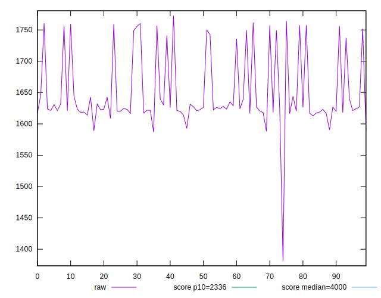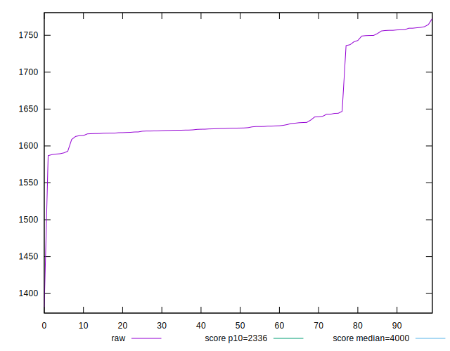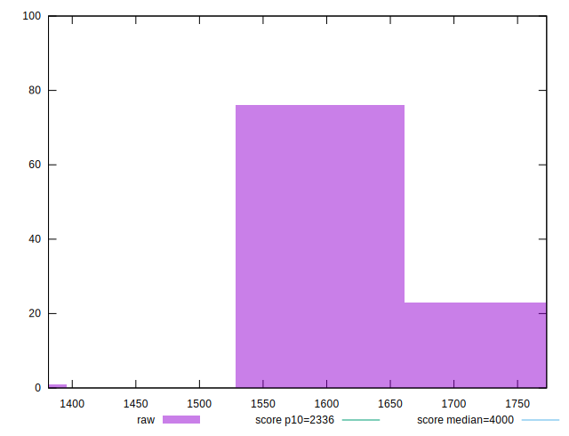
## Score


```yaml
p90min: 0.97
p90max: 0.99
p90range: 0.020000000000000018
p90mean: 0.979787234042553
median: 0.98
p90stdev: 0.0035666073647319632
mad: 0
stdevBySn: 0
lfitCenter: 0.9798829444717833
lfitStdev: 0.001304305139948977
mfitCenter: 0.9798829444717833
mfitStdev: 0.0016347040729162337
mfitConfidence: 0.00016347040729162337
p90skewness: -0.28978317838485
p90eccentricity: 0.9999999999999987
p90discretization: 31.333333333333332
outlandishness: 1.0000260588016852

```

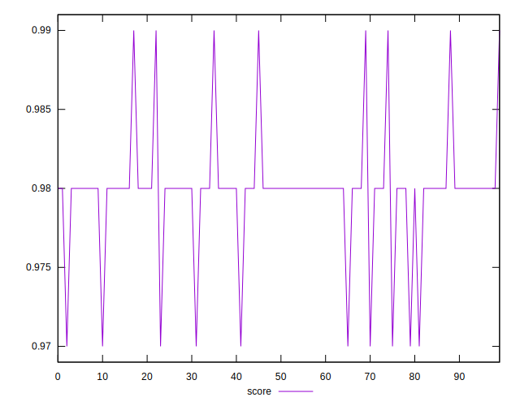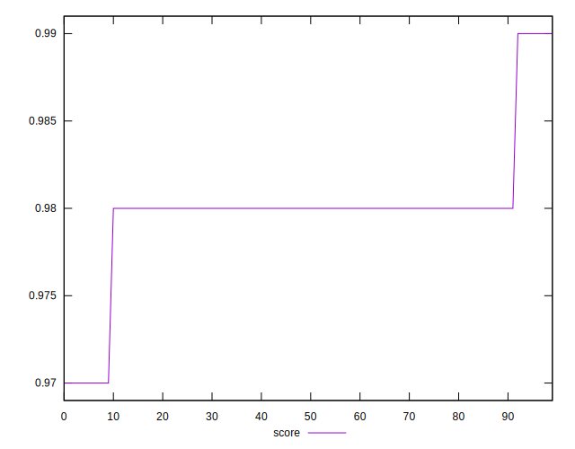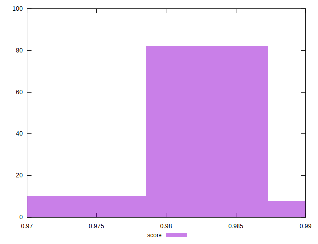
## Raw Estimate

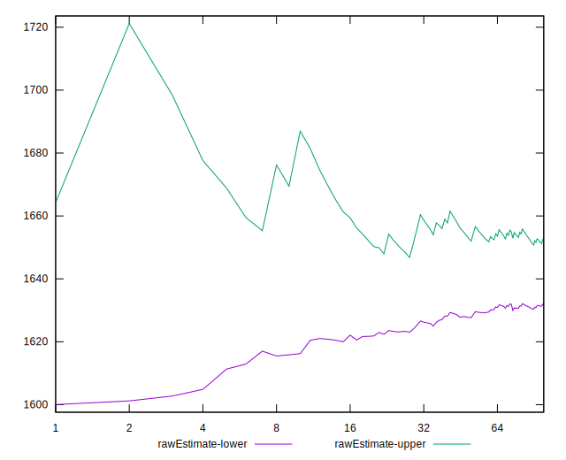
## Score Estimate

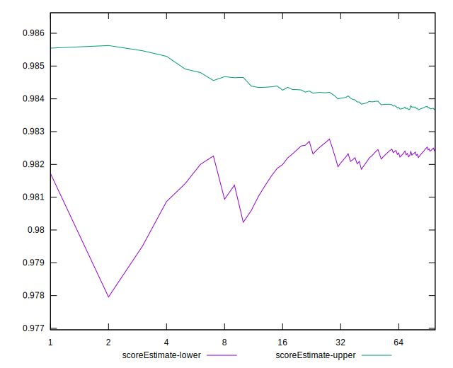
## P Score


```yaml
p90min: 0.9747250482725793
p90max: 0.9860851326754616
p90range: 0.011360084402882276
p90mean: 0.9823229435431721
median: 0.9841216807091369
p90stdev: 0.0036609456251893444
mad: 0.0004149034011563524
stdevBySn: 0.0007103374665117613
lfitCenter: 0.982889575892134
lfitStdev: 0.0027834748324308493
mfitCenter: 0.982889575892134
mfitStdev: 0.0034885683618578224
mfitConfidence: 0.0003488568361857822
p90skewness: -1.334740497598004
p90eccentricity: 1.0000000000000004
p90discretization: 1
outlandishness: 0.999909179523146

```

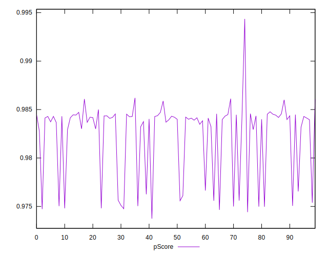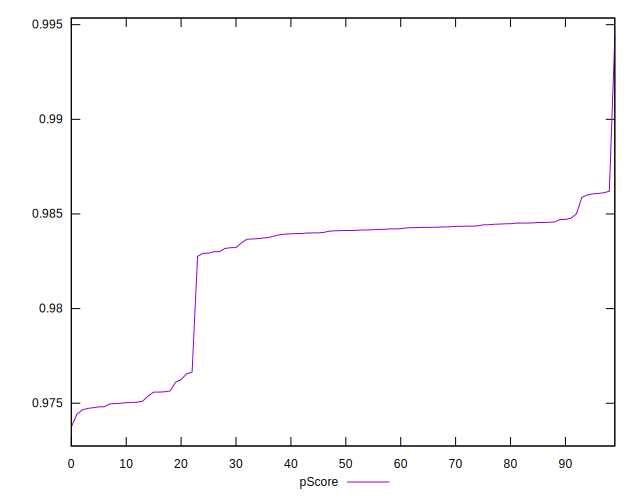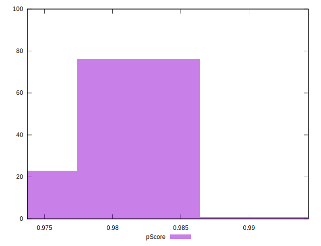
## Score Difference


```yaml
p90min: 0
p90max: 0
p90range: 0
p90mean: 0
median: 0
p90stdev: 0
mad: 0
stdevBySn: 0
lfitCenter: 0
lfitStdev: 0
mfitCenter: 0
mfitStdev: 0
mfitConfidence: 0
p90skewness: .nan
p90eccentricity: .nan
p90discretization: 94
outlandishness: .nan

```


## P Score Difference


```yaml
p90min: -0.004942580666926322
p90max: 0.00481253039565388
p90range: 0.009755111062580202
p90mean: 0.0026363210268033153
median: 0.004129073598666766
p90stdev: 0.0032108112452244753
mad: 0.00038975592428053263
stdevBySn: 0.0006000284892186243
lfitCenter: 0.0030975152737898496
lfitStdev: 0.0022451299936282576
mfitCenter: 0.0030975152737898496
mfitStdev: 0.002813853163956773
mfitConfidence: 0.0002813853163956773
p90skewness: -1.605259033030911
p90eccentricity: 0.9999999999999994
p90discretization: 1
outlandishness: 0.8837378120127599

```

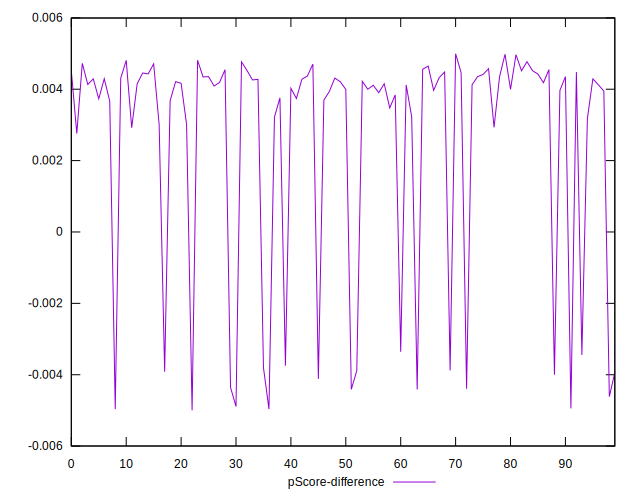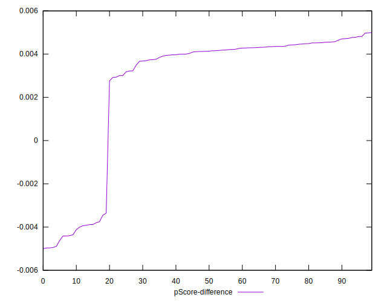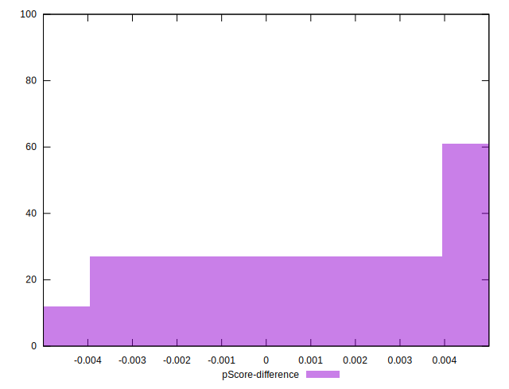