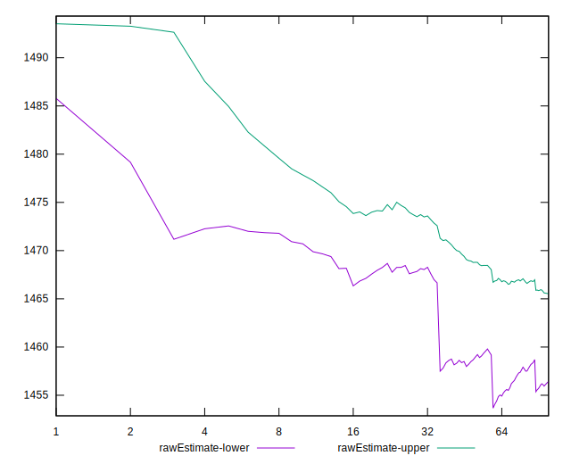

# //first-cpu-idle/samples/agenda

[→ Parent](../..)


## Raw


```yaml
p90min: 1437.5549999999998
p90max: 1487.8770000000002
p90range: 50.322000000000344
p90mean: 1465.3341510638297
median: 1468.35435
p90stdev: 11.107846958361067
mad: 5.471850000000018
stdevBySn: 9.49780676999981
lfitCenter: 1460.9743823908789
lfitStdev: 18.493082484592748
mfitCenter: 1460.9743823908789
mfitStdev: 23.177641743804074
mfitConfidence: 2.3177641743804074
p90skewness: -0.8525969292082377
p90eccentricity: 1
p90discretization: 1
outlandishness: 0.9849536252534666

```


## Score


```yaml
p90min: 1
p90max: 1
p90range: 0
p90mean: 1
median: 1
p90stdev: 0
mad: 0
stdevBySn: 0
lfitCenter: 1
lfitStdev: 0
mfitCenter: 1
mfitStdev: 0
mfitConfidence: 0
p90skewness: .nan
p90eccentricity: .nan
p90discretization: 94
outlandishness: 1

```


## Raw Estimate


## Score Estimate


## P Score


```yaml
p90min: 0.9992009360699212
p90max: 0.9993808225955125
p90range: 0.00017988652559131069
p90mean: 0.9992851136392651
median: 0.9992750278358334
p90stdev: 0.000039365048358664986
mad: 0.000019765586269260282
stdevBySn: 0.00003496726895829965
lfitCenter: 0.9992901423866074
lfitStdev: 0.000043604889662812744
mfitCenter: 0.9992901423866074
mfitStdev: 0.00005465062472547751
mfitConfidence: 0.0000054650624725477514
p90skewness: 0.7540896932383888
p90eccentricity: 0.9999999999999991
p90discretization: 1
outlandishness: 1.0000337268822461

```


## Score Difference


```yaml
p90min: 0
p90max: 0
p90range: 0
p90mean: 0
median: 0
p90stdev: 0
mad: 0
stdevBySn: 0
lfitCenter: 0
lfitStdev: 0
mfitCenter: 0
mfitStdev: 0
mfitConfidence: 0
p90skewness: .nan
p90eccentricity: .nan
p90discretization: 94
outlandishness: .nan

```


## P Score Difference


```yaml
p90min: -0.0007990639300787805
p90max: -0.0006191774044874698
p90range: 0.00017988652559131069
p90mean: -0.0007148863607344514
median: -0.0007249721641665596
p90stdev: 0.000039365048358664986
mad: 0.000019765586269260282
stdevBySn: 0.00003496726895829965
lfitCenter: -0.0007098576133926806
lfitStdev: 0.00004360488966275157
mfitCenter: -0.0007098576133926806
mfitStdev: 0.00005465062472540084
mfitConfidence: 0.000005465062472540084
p90skewness: 0.7540896932117412
p90eccentricity: 1
p90discretization: 1
outlandishness: 0.9534117968029246

```

