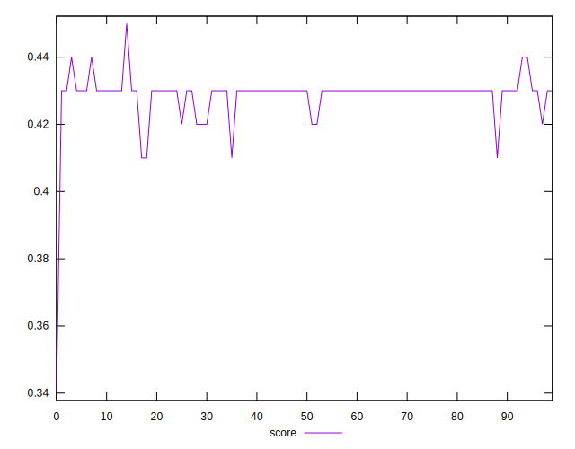

# //first-cpu-idle/samples/astro

[→ Parent](../..)


## Raw


```yaml
p90min: 7015.371999999999
p90max: 7192.304
p90range: 176.9320000000007
p90mean: 7042.032808510636
median: 7030.76
p90stdev: 37.591480422664915
mad: 8.001999999999953
stdevBySn: 11.475197200000899
lfitCenter: 7041.527829315741
lfitStdev: 28.207220606236287
mfitCenter: 7041.527829315741
mfitStdev: 35.352508395746234
mfitConfidence: 3.5352508395746236
p90skewness: 2.7664389647592973
p90eccentricity: 0.9999999999999999
p90discretization: 1.010752688172043
outlandishness: 1.0026714772728702

```


## Score


```yaml
p90min: 0.41
p90max: 0.44
p90range: 0.030000000000000027
p90mean: 0.4290425531914892
median: 0.43
p90stdev: 0.004143477041308611
mad: 0
stdevBySn: 0
lfitCenter: 0.429070515402459
lfitStdev: 0.0029103903480799612
mfitCenter: 0.429070515402459
mfitStdev: 0.0036476333720255986
mfitConfidence: 0.00036476333720255986
p90skewness: -2.4349263811725654
p90eccentricity: 0.9999999999999994
p90discretization: 23.5
outlandishness: 0.9960762591830882

```


## Raw Estimate


## Score Estimate


## P Score


```yaml
p90min: 0.4142394339204597
p90max: 0.43512762215273365
p90range: 0.020888188232273952
p90mean: 0.431949858684591
median: 0.4332819797709775
p90stdev: 0.004446650787868654
mad: 0.0009582846648734378
stdevBySn: 0.0013748832285557801
lfitCenter: 0.43204539024558175
lfitStdev: 0.003265884746100992
mfitCenter: 0.43204539024558175
mfitStdev: 0.004093179527250148
mfitConfidence: 0.0004093179527250148
p90skewness: -2.754424021068854
p90eccentricity: 1.0000000000000002
p90discretization: 1.010752688172043
outlandishness: 0.9952210569868163

```


## Score Difference


```yaml
p90min: 0
p90max: 5.551115123125783e-17
p90range: 5.551115123125783e-17
p90mean: 5.905441620346577e-19
median: 0
p90stdev: 5.695001657605475e-18
mad: 0
stdevBySn: 0
lfitCenter: 1.0755152514005351e-18
lfitStdev: 2.6436841970240598e-18
mfitCenter: 1.0755152514005351e-18
mfitStdev: 3.313366782061881e-18
mfitConfidence: 3.313366782061881e-19
p90skewness: 9.539955591519906
p90eccentricity: 0.9999999999999999
p90discretization: 47
outlandishness: 14.137600000000003

```


## P Score Difference


```yaml
p90min: -0.004591193109505232
p90max: 0.00468526316997997
p90range: 0.009276456279485201
p90mean: 0.002888855782844014
median: 0.003266410918384699
p90stdev: 0.0016156114751671943
mad: 0.0008408010932404453
stdevBySn: 0.0012903708979539945
lfitCenter: 0.0029555828959362948
lfitStdev: 0.0012223309164500983
mfitCenter: 0.0029555828959362948
mfitStdev: 0.0015319646196062476
mfitConfidence: 0.00015319646196062476
p90skewness: -1.9988468007928302
p90eccentricity: 1.0000000000000002
p90discretization: 1.010752688172043
outlandishness: 0.8842289501787847

```

