# //first-cpu-idle/samples/card

[→ Parent](../..)


## Raw


```yaml
p90min: 1589.0114999999998
p90max: 1760.65
p90range: 171.63850000000025
p90mean: 1650.3060414893614
median: 1624.2195000000002
p90stdev: 54.00875995839267
mad: 7.130249999999819
stdevBySn: 12.240279915000155
lfitCenter: 1641.705225776067
lfitStdev: 41.22148938586209
mfitCenter: 1641.705225776067
mfitStdev: 51.66347546048778
mfitConfidence: 5.166347546048778
p90skewness: 1.2949918493494965
p90eccentricity: 0.9999999999999999
p90discretization: 1
outlandishness: 0.9994381583279646

```

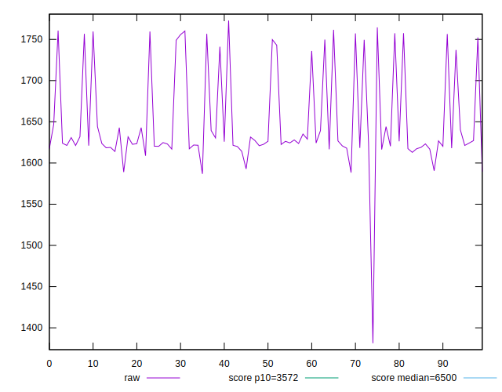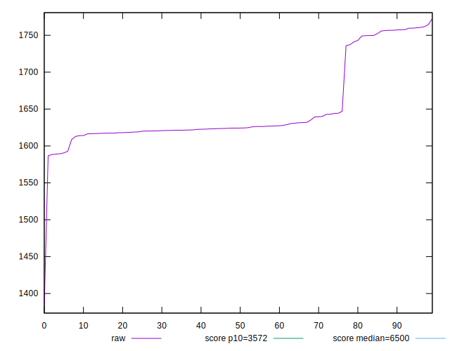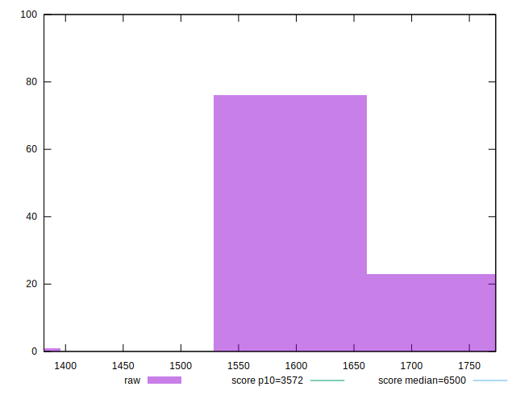
## Score


```yaml
p90min: 1
p90max: 1
p90range: 0
p90mean: 1
median: 1
p90stdev: 0
mad: 0
stdevBySn: 0
lfitCenter: 1
lfitStdev: 0
mfitCenter: 1
mfitStdev: 0
mfitConfidence: 0
p90skewness: .nan
p90eccentricity: .nan
p90discretization: 94
outlandishness: 1

```


## Raw Estimate

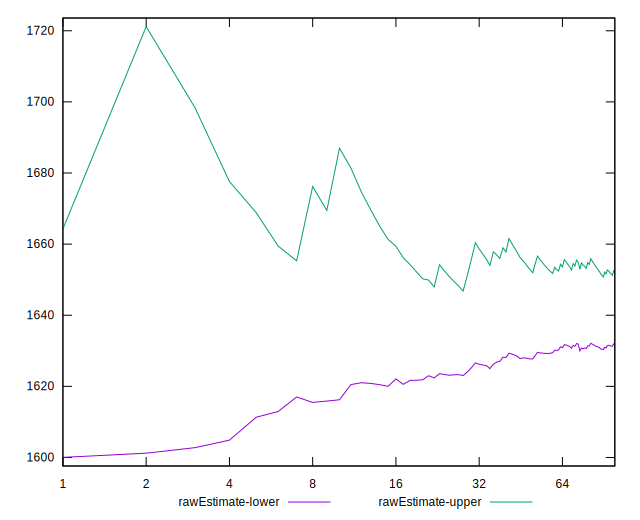
## Score Estimate

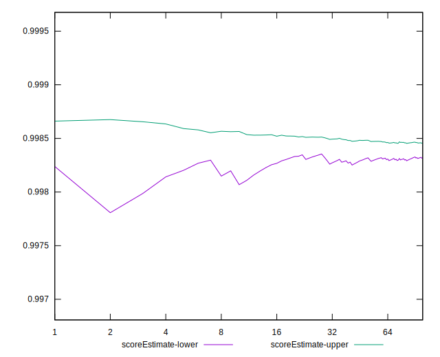
## P Score


```yaml
p90min: 0.9974124279312847
p90max: 0.9987171504210812
p90range: 0.001304722489796517
p90mean: 0.9982952098464604
median: 0.9985040697021246
p90stdev: 0.0004231857871731181
mad: 0.0000455003863621406
stdevBySn: 0.00007799071416962306
lfitCenter: 0.998360438322123
lfitStdev: 0.00032185358845595463
mfitCenter: 0.998360438322123
mfitStdev: 0.00040338365296347463
mfitConfidence: 0.000040338365296347464
p90skewness: -1.345589866085852
p90eccentricity: 1
p90discretization: 1
outlandishness: 0.9999857930766146

```

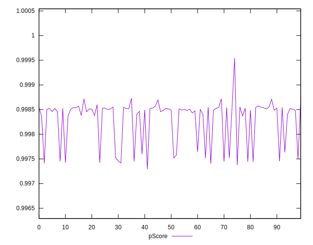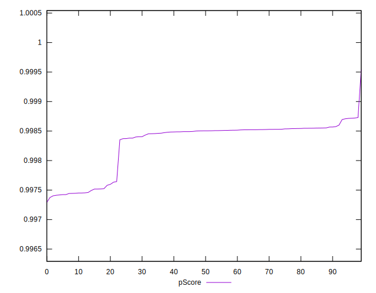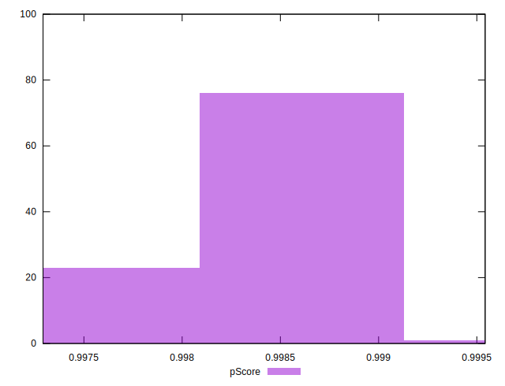
## Score Difference


```yaml
p90min: 0
p90max: 0
p90range: 0
p90mean: 0
median: 0
p90stdev: 0
mad: 0
stdevBySn: 0
lfitCenter: 0
lfitStdev: 0
mfitCenter: 0
mfitStdev: 0
mfitConfidence: 0
p90skewness: .nan
p90eccentricity: .nan
p90discretization: 94
outlandishness: .nan

```


## P Score Difference


```yaml
p90min: -0.0025875720687152937
p90max: -0.0012828495789187766
p90range: 0.001304722489796517
p90mean: -0.0017047901535399098
median: -0.0014959302978754807
p90stdev: 0.0004231857871731181
mad: 0.00004550038636219611
stdevBySn: 0.00007799071416962306
lfitCenter: -0.001639561677876907
lfitStdev: 0.00032185358845583667
mfitCenter: -0.001639561677876907
mfitStdev: 0.00040338365296332674
mfitConfidence: 0.00004033836529633267
p90skewness: -1.3455898660862797
p90eccentricity: 1.0000000000000002
p90discretization: 1
outlandishness: 1.008336657591994

```

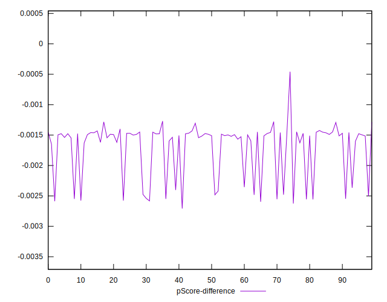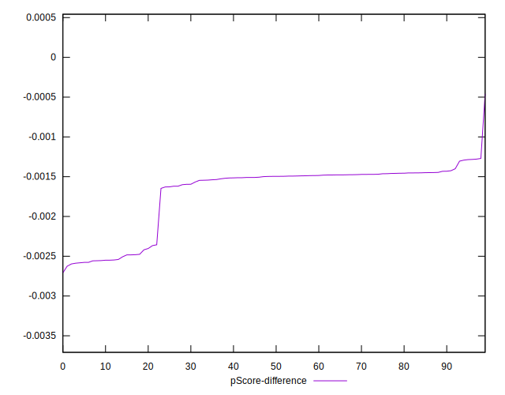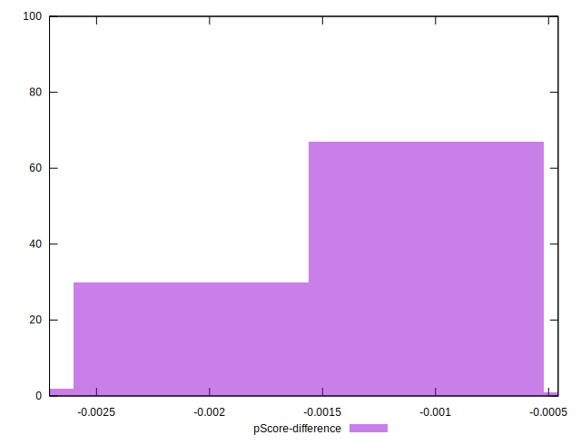