# //first-cpu-idle/samples/music

[→ Parent](../..)


## Raw


```yaml
p90min: 1436.406
p90max: 1486.4789999999998
p90range: 50.072999999999865
p90mean: 1464.5098404255325
median: 1467.2069999999999
p90stdev: 11.047041712702796
mad: 4.164000000000215
stdevBySn: 7.443612900000105
lfitCenter: 1465.4472949772787
lfitStdev: 7.451029273619343
mfitCenter: 1465.4472949772787
mfitStdev: 9.338480335575541
mfitConfidence: 0.9338480335575541
p90skewness: -1.2303815148262514
p90eccentricity: 0.9999999999999999
p90discretization: 1.010752688172043
outlandishness: 0.9997532699678283

```

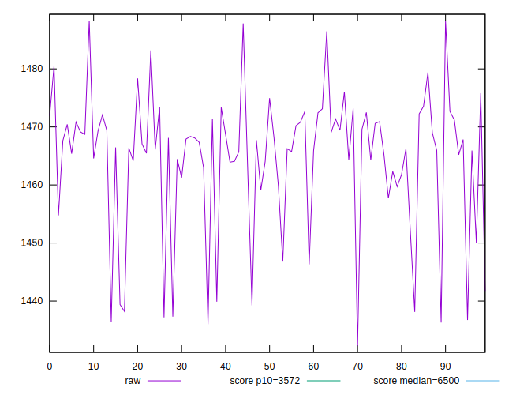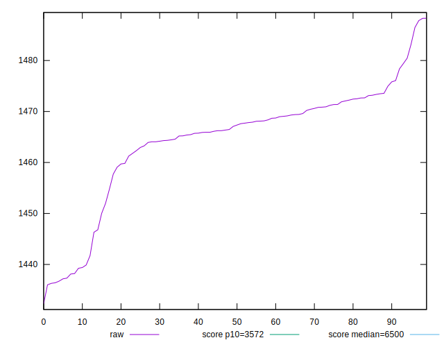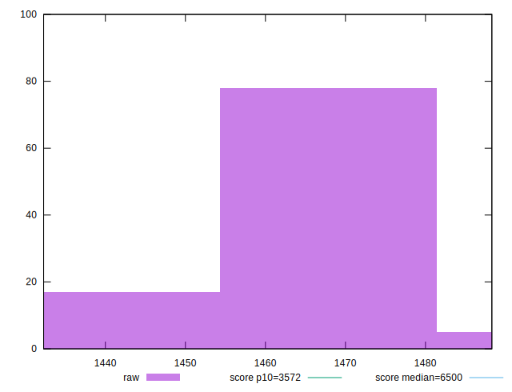
## Score


```yaml
p90min: 1
p90max: 1
p90range: 0
p90mean: 1
median: 1
p90stdev: 0
mad: 0
stdevBySn: 0
lfitCenter: 1
lfitStdev: 0
mfitCenter: 1
mfitStdev: 0
mfitConfidence: 0
p90skewness: .nan
p90eccentricity: .nan
p90discretization: 94
outlandishness: 1

```


## Raw Estimate

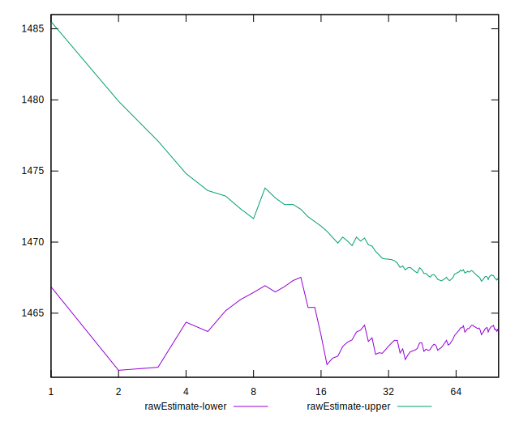
## Score Estimate

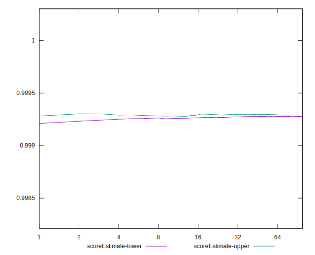
## P Score


```yaml
p90min: 0.9992064313916237
p90max: 0.999384518873442
p90range: 0.00017808748181835643
p90mean: 0.9992880977066024
median: 0.9992792084893272
p90stdev: 0.00003870267315720373
mad: 0.000015261104464980857
stdevBySn: 0.000026712388447672165
lfitCenter: 0.9992849338261195
lfitStdev: 0.000026272443922014818
mfitCenter: 0.9992849338261195
mfitStdev: 0.00003292762542242304
mfitConfidence: 0.000003292762542242304
p90skewness: 1.1265489896434984
p90eccentricity: 1.0000000000000007
p90discretization: 1.0217391304347827
outlandishness: 1.000000790163343

```

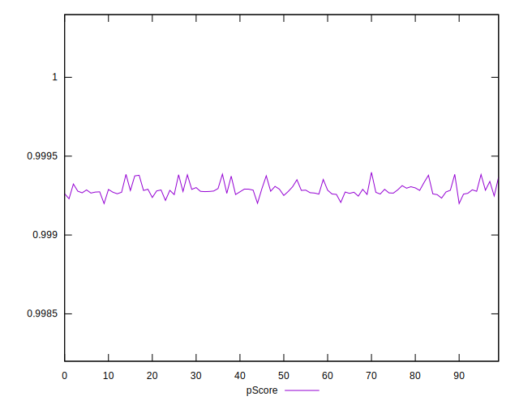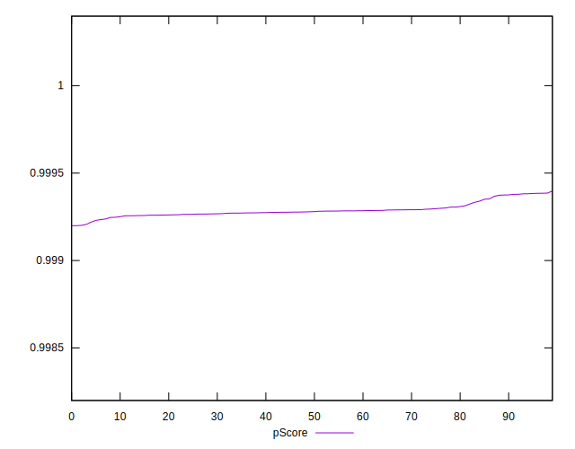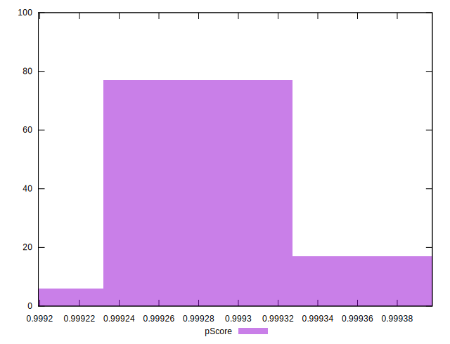
## Score Difference


```yaml
p90min: 0
p90max: 0
p90range: 0
p90mean: 0
median: 0
p90stdev: 0
mad: 0
stdevBySn: 0
lfitCenter: 0
lfitStdev: 0
mfitCenter: 0
mfitStdev: 0
mfitConfidence: 0
p90skewness: .nan
p90eccentricity: .nan
p90discretization: 94
outlandishness: .nan

```


## P Score Difference


```yaml
p90min: -0.000793568608376316
p90max: -0.0006154811265579596
p90range: 0.00017808748181835643
p90mean: -0.0007119022933975917
median: -0.0007207915106728358
p90stdev: 0.00003870267315720374
mad: 0.000015261104464980857
stdevBySn: 0.000026712388447672165
lfitCenter: -0.0007150661738808868
lfitStdev: 0.000026272443921848322
mfitCenter: -0.0007150661738808868
mfitStdev: 0.00003292762542221436
mfitConfidence: 0.0000032927625422214363
p90skewness: 1.12654898965375
p90eccentricity: 0.9999999999999994
p90discretization: 1.0217391304347827
outlandishness: 0.9988911656408975

```

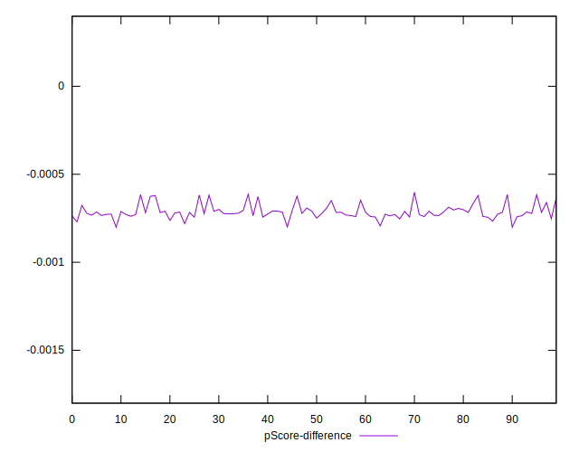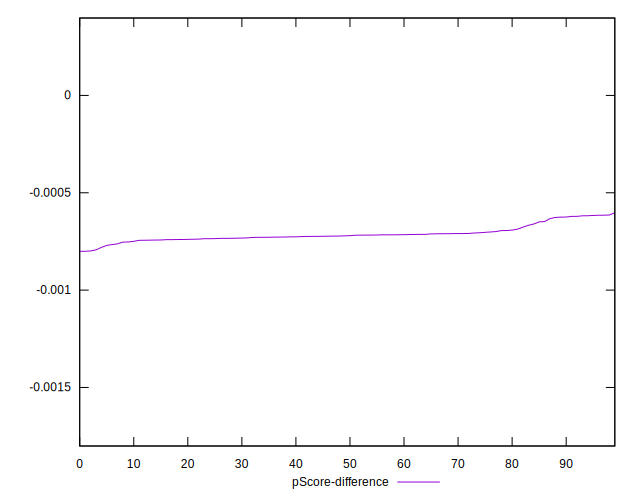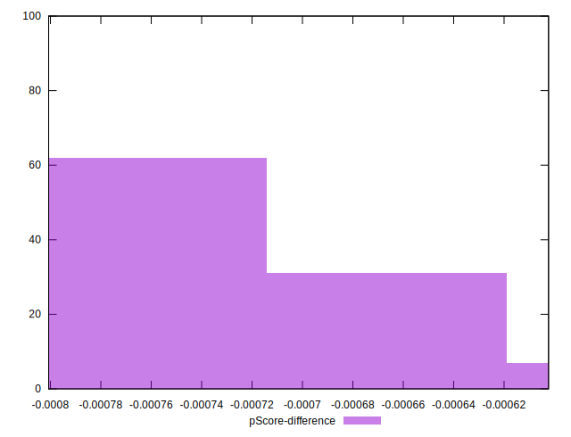