# //first-meaningful-paint/samples/agenda

[→ Parent](../..)


## Raw


```yaml
p90min: 1437.5549999999998
p90max: 1487.8770000000002
p90range: 50.322000000000344
p90mean: 1465.3341510638297
median: 1468.35435
p90stdev: 11.107846958361067
mad: 5.471850000000018
stdevBySn: 9.49780676999981
lfitCenter: 1460.9743823908789
lfitStdev: 18.493082484592748
mfitCenter: 1460.9743823908789
mfitStdev: 23.177641743804074
mfitConfidence: 2.3177641743804074
p90skewness: -0.8525969292082377
p90eccentricity: 1
p90discretization: 1
outlandishness: 0.9849536252534666

```

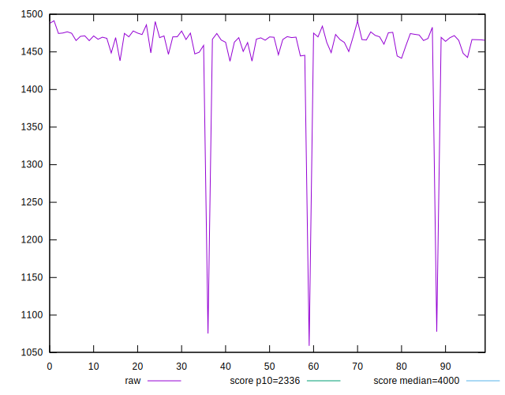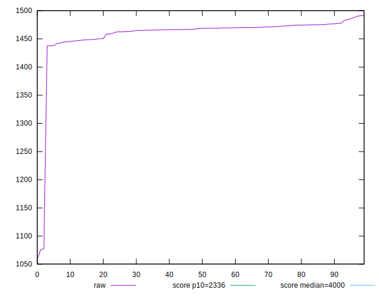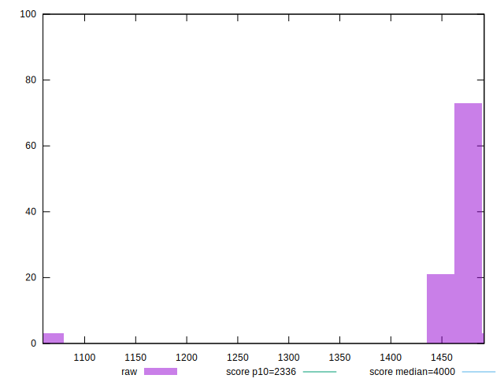
## Score


```yaml
p90min: 0.99
p90max: 0.99
p90range: 0
p90mean: 0.9899999999999988
median: 0.99
p90stdev: 1.2212453270876722e-15
mad: 0
stdevBySn: 0
lfitCenter: 0.9901433667946139
lfitStdev: 0.0003542151281484622
mfitCenter: 0.9901433667946139
mfitStdev: 0.0004439428282062034
mfitConfidence: 0.00004439428282062034
p90skewness: 1
p90eccentricity: 1
p90discretization: 94
outlandishness: 1.000606152433425

```

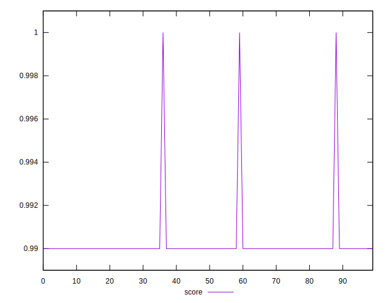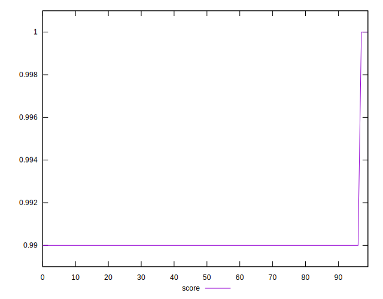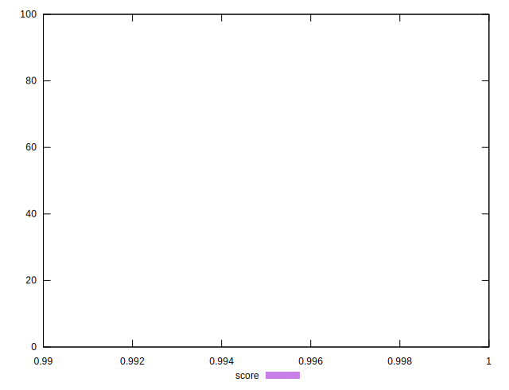
## Raw Estimate

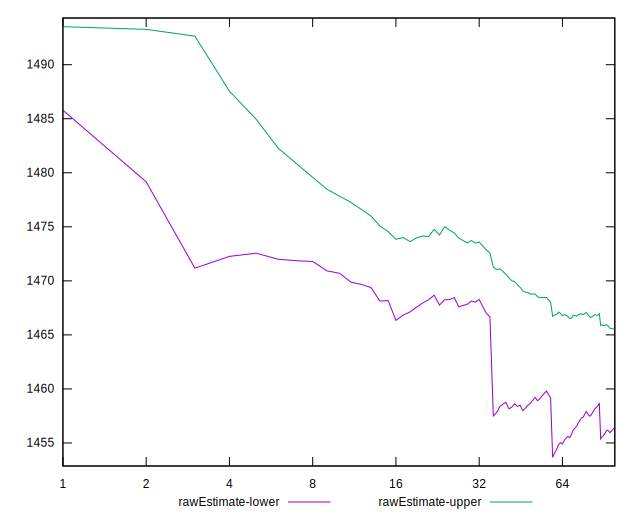
## Score Estimate

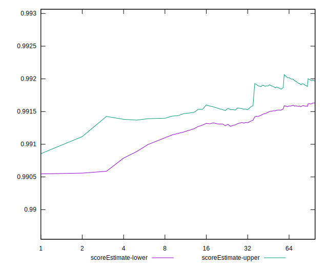
## P Score


```yaml
p90min: 0.9907727126969803
p90max: 0.9926227408961285
p90range: 0.001850028199148146
p90mean: 0.9916312877822253
median: 0.991526125010333
p90stdev: 0.0004055682814219227
mad: 0.00020294043847057797
stdevBySn: 0.00035769936199533475
lfitCenter: 0.9916933747853389
lfitStdev: 0.0004704839455138759
mfitCenter: 0.9916933747853389
mfitStdev: 0.0005896641808858614
mfitConfidence: 0.000058966418088586135
p90skewness: 0.7734256269148639
p90eccentricity: 1.0000000000000002
p90discretization: 1
outlandishness: 1.0003957860867565

```

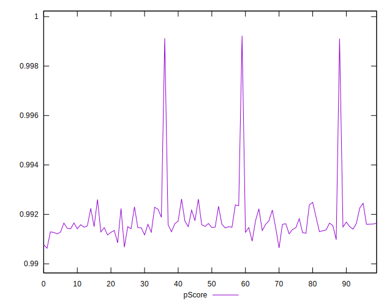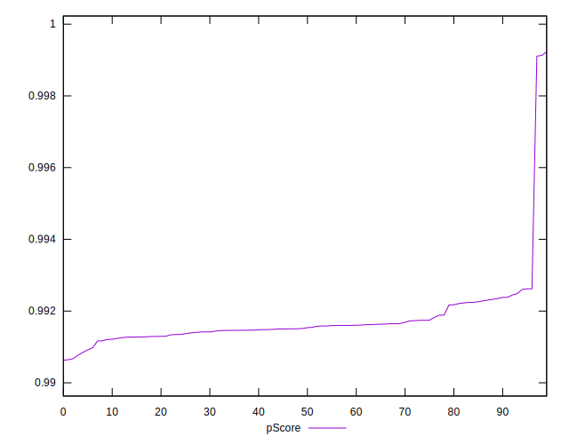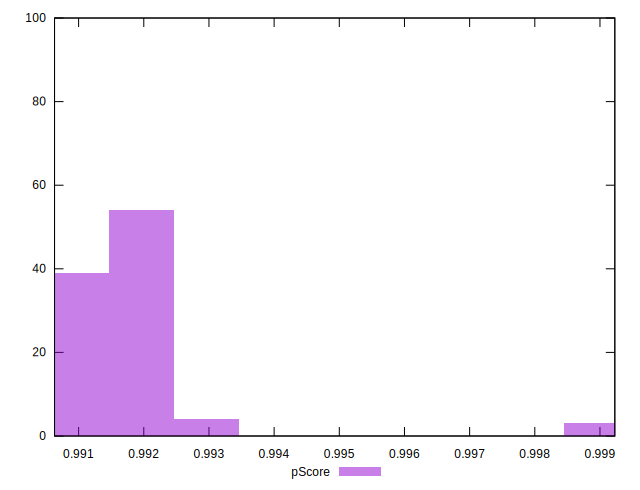
## Score Difference


```yaml
p90min: 0
p90max: 0
p90range: 0
p90mean: 0
median: 0
p90stdev: 0
mad: 0
stdevBySn: 0
lfitCenter: 0
lfitStdev: 0
mfitCenter: 0
mfitStdev: 0
mfitConfidence: 0
p90skewness: .nan
p90eccentricity: .nan
p90discretization: 94
outlandishness: .nan

```


## P Score Difference


```yaml
p90min: 0.0006305482443387245
p90max: 0.002487331781507729
p90range: 0.0018567835371690045
p90mean: 0.0015685504306731126
median: 0.0015042862727728812
p90stdev: 0.0004005799814055424
mad: 0.00020678122075140637
stdevBySn: 0.00035769936199533475
lfitCenter: 0.0015323932055725316
lfitStdev: 0.00030635942887527137
mfitCenter: 0.0015323932055725316
mfitStdev: 0.0003839646036956416
mfitConfidence: 0.000038396460369564156
p90skewness: 0.3329137224765637
p90eccentricity: 1.0000000000000004
p90discretization: 1
outlandishness: 0.9483496328526277

```

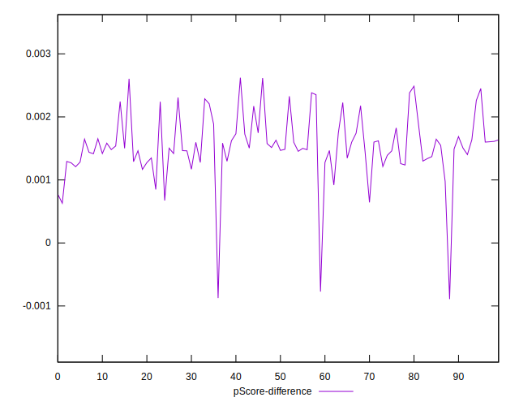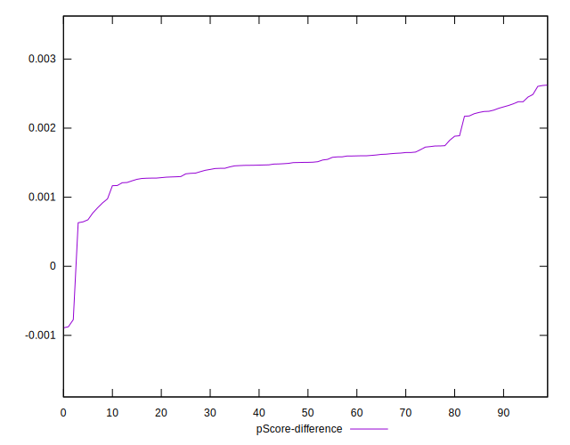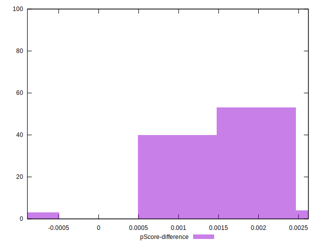