# //first-meaningful-paint/samples/astro

[→ Parent](../..)


## Raw


```yaml
p90min: 5020.332
p90max: 5694.308000000002
p90range: 673.9760000000015
p90mean: 5546.598563829785
median: 5657.143499999999
p90stdev: 193.51430967213835
mad: 25.194999999999254
stdevBySn: 39.31823309999859
lfitCenter: 5568.535051460198
lfitStdev: 179.8116799134407
mfitCenter: 5568.535051460198
mfitStdev: 225.36052071673214
mfitConfidence: 22.536052071673215
p90skewness: -1.3638463539907861
p90eccentricity: 1.0000000000000002
p90discretization: 1
outlandishness: 0.9927118642171757

```

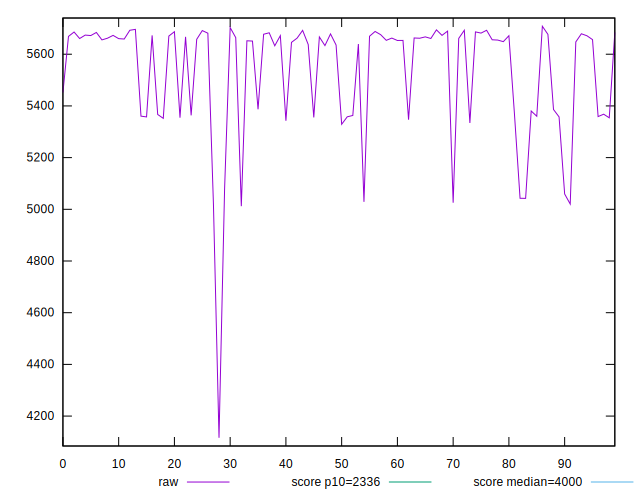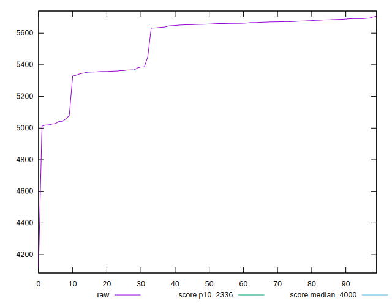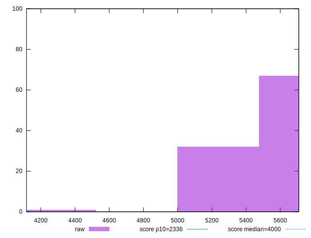
## Score


```yaml
p90min: 0.2
p90max: 0.29
p90range: 0.08999999999999997
p90mean: 0.21765957446808482
median: 0.2
p90stdev: 0.026394129421218434
mad: 0
stdevBySn: 0
lfitCenter: 0.21482083442716687
lfitStdev: 0.024545215471453764
mfitCenter: 0.21482083442716687
mfitStdev: 0.030762865584783045
mfitConfidence: 0.0030762865584783045
p90skewness: 1.4620234928731817
p90eccentricity: 1.0000000000000002
p90discretization: 13.428571428571429
outlandishness: 1.032796348309507

```

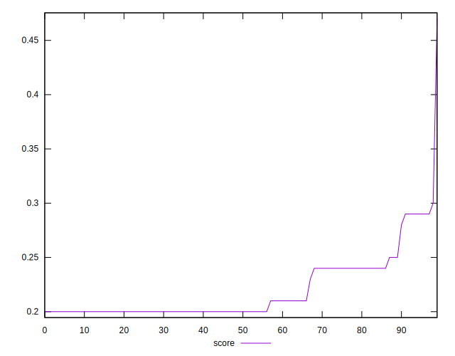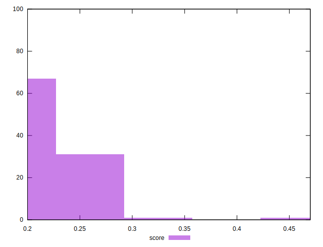
## Raw Estimate

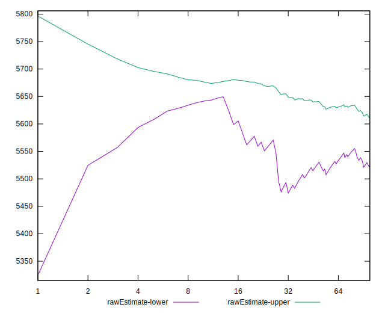
## Score Estimate

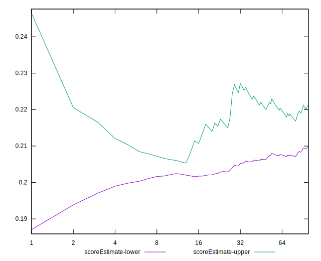
## P Score


```yaml
p90min: 0.20003146761196
p90max: 0.29413105847067184
p90range: 0.09409959085871183
p90mean: 0.21927681519227826
median: 0.20442847344377119
p90stdev: 0.02627356408777683
mad: 0.0030005747588906506
stdevBySn: 0.004667576090905032
lfitCenter: 0.21657051235676752
lfitStdev: 0.02439646878648227
mfitCenter: 0.21657051235676752
mfitStdev: 0.03057643926144187
mfitConfidence: 0.003057643926144187
p90skewness: 1.5054431206417076
p90eccentricity: 1.0000000000000007
p90discretization: 1
outlandishness: 1.0316425362102914

```

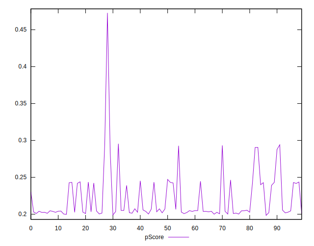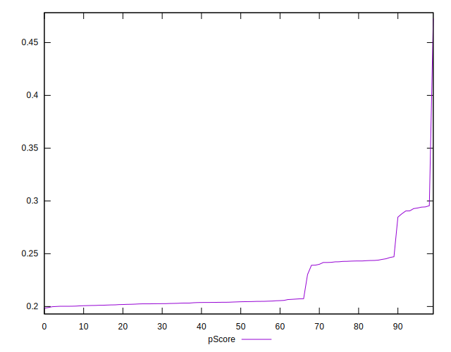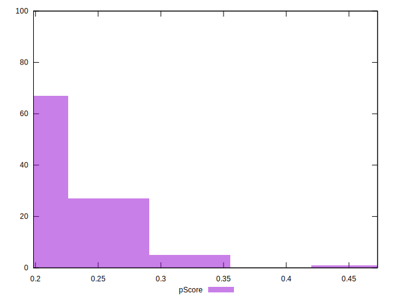
## Score Difference


```yaml
p90min: 0
p90max: 0
p90range: 0
p90mean: 0
median: 0
p90stdev: 0
mad: 0
stdevBySn: 0
lfitCenter: 2.583267684513104e-19
lfitStdev: 6.445158398659724e-19
mfitCenter: 2.583267684513104e-19
mfitStdev: 8.077808146406197e-19
mfitConfidence: 8.077808146406197e-20
p90skewness: .nan
p90eccentricity: .nan
p90discretization: 94
outlandishness: .inf

```

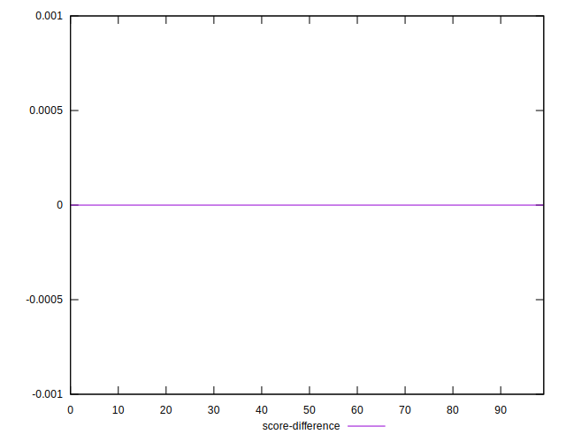
## P Score Difference


```yaml
p90min: -0.0045532261189346335
p90max: 0.004711007716373783
p90range: 0.009264233835308416
p90mean: 0.0016152911554378033
median: 0.002392258525126728
p90stdev: 0.002437856597965101
mad: 0.0015233216666822036
stdevBySn: 0.002118583272014383
lfitCenter: 0.0017928384231647937
lfitStdev: 0.001968724390210415
mfitCenter: 0.0017928384231647937
mfitStdev: 0.0024674301132113835
mfitConfidence: 0.00024674301132113837
p90skewness: -0.9843714434317986
p90eccentricity: 1.0000000000000002
p90discretization: 1
outlandishness: 0.8843691612623246

```

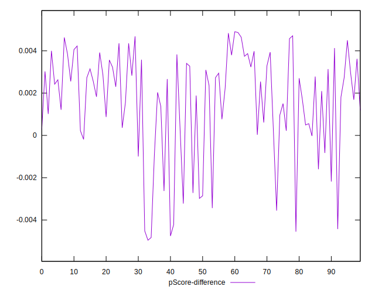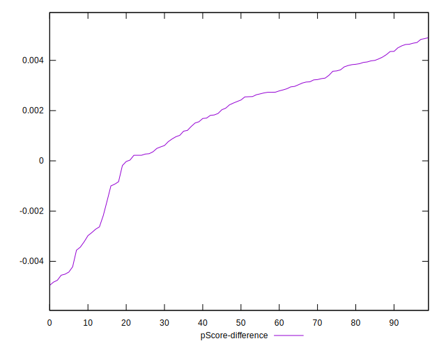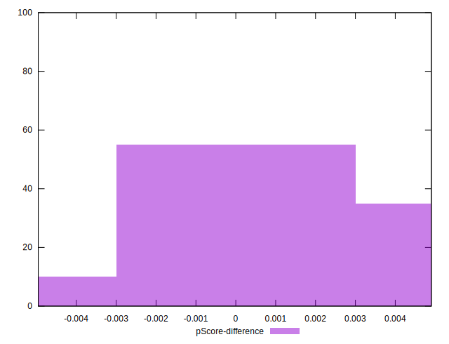