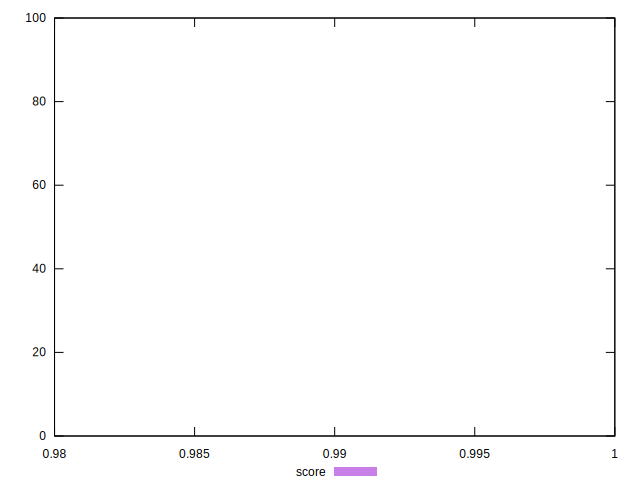

# //first-meaningful-paint/samples/music

[→ Parent](../..)


## Raw


```yaml
p90min: 1436.406
p90max: 1486.4789999999998
p90range: 50.072999999999865
p90mean: 1464.5098404255325
median: 1467.2069999999999
p90stdev: 11.047041712702796
mad: 4.164000000000215
stdevBySn: 7.443612900000105
lfitCenter: 1465.4472949772787
lfitStdev: 7.451029273619343
mfitCenter: 1465.4472949772787
mfitStdev: 9.338480335575541
mfitConfidence: 0.9338480335575541
p90skewness: -1.2303815148262514
p90eccentricity: 0.9999999999999999
p90discretization: 1.010752688172043
outlandishness: 0.9997532699678283

```


## Score


```yaml
p90min: 0.99
p90max: 0.99
p90range: 0
p90mean: 0.9899999999999988
median: 0.99
p90stdev: 1.2212453270876722e-15
mad: 0
stdevBySn: 0
lfitCenter: 0.9899999999999985
lfitStdev: 0
mfitCenter: 0.9899999999999985
mfitStdev: 0
mfitConfidence: 0
p90skewness: 1
p90eccentricity: 1
p90discretization: 94
outlandishness: 0.9999999999999996

```


## Raw Estimate


## Score Estimate


## P Score


```yaml
p90min: 0.990828210019493
p90max: 0.992661536128868
p90range: 0.001833326109375033
p90mean: 0.9916618974693776
median: 0.9915689774160981
p90stdev: 0.0003996143315587422
mad: 0.0001562522552644996
stdevBySn: 0.0002746079851283715
lfitCenter: 0.9916289856856291
lfitStdev: 0.00027095582589088007
mfitCenter: 0.9916289856856291
mfitStdev: 0.00033959276751874994
mfitConfidence: 0.000033959276751874996
p90skewness: 1.146985847059465
p90eccentricity: 1.0000000000000002
p90discretization: 1.0217391304347827
outlandishness: 1.0000091905301423

```


## Score Difference


```yaml
p90min: 0
p90max: 0
p90range: 0
p90mean: 0
median: 0
p90stdev: 0
mad: 0
stdevBySn: 0
lfitCenter: 0
lfitStdev: 0
mfitCenter: 0
mfitStdev: 0
mfitConfidence: 0
p90skewness: .nan
p90eccentricity: .nan
p90discretization: 94
outlandishness: .nan

```


## P Score Difference


```yaml
p90min: 0.0008282100194929587
p90max: 0.0026615361288679917
p90range: 0.001833326109375033
p90mean: 0.001661897469377436
median: 0.0015689774160981274
p90stdev: 0.0003996143315587423
mad: 0.0001562522552645551
stdevBySn: 0.0002746079851283715
lfitCenter: 0.001628985685629154
lfitStdev: 0.0002709558258909121
mfitCenter: 0.001628985685629154
mfitStdev: 0.00033959276751879006
mfitConfidence: 0.00003395927675187901
p90skewness: 1.1469858470549772
p90eccentricity: 0.9999999999999999
p90discretization: 1.0217391304347827
outlandishness: 1.005491537809716

```

