# //interactive/samples/agenda

[→ Parent](../..)


## Raw


```yaml
p90min: 1437.5549999999998
p90max: 1487.8770000000002
p90range: 50.322000000000344
p90mean: 1465.3341510638297
median: 1468.35435
p90stdev: 11.107846958361067
mad: 5.471850000000018
stdevBySn: 9.49780676999981
lfitCenter: 1460.9743823908789
lfitStdev: 18.493082484592748
mfitCenter: 1460.9743823908789
mfitStdev: 23.177641743804074
mfitConfidence: 2.3177641743804074
p90skewness: -0.8525969292082377
p90eccentricity: 1
p90discretization: 1
outlandishness: 0.9849536252534666

```

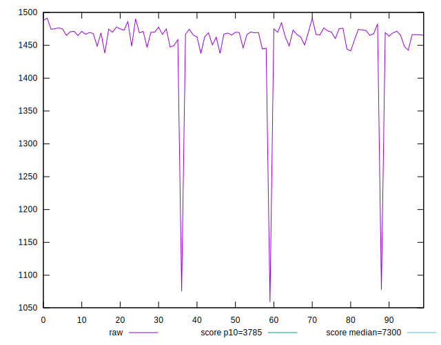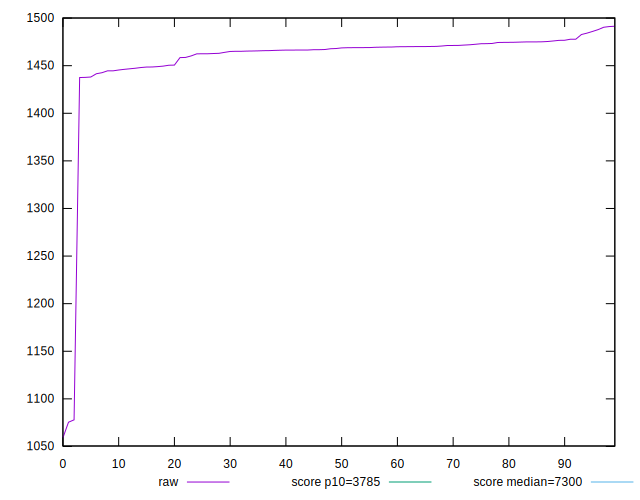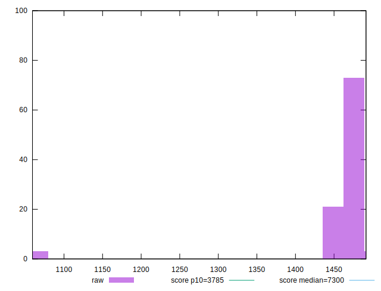
## Score


```yaml
p90min: 1
p90max: 1
p90range: 0
p90mean: 1
median: 1
p90stdev: 0
mad: 0
stdevBySn: 0
lfitCenter: 1
lfitStdev: 0
mfitCenter: 1
mfitStdev: 0
mfitConfidence: 0
p90skewness: .nan
p90eccentricity: .nan
p90discretization: 94
outlandishness: 1

```

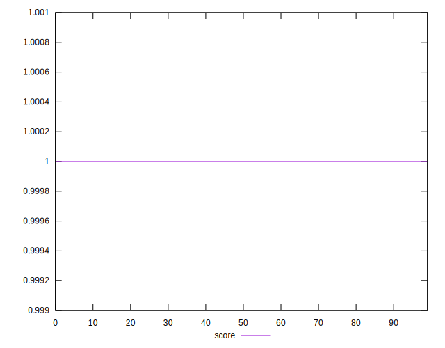
## Raw Estimate

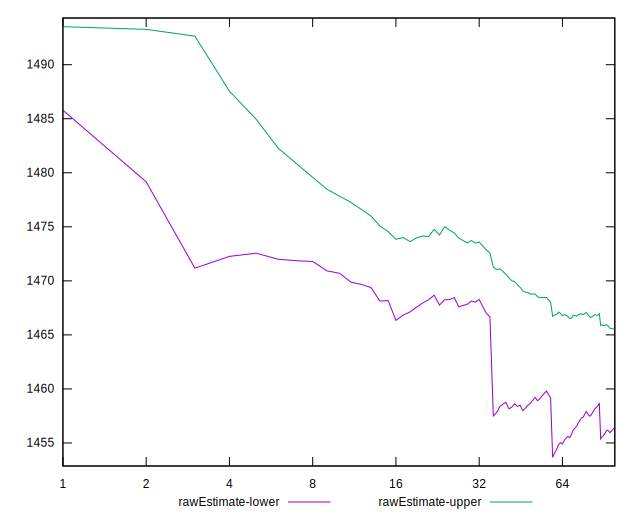
## Score Estimate

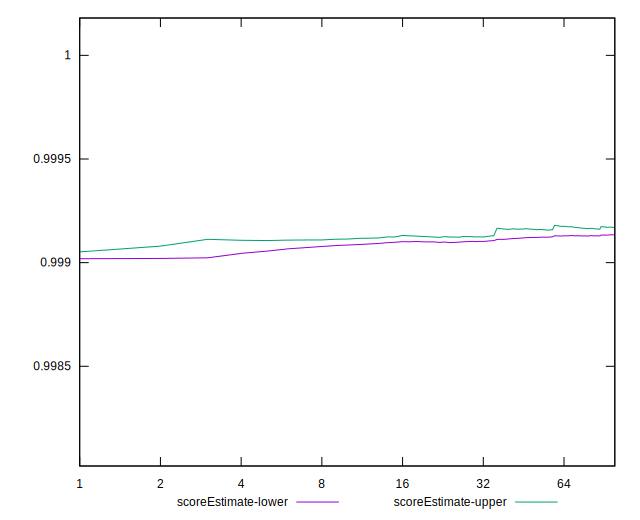
## P Score


```yaml
p90min: 0.9990430684029079
p90max: 0.9992388816434279
p90range: 0.00019581324051998195
p90mean: 0.9991342185127327
median: 0.9991231435512122
p90stdev: 0.000042897634852335835
mad: 0.000021491691631236876
stdevBySn: 0.000037932425664189276
lfitCenter: 0.9991405089506904
lfitStdev: 0.000049176979118276905
mfitCenter: 0.9991405089506904
mfitStdev: 0.00006163420322142454
mfitConfidence: 0.000006163420322142454
p90skewness: 0.7664054946426182
p90eccentricity: 1
p90discretization: 1
outlandishness: 1.0000403019889355

```

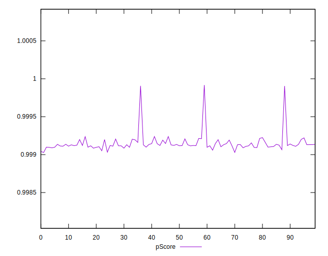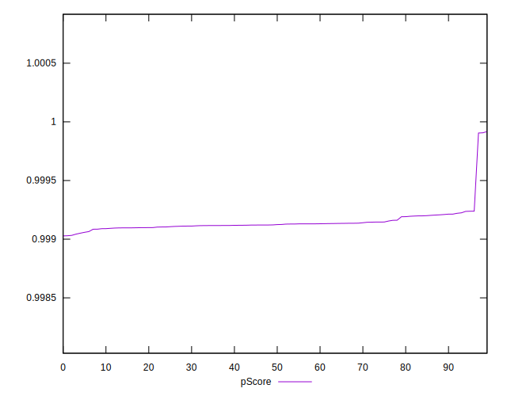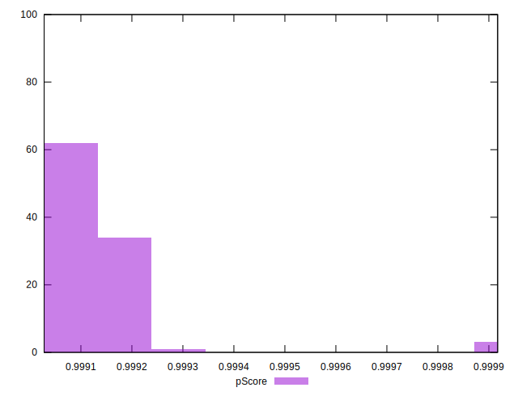
## Score Difference


```yaml
p90min: 0
p90max: 0
p90range: 0
p90mean: 0
median: 0
p90stdev: 0
mad: 0
stdevBySn: 0
lfitCenter: 0
lfitStdev: 0
mfitCenter: 0
mfitStdev: 0
mfitConfidence: 0
p90skewness: .nan
p90eccentricity: .nan
p90discretization: 94
outlandishness: .nan

```


## P Score Difference


```yaml
p90min: -0.0009569315970920922
p90max: -0.0007611183565721102
p90range: 0.00019581324051998195
p90mean: -0.0008657814872671857
median: -0.0008768564487877661
p90stdev: 0.00004289763485233584
mad: 0.000021491691631236876
stdevBySn: 0.000037932425664189276
lfitCenter: -0.0008594910493096499
lfitStdev: 0.000049176979118241425
mfitCenter: -0.0008594910493096499
mfitStdev: 0.00006163420322138007
mfitConfidence: 0.000006163420322138007
p90skewness: 0.7664054946623621
p90eccentricity: 0.9999999999999994
p90discretization: 1
outlandishness: 0.9540317048408036

```

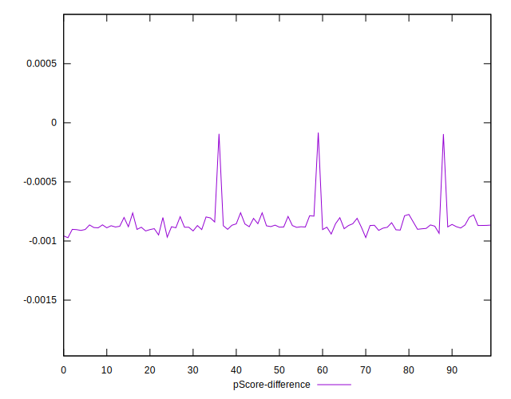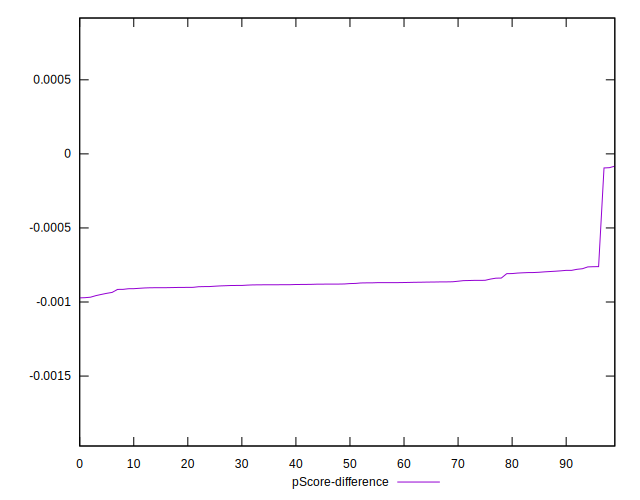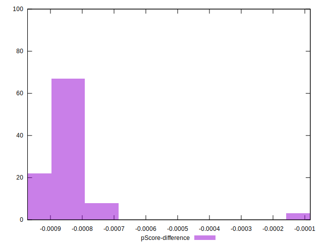