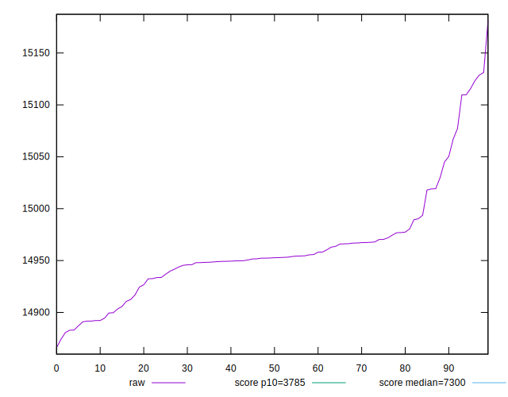

# //interactive/samples/astro

[→ Parent](../..)


## Raw


```yaml
p90min: 14882.871500000001
p90max: 15123.300499999998
p90range: 240.42899999999645
p90mean: 14959.95253191489
median: 14952.575
p90stdev: 49.59212465247733
mad: 17.725000000000364
stdevBySn: 30.429636225000483
lfitCenter: 14958.52920441068
lfitStdev: 31.912834539609563
mfitCenter: 14958.52920441068
mfitStdev: 39.996806730549544
mfitConfidence: 3.9996806730549546
p90skewness: 1.363748725822141
p90eccentricity: 0.9999999999999999
p90discretization: 1
outlandishness: 1.0004037362861642

```


## Score


```yaml
p90min: 0.08
p90max: 0.08
p90range: 0
p90mean: 0.08000000000000006
median: 0.08
p90stdev: 5.551115123125783e-17
mad: 0
stdevBySn: 0
lfitCenter: 0.08000000000000006
lfitStdev: 0
mfitCenter: 0.08000000000000006
mfitStdev: 0
mfitConfidence: 0
p90skewness: -1
p90eccentricity: 1
p90discretization: 94
outlandishness: 1

```


## Raw Estimate


## Score Estimate


## P Score


```yaml
p90min: 0.07764059790347
p90max: 0.08228655570139332
p90range: 0.004645957797923317
p90mean: 0.08077257727130524
median: 0.08091083415612921
p90stdev: 0.000960532193136436
mad: 0.000346036555365109
stdevBySn: 0.000595495813581029
lfitCenter: 0.08079920469732803
lfitStdev: 0.000618629331908054
mfitCenter: 0.08079920469732803
mfitStdev: 0.0007753368882185839
mfitConfidence: 0.00007753368882185839
p90skewness: -1.315647612108046
p90eccentricity: 1.0000000000000002
p90discretization: 1
outlandishness: 0.9986083864512041

```


## Score Difference


```yaml
p90min: 0
p90max: 0
p90range: 0
p90mean: 0
median: 0
p90stdev: 0
mad: 0
stdevBySn: 0
lfitCenter: 0
lfitStdev: 0
mfitCenter: 0
mfitStdev: 0
mfitConfidence: 0
p90skewness: .nan
p90eccentricity: .nan
p90discretization: 94
outlandishness: .nan

```


## P Score Difference


```yaml
p90min: -0.0023594020965300028
p90max: 0.002286555701393314
p90range: 0.004645957797923317
p90mean: 0.0007725772713052594
median: 0.000910834156129206
p90stdev: 0.0009605321931364364
mad: 0.000346036555365109
stdevBySn: 0.000595495813581029
lfitCenter: 0.0007992046973279983
lfitStdev: 0.0006186293319080674
mfitCenter: 0.0007992046973279983
mfitStdev: 0.0007753368882186007
mfitConfidence: 0.00007753368882186007
p90skewness: -1.3156476121081102
p90eccentricity: 0.9999999999999996
p90discretization: 1
outlandishness: 0.8597525326155894

```

