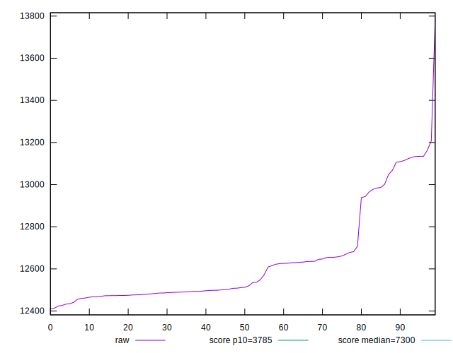

# //interactive/samples/music

[→ Parent](../..)


## Raw


```yaml
p90min: 12426.6485
p90max: 13134.301499999998
p90range: 707.6529999999984
p90mean: 12629.181659574468
median: 12511.90325
p90stdev: 213.30745642114218
mad: 73.74200000000019
stdevBySn: 96.64964567500186
lfitCenter: 12605.88081437616
lfitStdev: 169.88948266502604
mfitCenter: 12605.88081437616
mfitStdev: 212.92489061954782
mfitConfidence: 21.292489061954782
p90skewness: 1.356172141906913
p90eccentricity: 0.9999999999999999
p90discretization: 1
outlandishness: 1.0025852193624696

```


## Score


```yaml
p90min: 0.13
p90max: 0.15
p90range: 0.01999999999999999
p90mean: 0.14372340425531938
median: 0.15
p90stdev: 0.007716250130122798
mad: 0
stdevBySn: 0
lfitCenter: 0.14449278878302932
lfitStdev: 0.008083517696301223
mfitCenter: 0.14449278878302932
mfitStdev: 0.010131187018208778
mfitConfidence: 0.0010131187018208778
p90skewness: -0.7495385075037818
p90eccentricity: 1.000000000000001
p90discretization: 31.333333333333332
outlandishness: 0.9927297686117861

```


## Raw Estimate


## Score Estimate


## P Score


```yaml
p90min: 0.12589838600432274
p90max: 0.14965007078226766
p90range: 0.023751684777944926
p90mean: 0.1426162818111891
median: 0.14656602195023044
p90stdev: 0.007170511175568048
mad: 0.0026638832439085103
stdevBySn: 0.0034511107605556873
lfitCenter: 0.14340315939315565
lfitStdev: 0.005785769835080966
mfitCenter: 0.14340315939315565
mfitStdev: 0.007251387136857199
mfitConfidence: 0.0007251387136857199
p90skewness: -1.3086226344813423
p90eccentricity: 1
p90discretization: 1
outlandishness: 0.9930659148268134

```


## Score Difference


```yaml
p90min: 0
p90max: 0
p90range: 0
p90mean: 0
median: 0
p90stdev: 0
mad: 0
stdevBySn: 0
lfitCenter: 0
lfitStdev: 0
mfitCenter: 0
mfitStdev: 0
mfitConfidence: 0
p90skewness: .nan
p90eccentricity: .nan
p90discretization: 94
outlandishness: .nan

```


## P Score Difference


```yaml
p90min: -0.004229771138658384
p90max: 0.0029119261472813074
p90range: 0.007141697285939691
p90mean: -0.0011175475436490312
median: -0.0020369758774091695
p90stdev: 0.0021231379047060963
mad: 0.0014086362549704246
stdevBySn: 0.001998369820297258
lfitCenter: -0.0012771654187156384
lfitStdev: 0.00199157896643231
mfitCenter: -0.0012771654187156384
mfitStdev: 0.002496074076721462
mfitConfidence: 0.0002496074076721462
p90skewness: 0.49641452893564936
p90eccentricity: 0.9999999999999999
p90discretization: 1
outlandishness: 0.9322643675783415

```

