# //largest-contentful-paint/samples/agenda

[→ Parent](../..)


## Raw


```yaml
p90min: 1663.6872
p90max: 1712.8770000000002
p90range: 49.189800000000105
p90mean: 1690.9238297872346
median: 1693.35435
p90stdev: 10.317194624857951
mad: 5.078099999999949
stdevBySn: 8.772228929999994
lfitCenter: 1691.6436048167675
lfitStdev: 7.441814534372878
mfitCenter: 1691.6436048167675
mfitStdev: 9.32693137259465
mfitConfidence: 0.932693137259465
p90skewness: -0.8113335299857043
p90eccentricity: 0.9999999999999999
p90discretization: 1
outlandishness: 0.9998902183077936

```

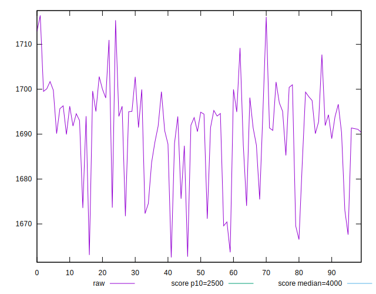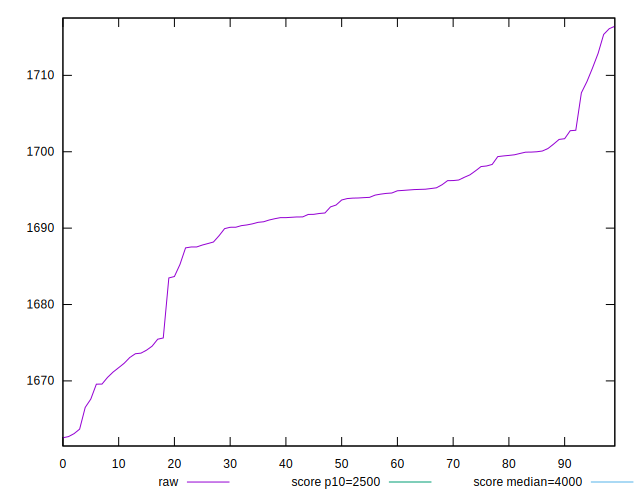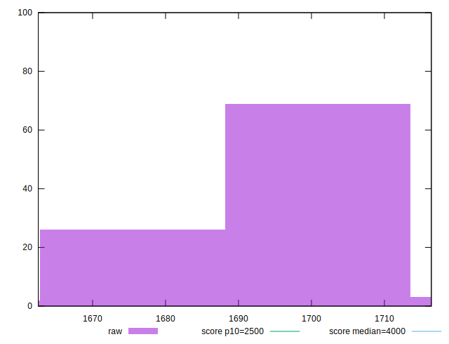
## Score


```yaml
p90min: 0.99
p90max: 0.99
p90range: 0
p90mean: 0.9899999999999988
median: 0.99
p90stdev: 1.2212453270876722e-15
mad: 0
stdevBySn: 0
lfitCenter: 0.9899999999999985
lfitStdev: 0
mfitCenter: 0.9899999999999985
mfitStdev: 0
mfitConfidence: 0
p90skewness: 1
p90eccentricity: 1
p90discretization: 94
outlandishness: 0.9999999999999996

```

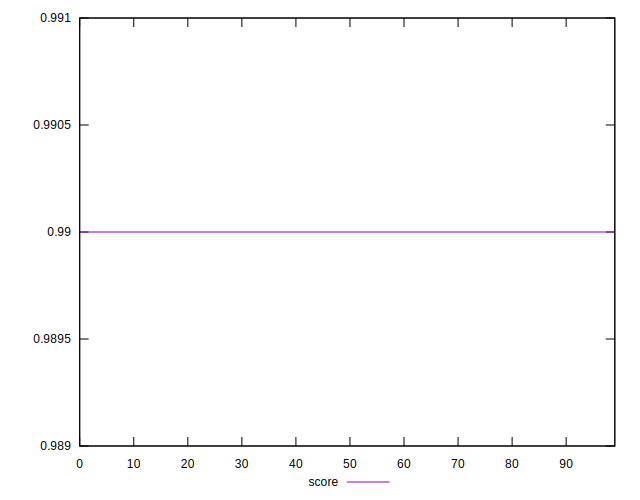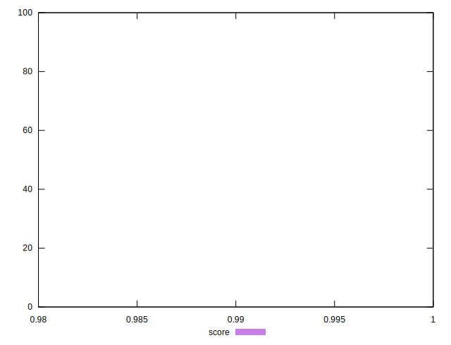
## Raw Estimate

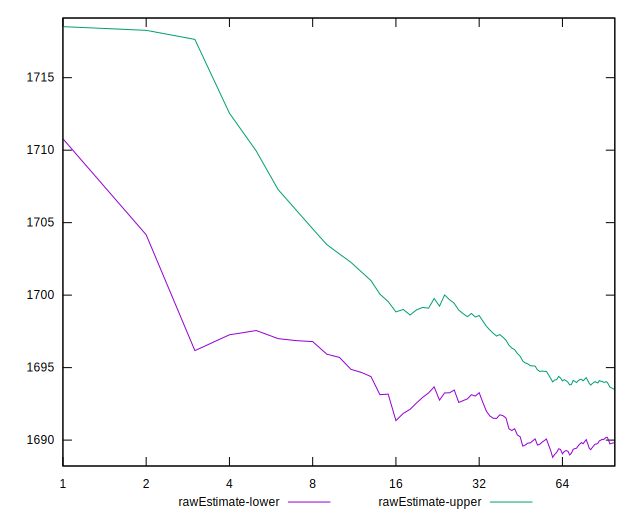
## Score Estimate

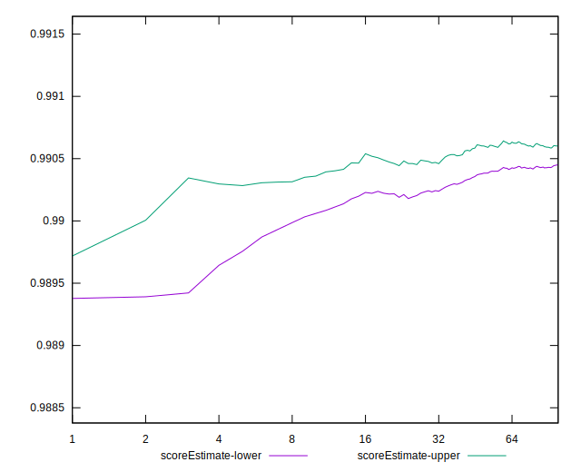
## P Score


```yaml
p90min: 0.9896264788052677
p90max: 0.9916217186391858
p90range: 0.0019952398339181387
p90mean: 0.9905489478576939
median: 0.9904561041453974
p90stdev: 0.00041638935780699836
mad: 0.00020916369909307342
stdevBySn: 0.00036017181652788595
lfitCenter: 0.9905209670420239
lfitStdev: 0.00030151880744809837
mfitCenter: 0.9905209670420239
mfitStdev: 0.0003778977844214687
mfitConfidence: 0.00003778977844214687
p90skewness: 0.729254802987489
p90eccentricity: 1.0000000000000002
p90discretization: 1
outlandishness: 1.0000029021027246

```

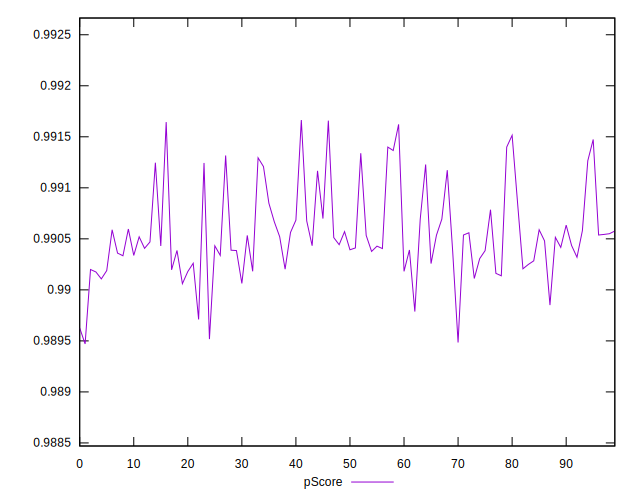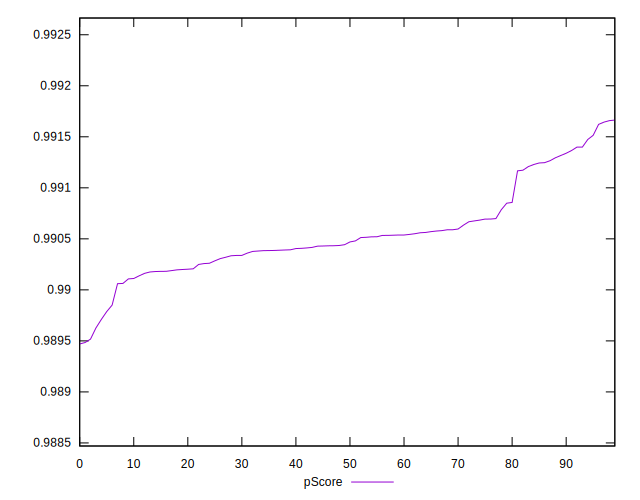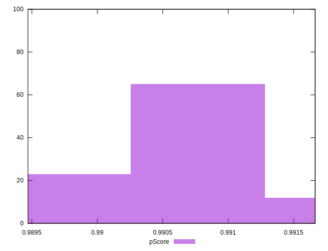
## Score Difference


```yaml
p90min: 0
p90max: 0
p90range: 0
p90mean: 0
median: 0
p90stdev: 0
mad: 0
stdevBySn: 0
lfitCenter: 0
lfitStdev: 0
mfitCenter: 0
mfitStdev: 0
mfitConfidence: 0
p90skewness: .nan
p90eccentricity: .nan
p90discretization: 94
outlandishness: .nan

```


## P Score Difference


```yaml
p90min: -0.00037352119473232914
p90max: 0.0016217186391858096
p90range: 0.0019952398339181387
p90mean: 0.0005489478576938774
median: 0.00045610414539748456
p90stdev: 0.0004163893578069983
mad: 0.00020916369909307342
stdevBySn: 0.00036017181652788595
lfitCenter: 0.0005209670420232912
lfitStdev: 0.00030151880744795157
mfitCenter: 0.0005209670420232912
mfitStdev: 0.0003778977844212847
mfitConfidence: 0.000037789778442128466
p90skewness: 0.7292548029875238
p90eccentricity: 1.0000000000000002
p90discretization: 1
outlandishness: 1.0052435511322113

```

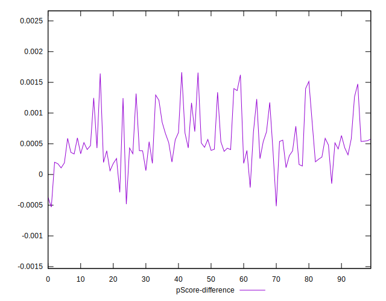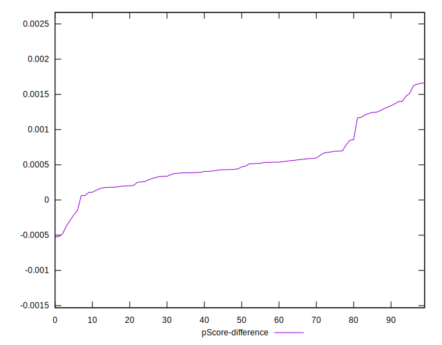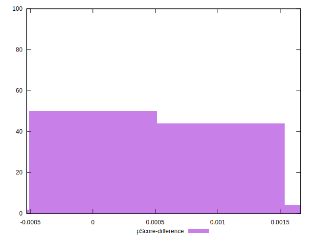