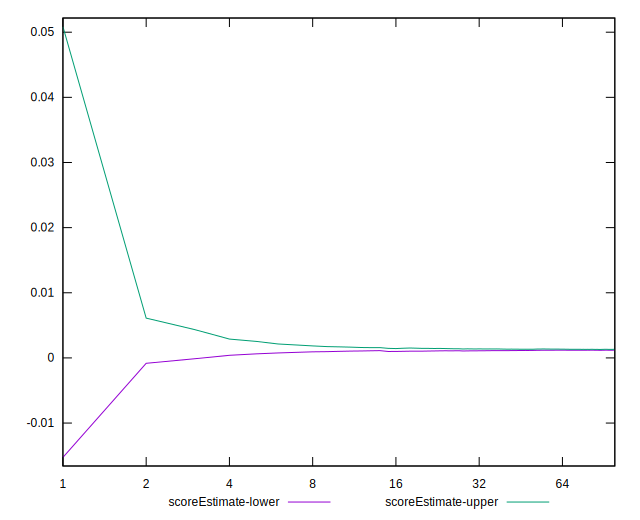

# //largest-contentful-paint/samples/astro

[→ Parent](../..)


## Raw


```yaml
p90min: 11264.795499999998
p90max: 13695.768999999997
p90range: 2430.9734999999982
p90mean: 12103.517542553187
median: 12141.65825
p90stdev: 349.6876573512898
mad: 159.9955
stdevBySn: 286.1825571500024
lfitCenter: 12118.66057671566
lfitStdev: 289.8775793216118
mfitCenter: 12118.66057671566
mfitStdev: 363.307668620147
mfitConfidence: 36.3307668620147
p90skewness: 1.3070928491688396
p90eccentricity: 1.0000000000000002
p90discretization: 1
outlandishness: 1.0023812037722968

```


## Score


```yaml
p90min: 0
p90max: 0
p90range: 0
p90mean: 0
median: 0
p90stdev: 0
mad: 0
stdevBySn: 0
lfitCenter: 0.0001396080405764575
lfitStdev: 0.000348316955550573
mfitCenter: 0.0001396080405764575
mfitStdev: 0.0004365505650975036
mfitConfidence: 0.00004365505650975036
p90skewness: .nan
p90eccentricity: .nan
p90discretization: 94
outlandishness: .inf

```


## Raw Estimate


## Score Estimate


## P Score


```yaml
p90min: 0.0003954718724583084
p90max: 0.002377581838697518
p90range: 0.0019821099662392094
p90mean: 0.001309086022082711
median: 0.001232718723542664
p90stdev: 0.00031613724098672984
mad: 0.000142445402240593
stdevBySn: 0.0002532012956616376
lfitCenter: 0.0014102738930633193
lfitStdev: 0.0004691306935113866
mfitCenter: 0.0014102738930633193
mfitStdev: 0.0005879681310180844
mfitConfidence: 0.00005879681310180844
p90skewness: 0.6374369817963057
p90eccentricity: 1
p90discretization: 1
outlandishness: 1.4526315081942138

```


## Score Difference


```yaml
p90min: 0
p90max: 0
p90range: 0
p90mean: 0
median: 0
p90stdev: 0
mad: 0
stdevBySn: 0
lfitCenter: 0
lfitStdev: 0
mfitCenter: 0
mfitStdev: 0
mfitConfidence: 0
p90skewness: .nan
p90eccentricity: .nan
p90discretization: 94
outlandishness: .nan

```


## P Score Difference


```yaml
p90min: 0.00035104480141473493
p90max: 0.0020669001205322335
p90range: 0.0017158553191174986
p90mean: 0.0012875271174307666
median: 0.0012306326722664462
p90stdev: 0.0003116034156849429
mad: 0.00014125955385888012
stdevBySn: 0.0002532012956616376
lfitCenter: 0.001265543475396664
lfitStdev: 0.0002497261206229233
mfitCenter: 0.001265543475396664
mfitStdev: 0.00031298527774860477
mfitConfidence: 0.000031298527774860474
p90skewness: 0.13544768031916288
p90eccentricity: 0.9999999999999997
p90discretization: 1
outlandishness: 0.9849135029569204

```

