# //largest-contentful-paint/samples/card

[→ Parent](../..)


## Raw


```yaml
p90min: 1814.0114999999998
p90max: 1961.0079999999998
p90range: 146.99649999999997
p90mean: 1854.3629861702125
median: 1847.8935000000001
p90stdev: 24.994704522548165
mad: 6.186750000000188
stdevBySn: 11.613121390000105
lfitCenter: 1853.099464566294
lfitStdev: 17.32020648834415
mfitCenter: 1853.099464566294
mfitStdev: 21.70765967490855
mfitConfidence: 2.1707659674908553
p90skewness: 1.6698096223428684
p90eccentricity: 0.9999999999999994
p90discretization: 1
outlandishness: 1.0026758972055814

```

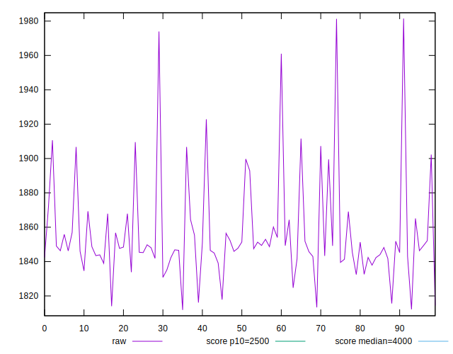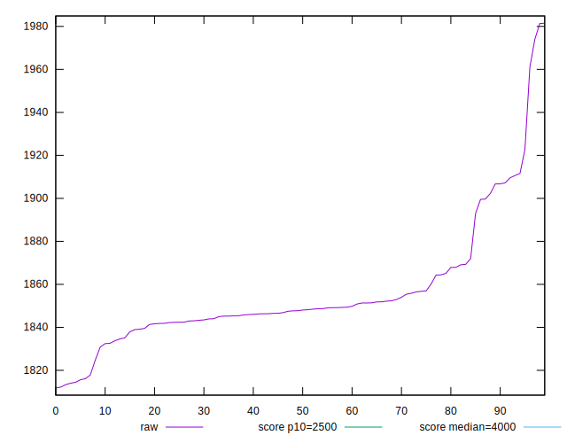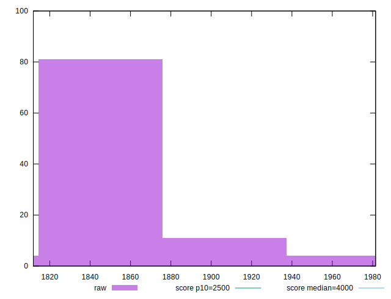
## Score


```yaml
p90min: 0.97
p90max: 0.98
p90range: 0.010000000000000009
p90mean: 0.9798936170212768
median: 0.98
p90stdev: 0.0010259202937226554
mad: 0
stdevBySn: 0
lfitCenter: 0.9798062523965824
lfitStdev: 0.00047624380658419294
mfitCenter: 0.9798062523965824
mfitStdev: 0.0005968830962015269
mfitConfidence: 0.000059688309620152686
p90skewness: -9.539955591520414
p90eccentricity: 0.9999999999999987
p90discretization: 47
outlandishness: 0.9994008063197466

```

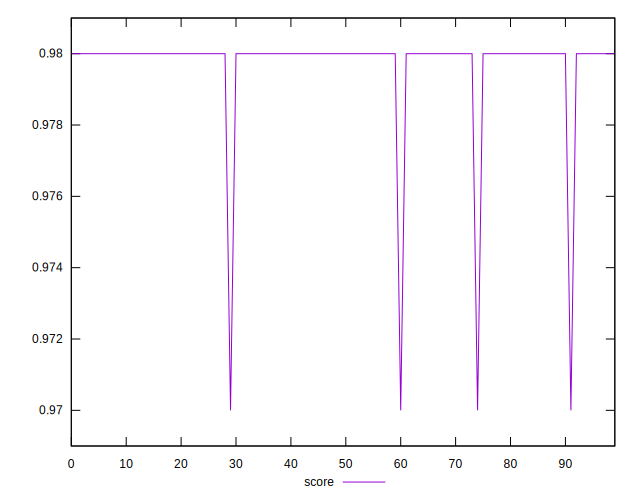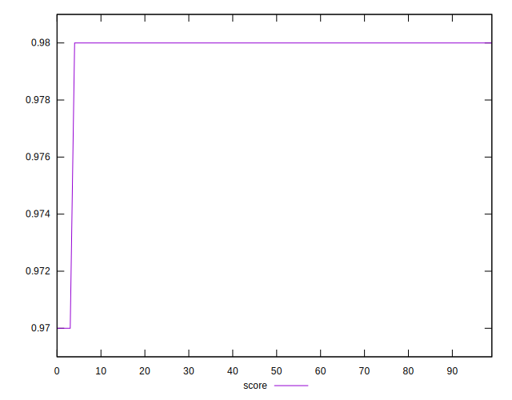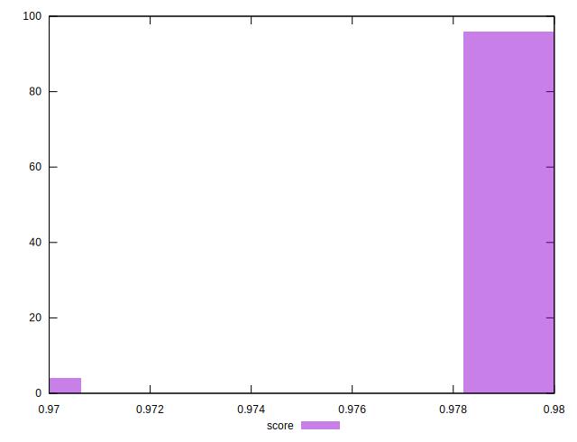
## Raw Estimate

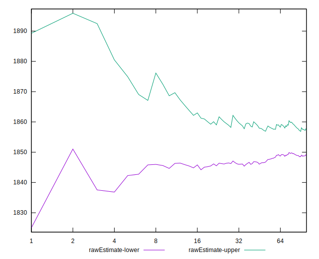
## Score Estimate

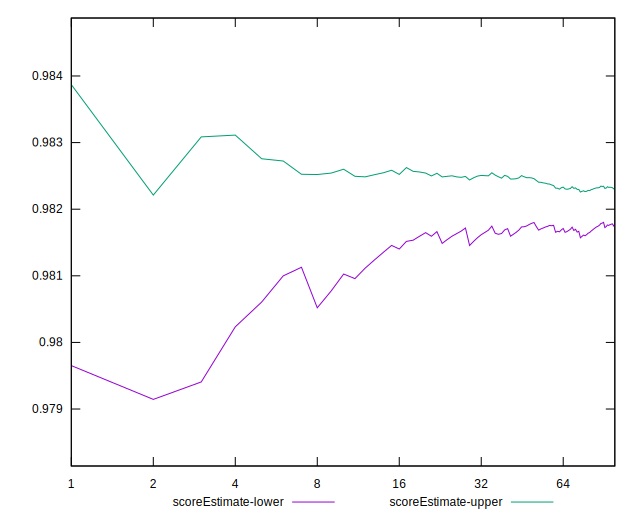
## P Score


```yaml
p90min: 0.974032926734776
p90max: 0.9844635198355346
p90range: 0.010430593100758556
p90mean: 0.9819129115602984
median: 0.98238383406908
p90stdev: 0.0017213013745763792
mad: 0.0003966926979979135
stdevBySn: 0.0007410792763564544
lfitCenter: 0.9819967069136866
lfitStdev: 0.0012021326419065107
mfitCenter: 0.9819967069136866
mfitStdev: 0.0015066498365459166
mfitConfidence: 0.00015066498365459165
p90skewness: -1.9147333426761877
p90eccentricity: 1.0000000000000002
p90discretization: 1
outlandishness: 0.9995862691078128

```

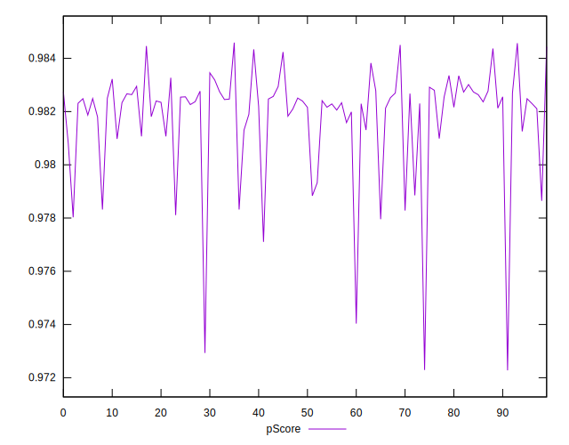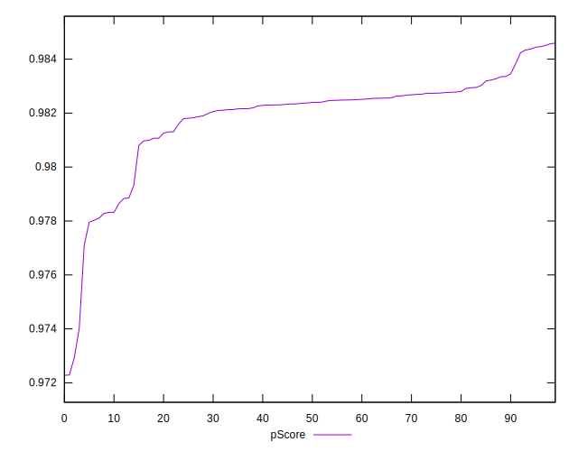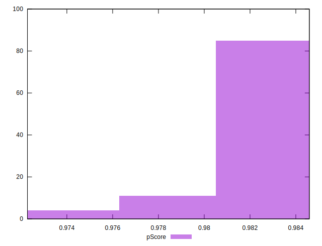
## Score Difference


```yaml
p90min: 0
p90max: 0
p90range: 0
p90mean: 0
median: 0
p90stdev: 0
mad: 0
stdevBySn: 0
lfitCenter: 0
lfitStdev: 0
mfitCenter: 0
mfitStdev: 0
mfitConfidence: 0
p90skewness: .nan
p90eccentricity: .nan
p90discretization: 94
outlandishness: .nan

```


## P Score Difference


```yaml
p90min: -0.0018905419845881566
p90max: 0.004463519835534613
p90range: 0.006354061820122769
p90mean: 0.0021726247407851886
median: 0.002404556995138196
p90stdev: 0.0013127383302254047
mad: 0.0003646199054125332
stdevBySn: 0.0006769321513475968
lfitCenter: 0.0022410147520749543
lfitStdev: 0.0008135474686570797
mfitCenter: 0.0022410147520749543
mfitStdev: 0.0010196305448711524
mfitConfidence: 0.00010196305448711524
p90skewness: -1.4760595958591478
p90eccentricity: 1.0000000000000009
p90discretization: 1
outlandishness: 0.9429733574360218

```

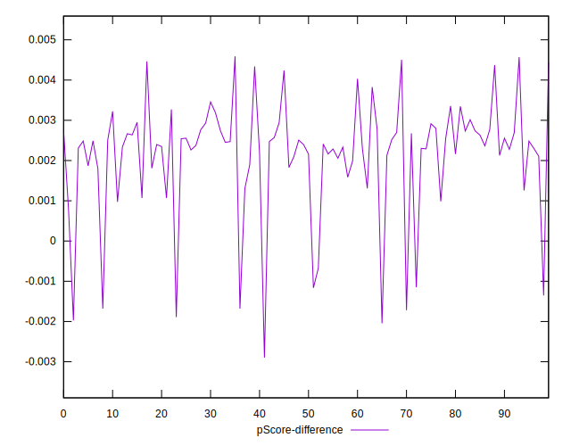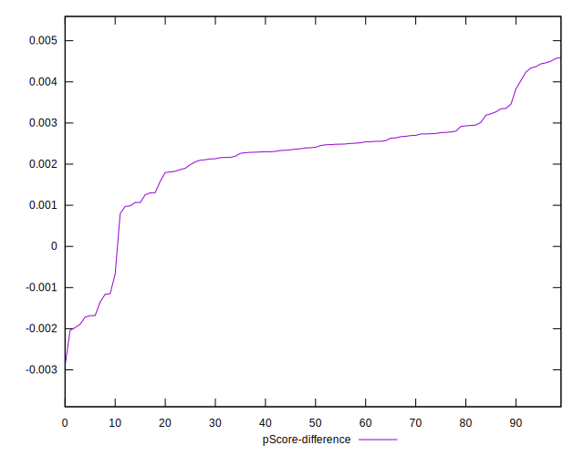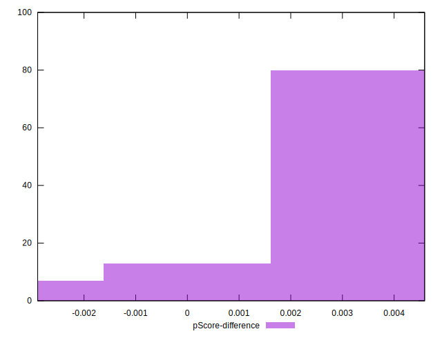