# //largest-contentful-paint/samples/music

[→ Parent](../..)


## Raw


```yaml
p90min: 1661.406
p90max: 1713.279
p90range: 51.87300000000005
p90mean: 1689.9222765957454
median: 1692.2069999999999
p90stdev: 11.532468238103087
mad: 4.431000000000267
stdevBySn: 7.726259100000065
lfitCenter: 1721.5562315709751
lfitStdev: 77.13745150963763
mfitCenter: 1721.5562315709751
mfitStdev: 96.67745859079868
mfitConfidence: 9.667745859079869
p90skewness: -1.0041235391725323
p90eccentricity: 1
p90discretization: 1.010752688172043
outlandishness: 1.078685735999017

```

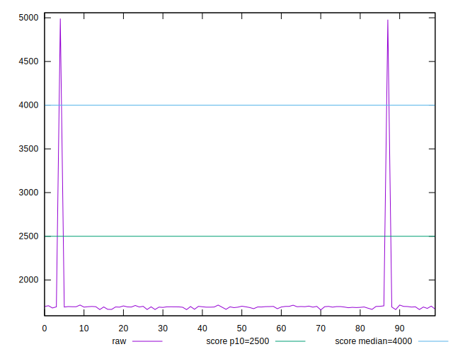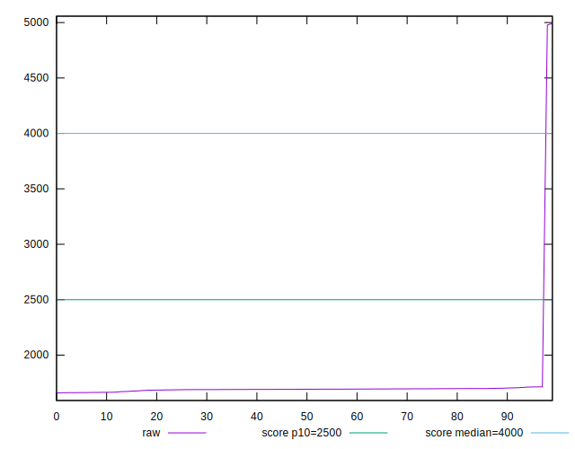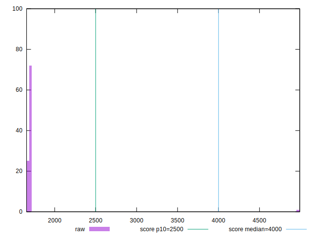
## Score


```yaml
p90min: 0.99
p90max: 0.99
p90range: 0
p90mean: 0.9899999999999988
median: 0.99
p90stdev: 1.2212453270876722e-15
mad: 0
stdevBySn: 0
lfitCenter: 0.9832573931644073
lfitStdev: 0.016741812206321247
mfitCenter: 0.9832573931644073
mfitStdev: 0.02098274994357736
mfitConfidence: 0.002098274994357736
p90skewness: 1
p90eccentricity: 1
p90discretization: 94
outlandishness: 0.9713197530864195

```

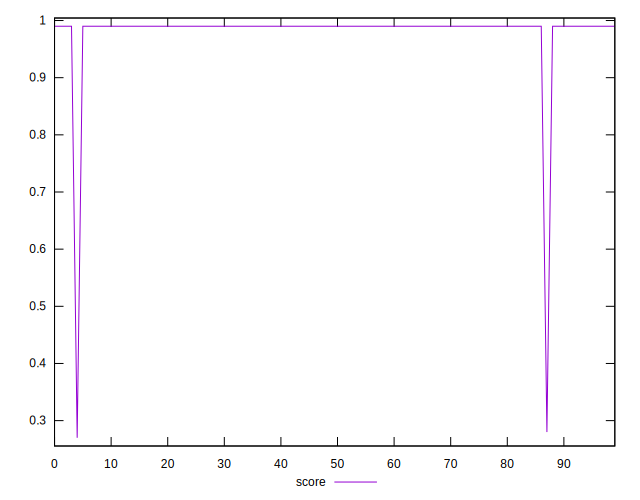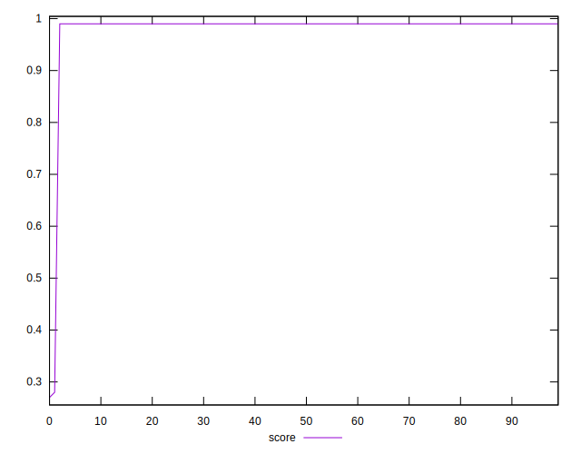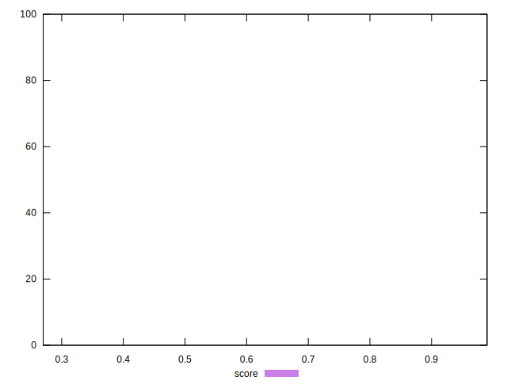
## Raw Estimate

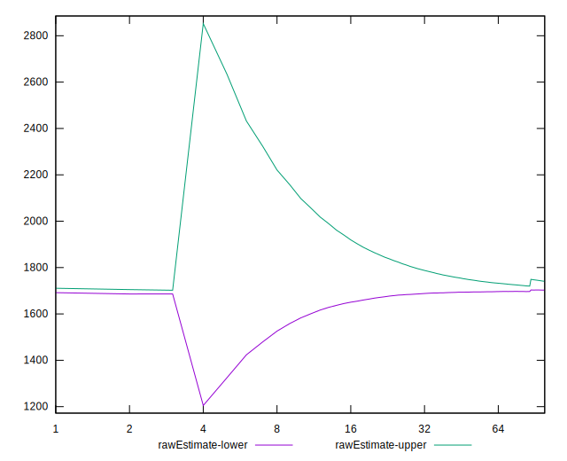
## Score Estimate

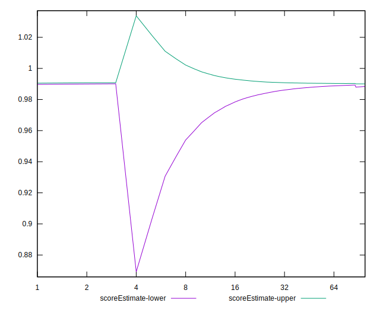
## P Score


```yaml
p90min: 0.9896088579358182
p90max: 0.9917067419340517
p90range: 0.0020978839982335185
p90mean: 0.9905881357138645
median: 0.9905032953886987
p90stdev: 0.0004616509823369787
mad: 0.00018318610871170815
stdevBySn: 0.00031796996528559774
lfitCenter: 0.983811966771849
lfitStdev: 0.016774033242877903
mfitCenter: 0.983811966771849
mfitStdev: 0.02102313302425341
mfitConfidence: 0.002102313302425341
p90skewness: 0.8968932008350232
p90eccentricity: 0.9999999999999999
p90discretization: 1.010752688172043
outlandishness: 0.9713336184414408

```

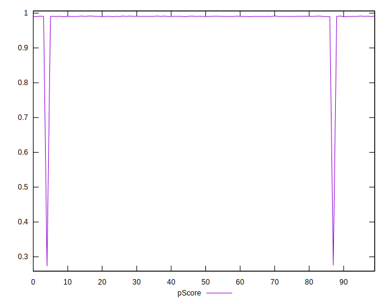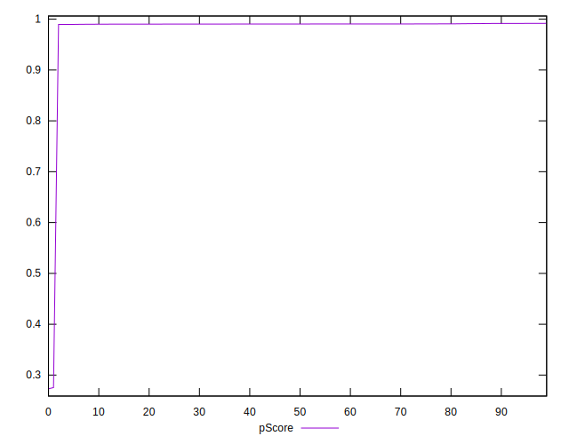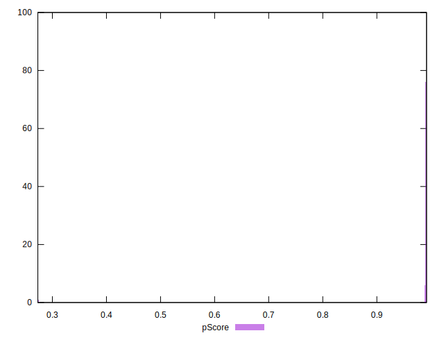
## Score Difference


```yaml
p90min: 0
p90max: 0
p90range: 0
p90mean: 0
median: 0
p90stdev: 0
mad: 0
stdevBySn: 0
lfitCenter: 0
lfitStdev: 0
mfitCenter: 0
mfitStdev: 0
mfitConfidence: 0
p90skewness: .nan
p90eccentricity: .nan
p90discretization: 94
outlandishness: .nan

```


## P Score Difference


```yaml
p90min: -0.0003714186760578331
p90max: 0.001710639909711209
p90range: 0.002082058585769042
p90mean: 0.0006104950965652621
median: 0.0005168644776565312
p90stdev: 0.00046456876970630504
mad: 0.00018563946920152619
stdevBySn: 0.00031796996528559774
lfitCenter: 0.0005616480452814331
lfitStdev: 0.00034235434135351794
mfitCenter: 0.0005616480452814331
mfitStdev: 0.00042907753642145666
mfitConfidence: 0.000042907753642145666
p90skewness: 0.9853091493789194
p90eccentricity: 0.9999999999999999
p90discretization: 1.010752688172043
outlandishness: 0.9232776100563306

```

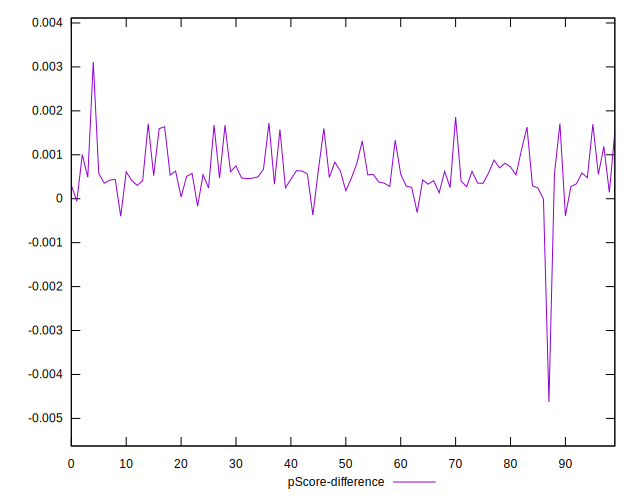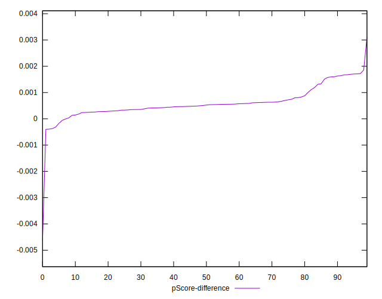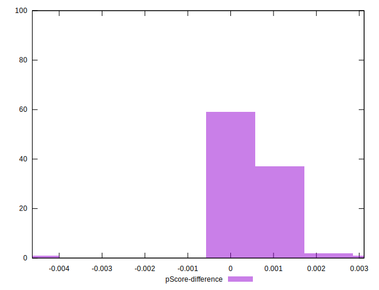