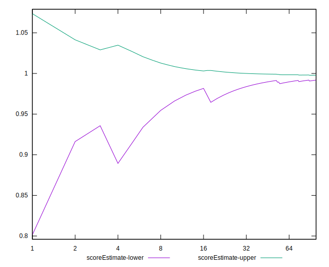

# //legacy-javascript/samples/astro

[→ Parent](../..)


## Raw


```yaml
p90min: 0
p90max: 150
p90range: 150
p90mean: 7.9787234042553195
median: 0
p90stdev: 33.66227091978024
mad: 0
stdevBySn: 0
lfitCenter: 6.141749641833831
lfitStdev: 14.764731673499382
mfitCenter: 6.141749641833831
mfitStdev: 18.504846958687082
mfitConfidence: 1.8504846958687082
p90skewness: 3.9819818903758333
p90eccentricity: 1.0000000000000018
p90discretization: 47
outlandishness: 2.262016

```


## Score


```yaml
p90min: 0.88
p90max: 1
p90range: 0.12
p90mean: 0.9936170212765958
median: 1
p90stdev: 0.026929816735824244
mad: 0
stdevBySn: 0
lfitCenter: 0.9950866002865332
lfitStdev: 0.011811785338799235
mfitCenter: 0.9950866002865332
mfitStdev: 0.014803877566949328
mfitConfidence: 0.0014803877566949327
p90skewness: -3.9819818903757844
p90eccentricity: 0.9999999999999972
p90discretization: 47
outlandishness: 0.9935351078871467

```


## Raw Estimate


## Score Estimate


## P Score


```yaml
p90min: 0.875
p90max: 1
p90range: 0.125
p90mean: 0.9933510638297872
median: 1
p90stdev: 0.02805189243315025
mad: 0
stdevBySn: 0
lfitCenter: 0.994881875298472
lfitStdev: 0.012303943061249205
mfitCenter: 0.994881875298472
mfitStdev: 0.015420705798905553
mfitConfidence: 0.0015420705798905553
p90skewness: -3.981981890375818
p90eccentricity: 0.9999999999999963
p90discretization: 47
outlandishness: 0.9932643925097983

```


## Score Difference


```yaml
p90min: 0
p90max: 0
p90range: 0
p90mean: 0
median: 0
p90stdev: 0
mad: 0
stdevBySn: 0
lfitCenter: 0
lfitStdev: 0
mfitCenter: 0
mfitStdev: 0
mfitConfidence: 0
p90skewness: .nan
p90eccentricity: .nan
p90discretization: 94
outlandishness: .nan

```


## P Score Difference


```yaml
p90min: -0.0050000000000000044
p90max: 0
p90range: 0.0050000000000000044
p90mean: -0.00026595744680851086
median: 0
p90stdev: 0.0011220756973260113
mad: 0
stdevBySn: 0
lfitCenter: -0.00020472498806112786
lfitStdev: 0.0004921577224499798
mfitCenter: -0.00020472498806112786
mfitStdev: 0.0006168282319562367
mfitConfidence: 0.00006168282319562367
p90skewness: -3.981981890375815
p90eccentricity: 0.9999999999999961
p90discretization: 47
outlandishness: 2.262016

```

