# //mainthread-work-breakdown/samples/agenda

[→ Parent](../..)


## Raw


```yaml
p90min: 775.584000000001
p90max: 853.8200000000006
p90range: 78.23599999999965
p90mean: 814.8935744680854
median: 814.4300000000007
p90stdev: 18.374281815746
mad: 16.091999999999814
stdevBySn: 21.96530680000028
lfitCenter: 815.0120266640049
lfitStdev: 15.957896523257666
mfitCenter: 815.0120266640049
mfitStdev: 20.00025733454181
mfitConfidence: 2.000025733454181
p90skewness: -0.03655365784064479
p90eccentricity: 0.9999999999999999
p90discretization: 1
outlandishness: 1.0002207662416136

```

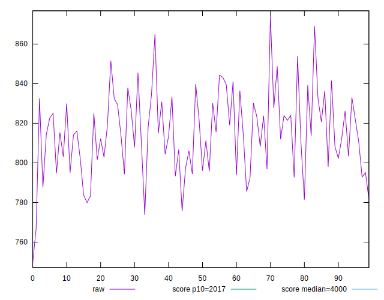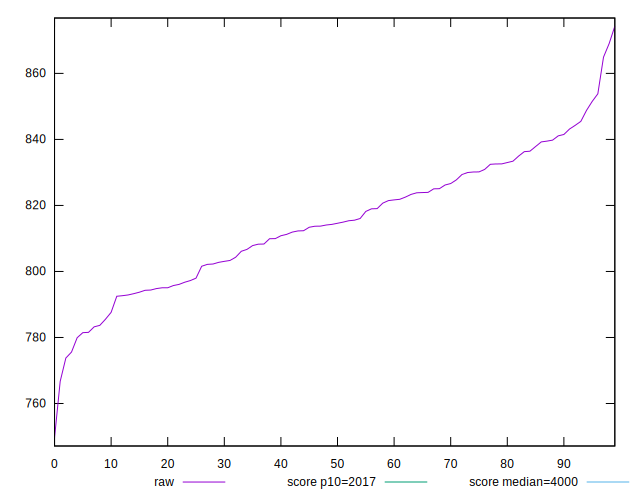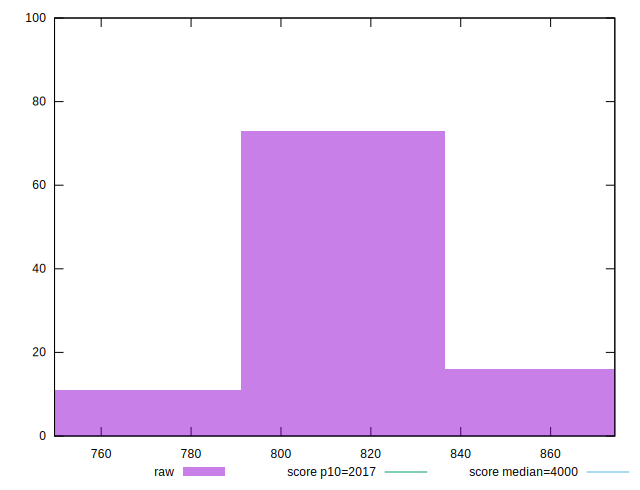
## Score


```yaml
p90min: 1
p90max: 1
p90range: 0
p90mean: 1
median: 1
p90stdev: 0
mad: 0
stdevBySn: 0
lfitCenter: 1
lfitStdev: 0
mfitCenter: 1
mfitStdev: 0
mfitConfidence: 0
p90skewness: .nan
p90eccentricity: .nan
p90discretization: 94
outlandishness: 1

```


## Raw Estimate

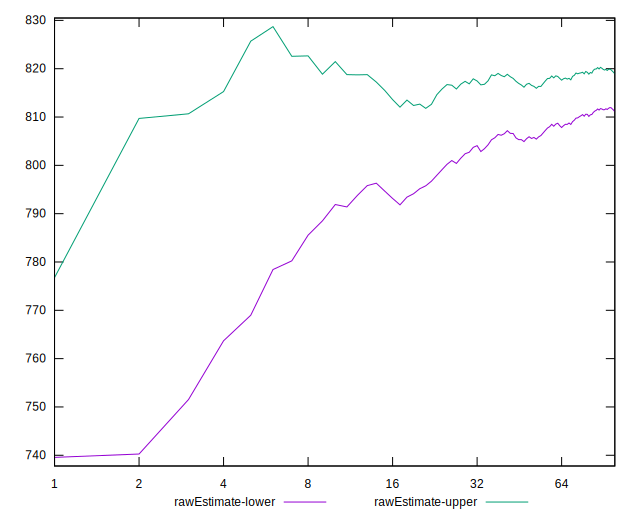
## Score Estimate

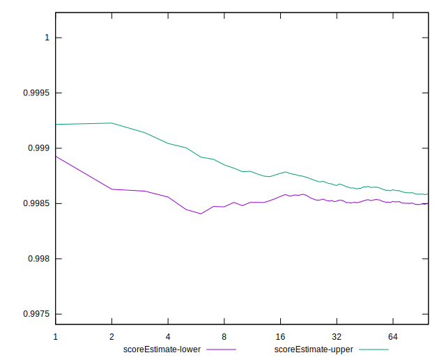
## P Score


```yaml
p90min: 0.9980773313423226
p90max: 0.9989313257042429
p90range: 0.0008539943619203516
p90mean: 0.9985386247312801
median: 0.9985539536302028
p90stdev: 0.00020022784202976162
mad: 0.00017773210126981187
stdevBySn: 0.00023470859304501262
lfitCenter: 0.9985385370744656
lfitStdev: 0.0001751819055896108
mfitCenter: 0.9985385370744656
mfitStdev: 0.000219557959098257
mfitConfidence: 0.0000219557959098257
p90skewness: -0.15264329838767776
p90eccentricity: 0.9999999999999992
p90discretization: 1
outlandishness: 0.9999887167385578

```

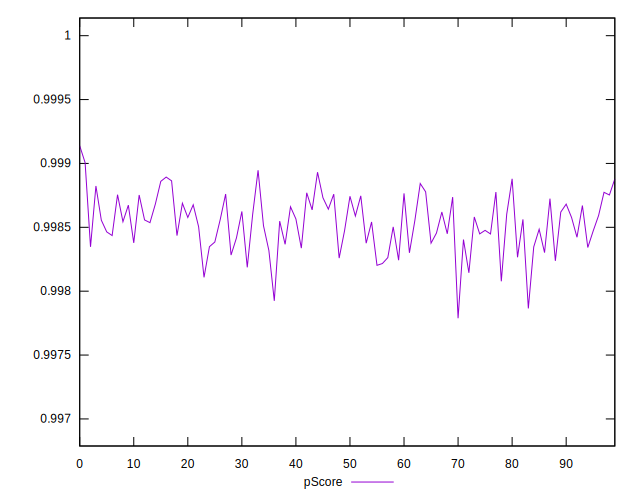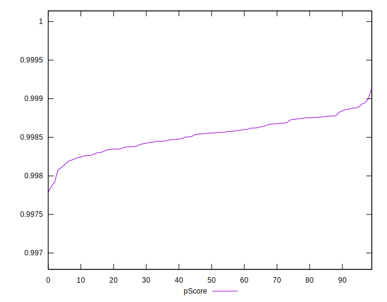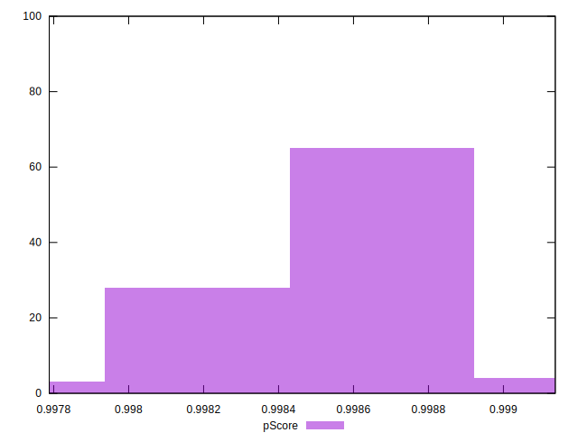
## Score Difference


```yaml
p90min: 0
p90max: 0
p90range: 0
p90mean: 0
median: 0
p90stdev: 0
mad: 0
stdevBySn: 0
lfitCenter: 0
lfitStdev: 0
mfitCenter: 0
mfitStdev: 0
mfitConfidence: 0
p90skewness: .nan
p90eccentricity: .nan
p90discretization: 94
outlandishness: .nan

```


## P Score Difference


```yaml
p90min: -0.0019226686576774288
p90max: -0.0010686742957570772
p90range: 0.0008539943619203516
p90mean: -0.0014613752687198489
median: -0.0014460463697971715
p90stdev: 0.0002002278420297616
mad: 0.00017773210126981187
stdevBySn: 0.00023470859304501262
lfitCenter: -0.0014614629255346341
lfitStdev: 0.00017518190558965207
mfitCenter: -0.0014614629255346341
mfitStdev: 0.00021955795909830875
mfitConfidence: 0.000021955795909830876
p90skewness: -0.15264329839043947
p90eccentricity: 0.9999999999999999
p90discretization: 1
outlandishness: 1.0077245868201836

```

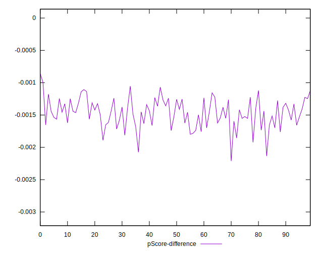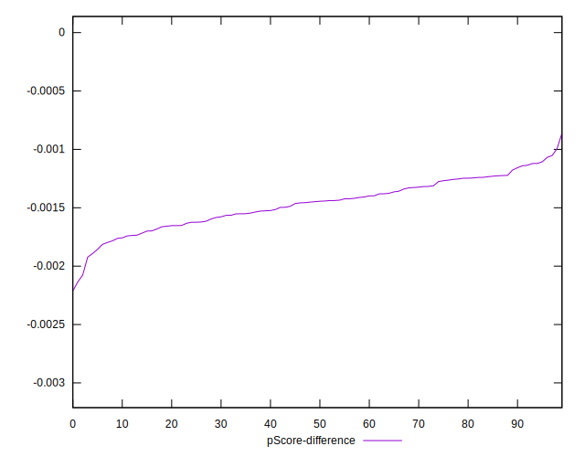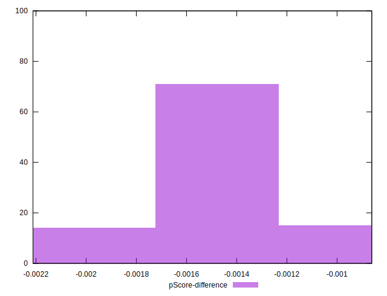