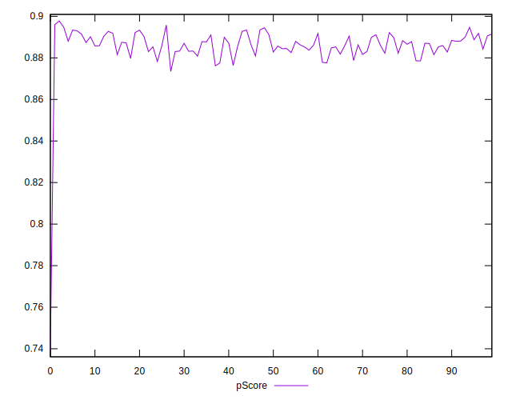

# //mainthread-work-breakdown/samples/astro

[→ Parent](../..)


## Raw


```yaml
p90min: 2048.768000000001
p90max: 2155.9599999999987
p90range: 107.19199999999773
p90mean: 2097.0261276595747
median: 2098.0120000000006
p90stdev: 26.184320354159237
mad: 21.109999999999445
stdevBySn: 31.430973000000836
lfitCenter: 2100.0619106549493
lfitStdev: 25.822530669845083
mfitCenter: 2100.0619106549493
mfitStdev: 32.36374278234571
mfitConfidence: 3.236374278234571
p90skewness: 0.17714316995666532
p90eccentricity: 0.9999999999999996
p90discretization: 1
outlandishness: 1.0066984330379674

```


## Score


```yaml
p90min: 0.88
p90max: 0.89
p90range: 0.010000000000000009
p90mean: 0.8867021276595749
median: 0.89
p90stdev: 0.0047013574029754
mad: 0
stdevBySn: 0
lfitCenter: 0.8868395021094303
lfitStdev: 0.006218157521598833
mfitCenter: 0.8868395021094303
mfitStdev: 0.007793304737716485
mfitConfidence: 0.0007793304737716485
p90skewness: -0.724100515522613
p90eccentricity: 0.9999999999999996
p90discretization: 47
outlandishness: 0.9970651439132686

```


## Raw Estimate


## Score Estimate


## P Score


```yaml
p90min: 0.8763324861321078
p90max: 0.8947698496465462
p90range: 0.018437363514438365
p90mean: 0.8865801508847585
median: 0.8864463145674502
p90stdev: 0.00449654052603358
mad: 0.003645550803694164
stdevBySn: 0.005437526244559677
lfitCenter: 0.8859749706712214
lfitStdev: 0.004568572678732373
mfitCenter: 0.8859749706712214
mfitStdev: 0.005725856731370229
mfitConfidence: 0.0005725856731370229
p90skewness: -0.20771040905320987
p90eccentricity: 0.9999999999999999
p90discretization: 1
outlandishness: 0.996822144619608

```


## Score Difference


```yaml
p90min: 0
p90max: 0
p90range: 0
p90mean: 0
median: 0
p90stdev: 0
mad: 0
stdevBySn: 0
lfitCenter: 0
lfitStdev: 0
mfitCenter: 0
mfitStdev: 0
mfitConfidence: 0
p90skewness: .nan
p90eccentricity: .nan
p90discretization: 94
outlandishness: .nan

```


## P Score Difference


```yaml
p90min: -0.00468235800777117
p90max: 0.004532137020393567
p90range: 0.009214495028164738
p90mean: -0.000245085366556997
median: -0.00006587854398465431
p90stdev: 0.0027624614750471265
mad: 0.0026290897325953466
stdevBySn: 0.0033810505892519077
lfitCenter: -0.0002430997443808634
lfitStdev: 0.0026324147793222044
mfitCenter: -0.0002430997443808634
mfitStdev: 0.0032992426615226196
mfitConfidence: 0.00032992426615226195
p90skewness: 0.02334792882536888
p90eccentricity: 0.9999999999999994
p90discretization: 1
outlandishness: 0.8782506399851222

```

