# //mainthread-work-breakdown/samples/card

[→ Parent](../..)


## Raw


```yaml
p90min: 801.2840000000008
p90max: 903.7880000000004
p90range: 102.50399999999956
p90mean: 849.1207234042565
median: 849.8040000000003
p90stdev: 22.020864295657173
mad: 14.6520000000001
stdevBySn: 22.610503400000447
lfitCenter: 849.6522489138478
lfitStdev: 17.811089253226154
mfitCenter: 849.6522489138478
mfitStdev: 22.322889984518756
mfitConfidence: 2.2322889984518755
p90skewness: 0.1156747495119848
p90eccentricity: 1
p90discretization: 1
outlandishness: 1.0029519480635627

```

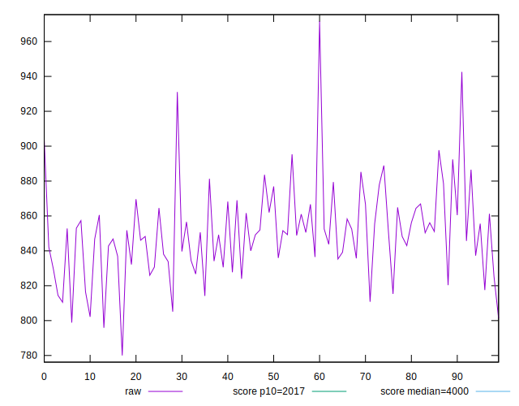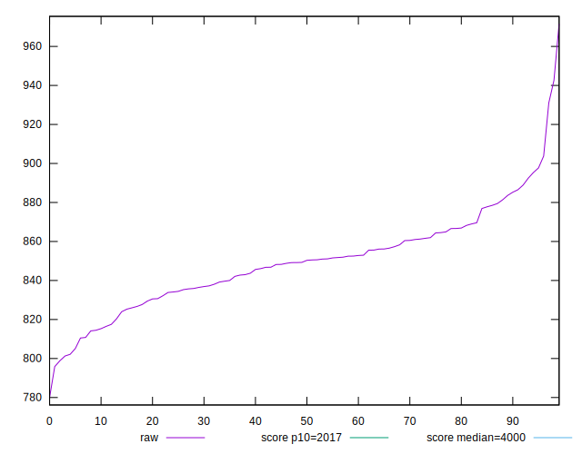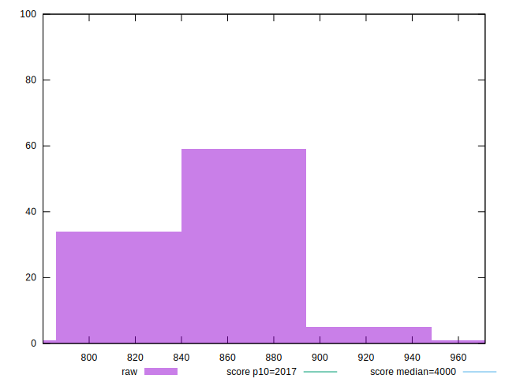
## Score


```yaml
p90min: 1
p90max: 1
p90range: 0
p90mean: 1
median: 1
p90stdev: 0
mad: 0
stdevBySn: 0
lfitCenter: 1
lfitStdev: 0
mfitCenter: 1
mfitStdev: 0
mfitConfidence: 0
p90skewness: .nan
p90eccentricity: .nan
p90discretization: 94
outlandishness: 1

```


## Raw Estimate

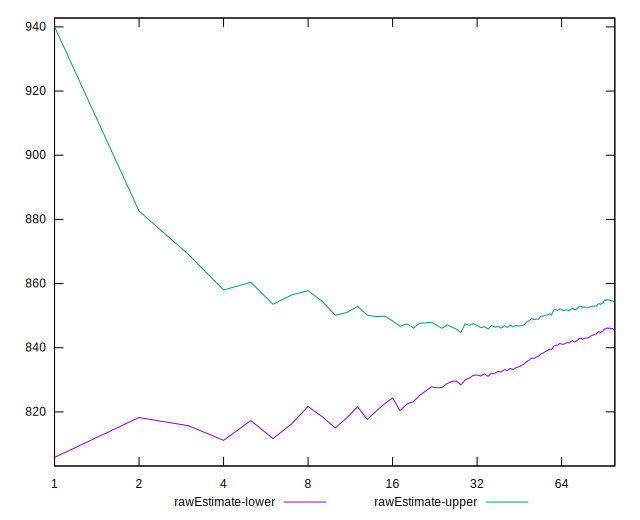
## Score Estimate

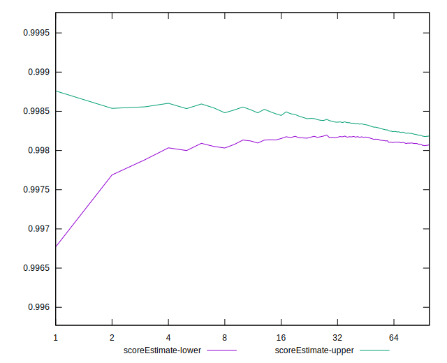
## P Score


```yaml
p90min: 0.9973164048823223
p90max: 0.9986913430343087
p90range: 0.0013749381519864157
p90mean: 0.9981229885738183
median: 0.9981306178442887
p90stdev: 0.00029202747666624417
mad: 0.00019601631766658079
stdevBySn: 0.0003043289145864901
lfitCenter: 0.9981156602134131
lfitStdev: 0.000239346641793876
mfitCenter: 0.9981156602134131
mfitStdev: 0.0002999765301811029
mfitConfidence: 0.000029997653018110287
p90skewness: -0.4297240576388162
p90eccentricity: 1.0000000000000002
p90discretization: 1
outlandishness: 0.9999395621882178

```

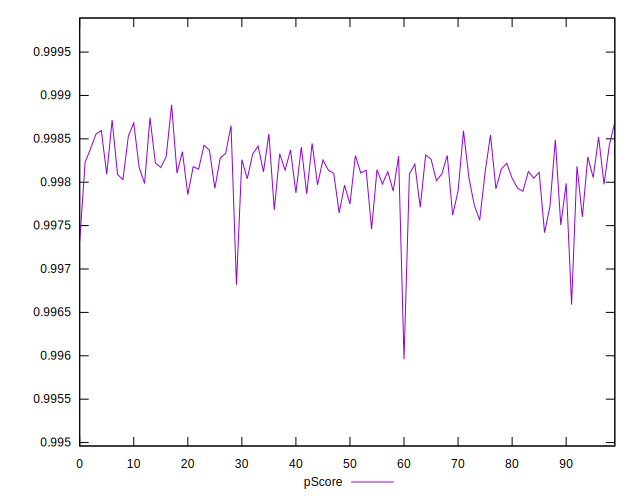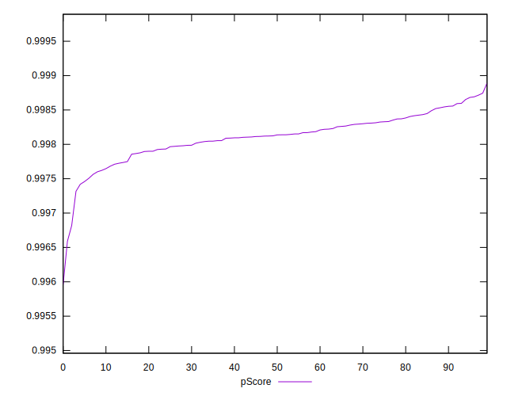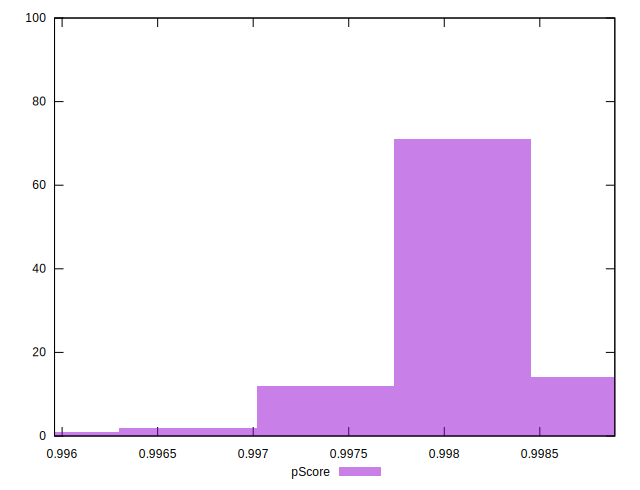
## Score Difference


```yaml
p90min: 0
p90max: 0
p90range: 0
p90mean: 0
median: 0
p90stdev: 0
mad: 0
stdevBySn: 0
lfitCenter: 0
lfitStdev: 0
mfitCenter: 0
mfitStdev: 0
mfitConfidence: 0
p90skewness: .nan
p90eccentricity: .nan
p90discretization: 94
outlandishness: .nan

```


## P Score Difference


```yaml
p90min: -0.002683595117677684
p90max: -0.0013086569656912683
p90range: 0.0013749381519864157
p90mean: -0.0018770114261814606
median: -0.0018693821557113077
p90stdev: 0.00029202747666624417
mad: 0.00019601631766658079
stdevBySn: 0.0003043289145864901
lfitCenter: -0.0018843397865866453
lfitStdev: 0.00023934664179384724
mfitCenter: -0.0018843397865866453
mfitStdev: 0.00029997653018106683
mfitConfidence: 0.00002999765301810668
p90skewness: -0.42972405764226235
p90eccentricity: 1.0000000000000002
p90discretization: 1
outlandishness: 1.0323972345620647

```

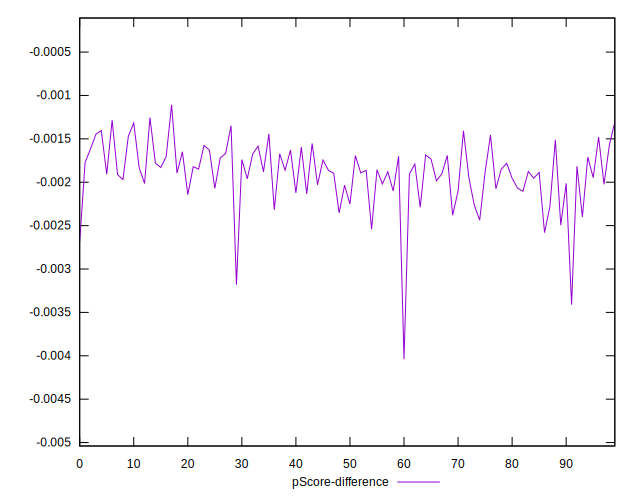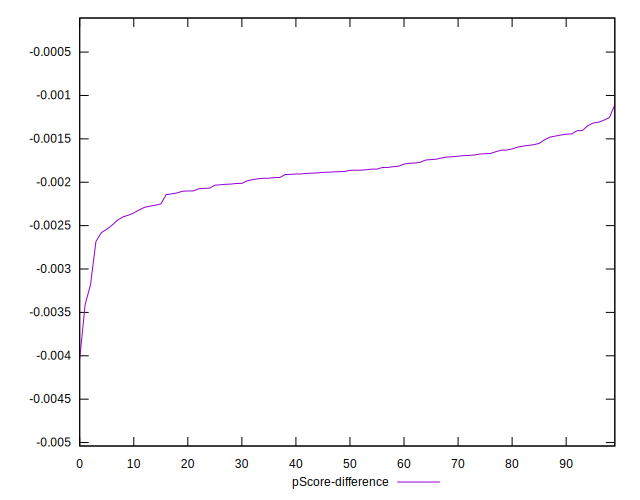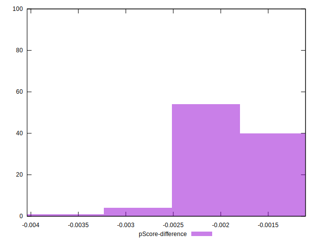